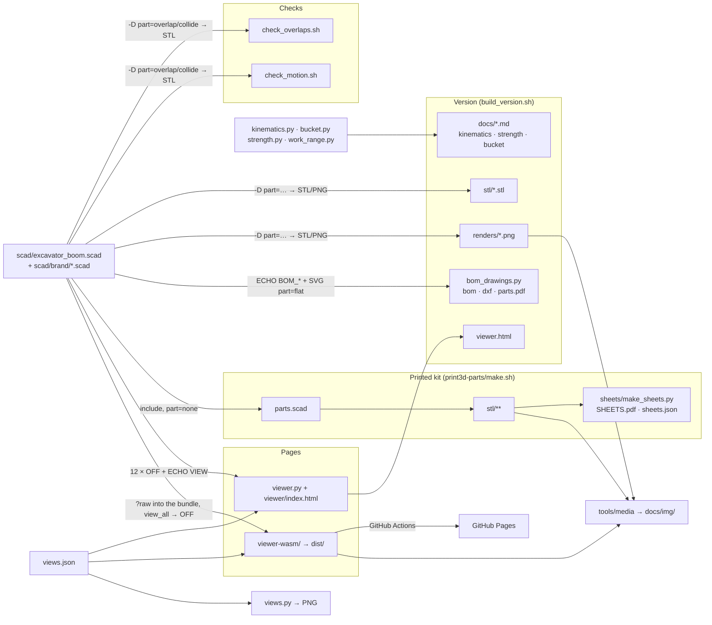

**English** · [Українська](ARCHITECTURE.uk.md)

# Software architecture

A short map: what the code is made of, who calls whom and in what format the data moves. Engineering detail is in [TECHNICAL.md](TECHNICAL.md); geometry in the pages, print versus steel and the OFF format are in [GEOMETRY.md](GEOMETRY.md).

## 1. Principle

- **One source of truth** — `scad/excavator_boom.scad`. Everything else consumes it.
- **The model's interface is the OpenSCAD command line**: input is `-D name=value`, output is a geometry file plus `ECHO:` lines on stderr. No tool keeps its own list of dimensions: numbers are read from echo, outlines from the export.
- **Twins** (`tools/kinematics.py`, `tools/bucket.py`, the `//<pose>` block in the pages) repeat the model's formulas in independent code; the checks catch any divergence (section 6).
- **Generated output** lives in `versions/VNNN-…/`; the root holds only sources, `docs/img/` and the printed kit.

## 2. Stack

| Layer | Technology |
|---|---|
| Model | OpenSCAD (desktop 2026.x, Manifold backend; CGAL only for renders) |
| Calculations, drawings, PDF | Python 3: standard library (system `python3`); numpy, shapely, matplotlib, Pillow (`tools/.venv`) |
| Orchestration | bash scripts (`build_version.sh`, `make.sh`, `check_*.sh`) |
| 3D page with a server | `http.server` (Python) + three.js 0.160 from a CDN, a single HTML file, no build step |
| 3D page without a backend | Vite, three.js, `openscad-wasm-prebuilt` (2025.01 engine) in a web worker, WebXR (AR on Android); tests run in node |
| PDF / screenshots / video | headless Chrome (HTML → PDF, screenshots), puppeteer-core, ffmpeg, poppler |
| CI / hosting | GitHub Actions → GitHub Pages (the WASM page only) |
| Process | git hook `tools/git-hooks/pre-commit`, Claude Code skills and workflows in `.claude/` |

## 3. How the parts connect

## 4. The model's interface

**Input** — `-D` only:

| Parameter | Values |
|---|---|
| `part` | `assembly` (default), a sub-assembly (`boom`, `stick`, `bucket`, `post`, …), a group of plates (`boom_gussets`, …), `flat` / `tubeface` / `flatbrand` / `tubebrand` (2D projections), `overlap` / `collide` (intersection `ov_a`×`ov_b`), `view_all` (every body of the page in one file), `none` (the model as a library) |
| `boom_angle`, `stick_angle`, `bucket_angle` | the pose, degrees; the model itself clamps anything beyond the cylinder stroke |
| `show_*`, `ground_span` | visibility of sub-assemblies and helpers (ground, work envelope, logo) |
| anything else | any Customizer parameter (groups `/* [Name] */` at the top of the file) |

**Output:**

| Channel | Format | Read by |
|---|---|---|
| `ECHO: "=== …"` | text: angle ranges, current pose, bucket | `VERSION.md`, the pages' log |
| `ECHO: "!!! …"` | text: warnings (cylinder cannot reach, dead centre) | the pages, `npm test` (fails on them) |
| `ECHO: VIEW = [[key, value], …]` | list of pairs ≈ JSON (`undef/nan/inf` → `null`) | both pages: joint points, list of bodies, pins |
| `ECHO: BOM_PARAMS / BOM_FLAT / BOM_STRIPS / BOM_WEAR / BOM_SHELL / BOM_TUBES / BOM_ROUND / BOM_PINS` | nested lists | `bom_drawings.py` |
| STL (binary) | sub-assembly geometry | the version, the checks (`stl_volume.py` → cm³), the kit |
| OFF with face colours | mesh + RGB per face | the pages (colour = material / role) |
| SVG | 2D plate outline (`part="flat"`) | `bom_drawings.py` → DXF, dimensions, mass |
| PNG | render (`--render=cgal`, orthographic/perspective) | the version, the sheets, `views.py` |

## 5. Data flows

| From → to | Format | Who / how |
|---|---|---|
| model → checks | intersection STL → volume, cm³ (tolerance 0.05) | `check_overlaps.sh` (plate pairs within a sub-assembly), `check_motion.sh` (moving pairs over the full stroke) |
| model → version | STL, PNG, echo → `VERSION.md` | `build_version.sh` |
| twins → reports | Markdown on stdout, PNG (matplotlib) | `kinematics.py`, `strength.py`, `bucket.py`, `work_range.py` |
| model → BOM and drawings | echo `BOM_*` + SVG → `bom.md`, `bom.csv`, DXF 1:1, `parts.pdf` | `bom_drawings.py` |
| version → README | PNG copies in `docs/img/`; paths in `README*.md` rewritten by `sed` | `build_version.sh` |
| page (server) ↔ `viewer.py` | `GET /api/schema` → parameters as JSON; `GET /api/views` → `views.json`; `POST /api/build {params, fresh}` → `{view, parts{body: {pos, groups[{color, idx}]}}, log, ms}` | 12 OpenSCAD processes in parallel, one OFF per body; cache of recent parameter sets |
| WASM page ↔ worker | `postMessage {id, source, files, defs}` → `{id, view, parts, log, ms}` (buffers transferred) | one run of `part="view_all"`: bodies shifted by `i·spacing` along Y, `offmesh.js` cuts them apart |
| model → WASM page | the `.scad` text is bundled at build time (`?raw`), `views.json` as JSON | Vite; no other inputs (the URL supplies only `?lang`) |
| pose in the browser | angles → `pose()` points → body matrices | JS, no OpenSCAD; the same formulas as the model's `pt_*()` |
| page → saved views | JSON (camera, angles, changed parameters, visibility): clipboard / `views.json` file / `localStorage` | `views.py render` → OpenSCAD PNG |
| model → 1:5 kit | `parts.scad` + `parts.tsv` (TSV, `-` = empty) → one STL per component | `print3d-parts/make.sh`; `check_print.py` → JSON; `make_bom.py` → `BOM.md` |
| kit → sheets | STL (shapely silhouettes) + `assembly.tsv` + `sheets.scad` (PNG) → HTML → PDF | `make_sheets.py` → `SHEETS.pdf`, `sheets.json` (every number), `png/` (from the PDF via poppler) |
| page/PDF → README media | puppeteer screenshots → GIF (ffmpeg); PDF previews | `tools/media/readme_media.sh` → `docs/img/` |
| `main` → Pages | `npm ci` → `npm test` → `vite build` → `dist/` + LICENSE, THIRD-PARTY | `.github/workflows/pages.yml` |

## 6. What must agree and who checks it

| Invariant | Check |
|---|---|
| plates touch but do not overlap | `check_overlaps.sh`; git hook before committing changes in `scad/` |
| moving pairs do not collide | `check_motion.sh` (part of the version build) |
| Python kinematics = the model | angle ranges within 0.1°, bucket linkage branch 0.000 mm: `kinematics.py`, `kinematics.py --check` |
| the model builds in the older WASM engine without warnings | `npm test` (also in CI before publishing) |
| the `//<pose>`, `//<spacemouse>`, `//<viewjson>` blocks are identical in both pages | `npm test` |
| JS pose = the model's echo (bucket tooth) | `npm test` |
| translation complete, legend colours exist in the model's `color(...)` | `npm test` |
| camera conversion page → OpenSCAD | `views.py check` + `media/view_roundtrip.mjs` |
| every kit part is in exactly one step | `make.sh` (`parts.tsv` ↔ `assembly.tsv`) |
| docs: links, anchors, skeleton of bilingual pairs | `check_docs.py` |
| no personal data in a commit (text and PDF, PNG, zip metadata) | `check_personal.py` |

## 7. Where things live

| Folder | Contents |
|---|---|
| `scad/` | the model and the logo polygons |
| `tools/` | twins, generators, checks, `media/`, `git-hooks/`, `dev/` (SpaceMouse helper, agent analytics) |
| `web/` | the pages: `viewer/` with its server `viewer.py`, `viewer-wasm/` (published on Pages) |
| `versions/VNNN-…/` | `stl/`, `renders/`, `docs/`, `bom/`, `dxf/`, `drawings/`, `scad/` (snapshot of the model and scripts), `viewer.html`, `VERSION.md` |
| `print3d-parts/` | the 1:5 kit: `parts.scad`, `parts.tsv`, `assembly.tsv`, `stl/`, `BOM.md`, `sheets/`, `stand/` (a separate display stand with its own `make.sh`) |
| `docs/img/` | README images (updated by `build_version.sh` and `readme_media.sh`) |
| `views.json` | saved views (shared by the pages and `views.py`) |
| `.claude/` | agent skills and workflows |
| `temp/` | drafts and publication media, not in git |
| `_deprecated/` | archive, not used |
