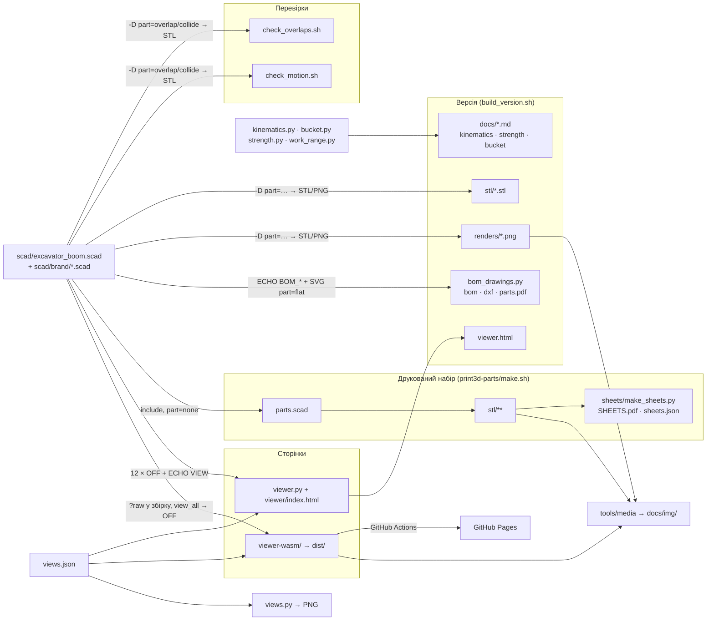

[English](ARCHITECTURE.md) · **Українська**

# Програмна архітектура

Коротка карта: з чого складається код, хто кого викликає і в якому форматі йдуть дані. Інженерні подробиці — у [TECHNICAL.uk.md](TECHNICAL.uk.md); геометрія в сторінках, друк проти металу і формат OFF — у [GEOMETRY.uk.md](GEOMETRY.uk.md).

## 1. Принцип

- **Одне джерело правди** — `scad/excavator_boom.scad`. Усе інше — його споживачі.
- **Інтерфейс моделі — командний рядок OpenSCAD**: вхід — `-D назва=значення`, вихід — файл геометрії та рядки `ECHO:` у stderr. Жоден інструмент не має власного списку розмірів: числа читаються з echo, контури — з експорту.
- **Двійники** (`tools/kinematics.py`, `tools/bucket.py`, блок `//<pose>` у сторінках) повторюють формули моделі незалежним кодом; розбіжність ловлять перевірки (розділ 6).
- **Згенероване** живе в `versions/VNNN-…/`; у корені — лише джерела, `docs/img/` і друкований набір.

## 2. Стек

| Шар | Технології |
|---|---|
| Модель | OpenSCAD (настільний 2026.x, рушій Manifold; CGAL — лише для рендерів) |
| Розрахунки, креслення, PDF | Python 3: стандартна бібліотека (системний `python3`); numpy, shapely, matplotlib, Pillow (`tools/.venv`) |
| Оркестрація | bash-скрипти (`build_version.sh`, `make.sh`, `check_*.sh`) |
| 3D-сторінка з сервером | `http.server` (Python) + three.js 0.160 з CDN, один HTML без збирання |
| 3D-сторінка без бекенду | Vite, three.js, `openscad-wasm-prebuilt` (рушій 2025.01) у веб-воркері, WebXR (AR на Android); тест — node |
| PDF / знімки / відео | Chrome headless (HTML → PDF, знімки), puppeteer-core, ffmpeg, poppler |
| CI / хостинг | GitHub Actions → GitHub Pages (лише WASM-сторінка) |
| Процес | git-хук `tools/git-hooks/pre-commit`, skills і workflow Claude Code у `.claude/` |

## 3. Схема зв'язків

## 4. Інтерфейс моделі

**Вхід** — лише `-D`:

| Параметр | Значення |
|---|---|
| `part` | `assembly` (типово), вузол (`boom`, `stick`, `bucket`, `post`, …), група пластин (`boom_gussets`, …), `flat` / `tubeface` / `flatbrand` / `tubebrand` (2D-проєкції), `overlap` / `collide` (перетин `ov_a`×`ov_b`), `view_all` (усі тіла сторінки в одному файлі), `none` (модель як бібліотека) |
| `boom_angle`, `stick_angle`, `bucket_angle` | поза, градуси; поза ходом циліндра модель сама обмежує |
| `show_*`, `ground_span` | видимість вузлів і допоміжного (земля, зона досяжності, логотип) |
| решта | будь-який параметр Customizer (групи `/* [Назва] */` на початку файлу) |

**Вихід:**

| Канал | Формат | Хто читає |
|---|---|---|
| `ECHO: "=== …"` | текст: діапазони кутів, поточна поза, ківш | `VERSION.md`, лог сторінок |
| `ECHO: "!!! …"` | текст: попередження (циліндр не дістає, мертва точка) | сторінки, `npm test` (валиться на них) |
| `ECHO: VIEW = [[ключ, значення], …]` | список пар ≈ JSON (`undef/nan/inf` → `null`) | обидві сторінки: точки шарнірів, список тіл, пальці |
| `ECHO: BOM_PARAMS / BOM_FLAT / BOM_STRIPS / BOM_WEAR / BOM_SHELL / BOM_TUBES / BOM_ROUND / BOM_PINS` | вкладені списки | `bom_drawings.py` |
| STL (binary) | геометрія вузлів | версія, перевірки (`stl_volume.py` → см³), набір |
| OFF з кольорами граней | сітка + RGB грані | сторінки (колір = матеріал / роль) |
| SVG | 2D-контур пластини (`part="flat"`) | `bom_drawings.py` → DXF, розміри, маса |
| PNG | рендер (`--render=cgal`, ортогональна/перспектива) | версія, аркуші, `views.py` |

## 5. Потоки даних

| Звідки → куди | Формат | Хто / як |
|---|---|---|
| модель → перевірки | STL перетину → об'єм, см³ (допуск 0.05) | `check_overlaps.sh` (пари пластин вузла), `check_motion.sh` (рухомі пари на всьому ході) |
| модель → версія | STL, PNG, echo → `VERSION.md` | `build_version.sh` |
| двійники → звіти | Markdown у stdout, PNG (matplotlib) | `kinematics.py`, `strength.py`, `bucket.py`, `work_range.py` |
| модель → BOM і креслення | echo `BOM_*` + SVG → `bom.md`, `bom.csv`, DXF 1:1, `parts.pdf` | `bom_drawings.py` |
| версія → README | копії PNG у `docs/img/`; шляхи в `README*.md` переписуються `sed` | `build_version.sh` |
| сторінка (сервер) ↔ `viewer.py` | `GET /api/schema` → JSON параметрів; `GET /api/views` → `views.json`; `POST /api/build {params, fresh}` → `{view, parts{тіло: {pos, groups[{color, idx}]}}, log, ms}` | 12 процесів OpenSCAD паралельно, по OFF на тіло; кеш останніх наборів параметрів |
| WASM-сторінка ↔ воркер | `postMessage {id, source, files, defs}` → `{id, view, parts, log, ms}` (буфери — transfer) | один запуск `part="view_all"`: тіла зсунуті на `i·spacing` по Y, `offmesh.js` розрізає назад |
| модель → WASM-сторінка | текст `.scad` вшивається збіркою (`?raw`), `views.json` — як JSON | Vite; інших входів немає (з адреси — лише `?lang`) |
| поза в браузері | кути → точки `pose()` → матриці тіл | JS, без OpenSCAD; ті самі формули, що `pt_*()` моделі |
| сторінка → ракурси | JSON (камера, кути, змінені параметри, видимість): буфер обміну / файл `views.json` / `localStorage` | `views.py render` → PNG OpenSCAD |
| модель → набір 1:5 | `parts.scad` + `parts.tsv` (TSV, «-» = порожньо) → STL по одному компоненту | `print3d-parts/make.sh`; `check_print.py` → JSON; `make_bom.py` → `BOM.md` |
| набір → аркуші | STL (силуети shapely) + `assembly.tsv` + `sheets.scad` (PNG) → HTML → PDF | `make_sheets.py` → `SHEETS.pdf`, `sheets.json` (усі числа), `png/` (з PDF через poppler) |
| сторінка/PDF → медіа README | знімки puppeteer → GIF (ffmpeg); прев'ю PDF | `tools/media/readme_media.sh` → `docs/img/` |
| `main` → Pages | `npm ci` → `npm test` → `vite build` → `dist/` + LICENSE, THIRD-PARTY | `.github/workflows/pages.yml` |

## 6. Що має збігатися і хто це перевіряє

| Інваріант | Перевірка |
|---|---|
| пластини прилягають, не перекриваються | `check_overlaps.sh`; git-хук перед комітом змін у `scad/` |
| рухомі пари не зіткаються | `check_motion.sh` (у складі збирання версії) |
| Python-кінематика = модель | діапазони кутів до 0.1°, гілка ковша 0.000 мм: `kinematics.py`, `kinematics.py --check` |
| модель будується старішим рушієм WASM без попереджень | `npm test` (також у CI перед публікацією) |
| блоки `//<pose>`, `//<spacemouse>`, `//<viewjson>` однакові в обох сторінках | `npm test` |
| поза JS = echo моделі (зуб ковша) | `npm test` |
| переклад повний, кольори легенди є в `color(...)` моделі | `npm test` |
| перерахунок камери сторінка → OpenSCAD | `views.py check` + `media/view_roundtrip.mjs` |
| кожна деталь набору — рівно в одному кроці | `make.sh` (звірка `parts.tsv` ↔ `assembly.tsv`) |
| документи: посилання, якорі, кістяк двомовних пар | `check_docs.py` |
| у коміті немає особистих даних (текст і метадані PDF, PNG, zip) | `check_personal.py` |

## 7. Де що лежить

| Тека | Вміст |
|---|---|
| `scad/` | модель і полігони логотипа |
| `tools/` | двійники, генератори, перевірки, сервер сторінки, `viewer/`, `viewer-wasm/`, `media/`, `git-hooks/` |
| `versions/VNNN-…/` | `stl/`, `renders/`, `docs/`, `bom/`, `dxf/`, `drawings/`, `scad/` (знімок моделі й скриптів), `viewer.html`, `VERSION.md` |
| `print3d-parts/` | набір 1:5: `parts.scad`, `parts.tsv`, `assembly.tsv`, `stl/`, `BOM.md`, `sheets/`, `stand/` (окрема стійка, свій `make.sh`) |
| `docs/img/` | картинки README (оновлюють `build_version.sh` і `readme_media.sh`) |
| `views.json` | збережені ракурси (спільні для сторінок і `views.py`) |
| `.claude/` | skills і workflow агентів |
| `temp/` | чернетки й медіа для публікацій, не в git |
| `_deprecated/` | архів, не використовується |
