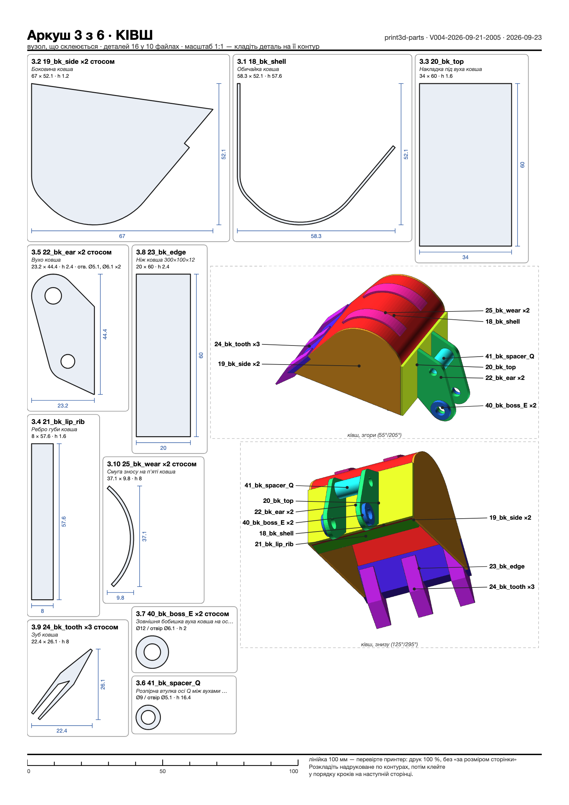
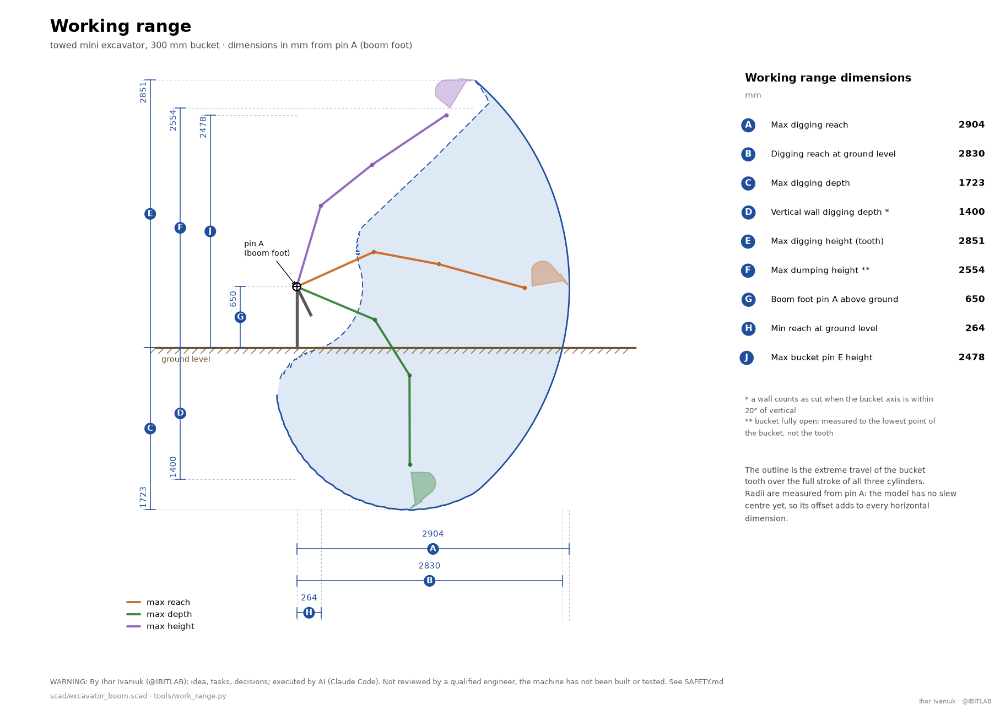

**English** · [Українська](README.uk.md)

# Mini excavator boom, stick and bucket — a parametric OpenSCAD model

> ## ⚠️ Generated by AI. Use at your own risk
>
> **All of this documentation, the model geometry, the calculations, the drawings and the bill of materials were produced and computed by artificial intelligence.** None of it has been checked or approved by a qualified engineer. The "independent review" in section 4a was likewise carried out by AI agents, not by human experts.
>
> This is **not engineering documentation**. The calculations are simplified, the inputs are incomplete (some were taken from vendor pages marked "≈"), and nothing has been tested physically — no machine has ever been built from this model.
>
> **A mini excavator is a dangerous machine.** A weld that lets go, a pin that shears, a boom that drops under load, a tip-over, a burst hose, a pinhole jet of hydraulic oil (it injects under the skin and requires immediate surgery) — these maim and kill.
>
> **The author and any contributors accept no liability whatsoever** for the consequences of using this material: for harm to life or health, injury, death, damage to property, direct or indirect losses, or for errors in the calculations, drawings or descriptions. The material is provided "as is", without warranty of any kind, express or implied, including any warranty of fitness for a particular purpose.
>
> **Whatever you do with this material, you do at your own risk and on your own responsibility.** Before cutting metal, have the calculations and drawings checked by a qualified mechanical engineer, have the welding done by a certified welder and the hydraulics by a specialist. Follow your local safety regulations. The machine is not certified and is not intended for sale, for commercial use, or for use on public roads.
>
> 👉 **The specific unfinished points and hazards of this particular design are in [SAFETY.md](SAFETY.md). Read it before you cut anything.**

Working equipment (boom + stick + bucket linkage + a **300 mm bucket**) built around **already-purchased** hydraulic cylinders:
boom ГЦ 63.40.500.700 (ШС-30 spherical bearing), stick ЦС50.25.400.600 (ШС-25), bucket ЦС50.25.300.510 (ШС-25).
The arms are made of common hollow sections (ordinary stockist sizes); the reinforcements are doublers, cheeks and saddles in S235JR (Ст3) steel.
The bucket is welded up from real parts (side plates, shell, cutting edge, teeth, ears) and checked for collisions with the stick, the rocker and the link over the full cylinder stroke.

**Quick start (dependencies and the core commands): [QUICKSTART.md](QUICKSTART.md).**


## 1. Files

| File | Purpose |
|---|---|
| `scad/excavator_boom.scad` | **The main model.** All parameters sit at the top of the file (Customizer groups). The angles are the primary parameters; their ranges are derived from the cylinder lengths and printed through `echo()`. |
| `tools/kinematics.py` | An independent solver for the same geometry: range checks, moment arms, tooth force, work envelope; `--search` fits the mounting positions. |
| `tools/work_range.py` | **Working-range drawing** with dimensions A…J (the way excavator catalogues show them): the outline is swept over the full stroke of all three cylinders, the bucket silhouette comes from `tools/bucket.py`. Both languages: `--lang uk\|en`. |
| `views.json` → `tools/views.py` | **Viewpoints saved from the 3D page**: camera, angles, changed parameters, visibility. `list` / `flags` / `render NAME` / `check` (against a real screenshot of the page). A view found by eye becomes a reproducible render. |
| `tools/strength.py` | Member statics plus strength of materials: N/V/M diagrams, checks of the tubes and doublers, pins, bushings and welds; section comparison (`--boom 120x80x5 --stick 100x60x5`). |
| `tools/bucket.py` | **The bucket**: a Python twin of the bucket profile — capacity (struck / heaped), mass, carry and dump angles, a 2D clearance check of the moving pairs over the full stroke, strength of the ears, of pins E/Q and of the welds. Run it with `tools/.venv/bin/python tools/bucket.py [--png file]`. |
| `docs/01-design-inputs.md` | **A source document, written by hand.** The inputs: cylinders, spherical bearings, pins and bushings, the steel sizes actually available, hydraulics, class benchmarks, standards. |
| `docs/research/` | Raw research notes with links to the sources. |
| `docs/img/` | The images used by this README; `build_version.sh` refreshes them from the latest version. |
| `versions/VNNN-date-time/` | **Built versions — everything generated lives only here**: `stl/`, `renders/`, `docs/` (`02-kinematics.md`, `03-strength.md`, `04-bom.md`, the angle ranges, the intersection check), `bom/`, `dxf/`, `drawings/`, `scad/` (a snapshot of the model and the scripts), `VERSION.md`. The current one is the folder with the highest number. |
| `tools/build_version.sh` | **The version build script**: intersection check → moving-pair check → STL of every part → renders → reports → `VERSION.md`. The version number increments automatically. |
| `tools/bom_drawings.sh` | **BOM + drawings**: the bill of materials (`bom.md`, `bom.csv`), the outlines of every plate as 1:1 DXF for cutting, and PDF sketches with the main dimensions (`drawings/parts.pdf` + PNG pages). The data comes from the model's echo and from a projection of each plate — there is no separate list of dimensions anywhere. The first run creates `tools/.venv` with matplotlib. |
| `print3d-parts/` | **The 1:5 printed kit** — every component on its own, the way it is cut from steel (53 files, 76 pieces), glued instead of welded: `make.sh` → STL sorted by slicer job, `BOM.md`, `ASSEMBLY.md`. Separately, `sheets/SHEETS.pdf` — **1:1 sorting sheets** for the pile of printed parts: the outline of every part on the sheet of its own sub-assembly, renders with callouts, gluing step cards. See section 2. |
| `tools/viewer.sh` → `tools/viewer.py`, `tools/viewer/index.html` | **An interactive 3D page in the browser**: orbit / pan / zoom, the angles change instantly, and any other model parameter is rebuilt through OpenSCAD in ≈ 0.4 s. See section 2. |
| `tools/viewer-wasm.sh` → `tools/viewer-wasm/` (`package.json`, Vite) | **A second version of the 3D page — with no backend**: OpenSCAD-WASM in a web worker renders the model right in the browser; it builds into a static site in `dist/`. See section 2. |
| `tools/media/` | Screenshots of the page in headless Chrome (`page_shot.mjs`), collages (`compose.py`) and a full set of images and video for publications (`make_media.sh` → `temp/media/`, which is never committed). |
| `tools/check_overlaps.sh` | Checks that the sub-assemblies of the weldment abut but never overlap (the intersection volume of every pair is 0). |
| `tools/check_motion.sh` | Checks the **moving** pairs in 3D over the full cylinder stroke: bucket ↔ stick / rocker / link / cylinder, link ↔ rocker, the bodies of all three cylinders ↔ their own brackets, stick ↔ boom; and, for reference, bucket ↔ boom in the folded pose. |
| `tools/stl_volume.py` | The volume of an STL (cm³), needed for the intersection check. |
| `tools/agent_analytics.py` | Analytics of the agent work from the Claude Code logs (tokens, minutes, roles). |
| `tools/git-hooks/pre-commit` | A git hook: before committing changes under `scad/` it checks the plates for overlaps. Enable it once: `git config core.hooksPath tools/git-hooks`. |
| `CLAUDE.md` | Project rules for Claude Code (language, commits, where everything lives). |
| `.claude/skills/` | The project skills: `scad-mechanism` (model rules and checklist), `new-assembly` (the recipe for a new sub-assembly), `build-version`, `part-drawings`, `browser-verify` (checking the pages in headless Chrome), `media-kit` (material for publications), `design-review`, `research-sweep`, `agent-analytics`. Everything stays inside the repository; nothing is installed into `~/.claude`. |
| `.claude/workflows/` | Saved multi-agent workflows: `design-review` (reviewers + refutation) and `research-sweep` (researchers + a critic). Every agent writes its result straight into `docs/reviews/…` or `docs/research/…`, so nothing is lost if a usage limit cuts the run short. |

Agreement between the two independent implementations (OpenSCAD ↔ Python): the angle ranges match to within 0.1°, the bucket-linkage branch to 0.000 mm.

## 2. Using the model

Open `scad/excavator_boom.scad` in OpenSCAD (≥ 2021.01; verified on 2026.09). The first group in the Customizer (Window → Customizer):

| Parameter | Default | Range (computed) | Meaning |
|---|---|---|---|
| `boom_angle` | 15° | **−38.1° … +58.3°** | angle of the boom chord (axis A → axis B) to the horizon, + upwards |
| `stick_angle` | 100° | **50.7° … 155.6°** | interior boom–stick angle at joint B (folded … extended) |
| `bucket_angle` | 60° | **−17.0° … +138.5°** | bucket angle relative to the stick axis, + = curling in |
| `clamp_to_cylinders` | true | | limit the angles to what the cylinders can reach (otherwise: a red cylinder + a warning) |

The console (`echo`) prints the ranges, the current cylinder lengths and moment arms, and the tooth coordinates. The remaining groups are: cylinders (closed length, stroke, barrel/rod, pin), boom, stick, bucket linkage, pins/bushings/plates, and display (`show_envelope` draws the work envelope as points).

From the command line:
```
openscad -o out.png --viewall --autocenter -D boom_angle=-38 -D stick_angle=90 -D bucket_angle=60 scad/excavator_boom.scad
openscad -o out.echo scad/excavator_boom.scad        # just the echo with the ranges
cd tools && python3 kinematics.py && python3 strength.py --boom 120x80x5 --stick 100x60x5
```

### The interactive 3D page (Step 2.0)

```
tools/viewer.sh                                   # opens http://127.0.0.1:8765/ in the browser (Ctrl+C to stop)
python3 tools/viewer.py --export file.html        # a static page with no server (one ships with every version: versions/VNNN-…/viewer.html)
```

- **Mouse**: left button orbits, right button or Shift pans, the wheel zooms towards the cursor, a double click on a part sets a new orbit centre. There are view buttons (side, isometric, top, front, fit) and a perspective / orthographic toggle.
- **The boom, stick and bucket angles** move the model instantly: the page assembles the pose itself, using the same formulas as the model's `pt_*()` functions and the points the model prints in `echo(VIEW = …)` (cross-checked against the model's echo: the tooth position and the cylinder lengths agree to within 0.1 mm). The slider limits come from the cylinder strokes; next to each angle you see the cylinder length and the stroke used. Clear "limit to cylinder stroke" and a cylinder beyond its stroke turns red. Ready-made poses and a "dig cycle" are included.
- **Every other parameter** (the Customizer groups are read straight from the `.scad` — there is no separate list) goes to a local server: it runs OpenSCAD in parallel for 12 parts in their own coordinate frames and returns coloured meshes (OFF format). Changed parameters are highlighted; "Copy changes" gives you lines ready to paste into the `.scad`; "Reload model" picks up edits to the file. Warnings from the model (`!!!` — a dead centre in the linkage, an unreachable cylinder length) are shown on screen.
- The server listens on 127.0.0.1 only; values coming from the browser are coerced to the types in the schema (numbers, booleans, enumerations), so arbitrary text never reaches OpenSCAD. three.js is loaded from a CDN (jsdelivr) — an internet connection is required.

### The 3D page with no backend: OpenSCAD-WASM in the browser (Step 2.1)

```
cd tools/viewer-wasm && npm install      # dependencies: three, openscad-wasm-prebuilt (OpenSCAD 2025.01 + Manifold, 11 MB), vite
npm run dev                              # http://localhost:8766/ — editing scad/excavator_boom.scad reloads the page at once
npm run build                            # a static site in dist/ (≈12 MB): drop it on any static host
npm run preview                          # view the built dist/ locally
npm test                                 # a smoke test with no browser
# the same in one command from the repository root: tools/viewer-wasm.sh [build|preview|phone|test]
# phone — build and serve it to your phone on the same Wi-Fi (Vite otherwise listens on 127.0.0.1 only)
```

- The same page and the same controls as the server version (which is still there: `tools/viewer.sh`), except that **OpenSCAD runs in a web worker in the browser**; neither Python nor an installed OpenSCAD is needed. The model is embedded into the page at build time (a `?raw` import) and the Customizer parameters are parsed by JavaScript (`src/schema.js`).
- One engine run per parameter change: in `part="view_all"` mode the model lays all 12 parts out with an offset along Y and the page cuts the mesh back apart (`src/offmesh.js`). Measured in Chrome: the first start takes ≈ 5 s (loading the engine), a **rebuild after a parameter change ≈ 2.2 s**; the angles remain instant. For comparison, the server version rebuilds in ≈ 0.4 s.
- **Two languages: English and Ukrainian.** A `UK | EN` switch sits in the panel header; the language comes from `?lang=en` in the URL, then from the browser's storage, then from the browser's own language. Switching only redraws the labels — OpenSCAD is not restarted, and the angles, checkboxes and changed parameters all stay as they were. The group names and the descriptions of all 103 model parameters are translated too: the English texts live in `src/i18n.js` while the Ukrainian ones are read straight from the `.scad` comments, so the model remains the single source of truth. `npm test` verifies that the dictionary has not drifted from the model (every group and every documented parameter has a translation) and that both languages carry the same keys. Warnings printed by the model itself (`!!!`) stay in Ukrainian — they come from `echo()` in the `.scad`. The server page (`tools/viewer.sh`) is Ukrainian only.
- **The page reads only the language from the URL** (`?lang=en`). Initial parameter values used to be given there too — that was removed on purpose: it was the one path by which a value from someone else's link reached the text of the OpenSCAD model. The model is embedded into the page at build time, and **there is no way to open somebody else's `.scad` in it either** — that was removed on purpose: such a file's text would become the group names, descriptions and warnings in the panel, i.e. foreign data inside a page that lives on a shared GitHub Pages domain.
- **On phones and tablets the panel is a bottom drawer** with three states: collapsed (just the grab bar with the reach and the tooth height — the model gets 93 % of the screen), working (the three angle sliders and the ready-made poses) and full (the view presets and visibility checkboxes as well). Drag it by the handle, tap the handle to collapse or expand. The layout is triggered not only by width but by `pointer: coarse`: a phone held sideways (844 px) and a tablet in portrait (768 px) would otherwise get a side column taking half the screen. Model parameters, devices and the render views are hidden on touch devices — nobody edits those from a phone. The AI warning is collapsed by default **everywhere** — only the summary line shows and the reader opens the rest themselves; on a phone it sits behind a ⚠ icon on the handle, next to the collapse button and the language switch, and opens as a card over the model. The handle sticks to the top of the panel, so you can collapse and expand from anywhere in the scroll — and the scroll position is kept. A note at the bottom of the panel says what the phone version leaves out. On a phone the view presets sit as **icons in the "Angles" heading row** — an isometric cube with the face you are looking at shaded, the way CAD tools do it. The whole set then fits on the first screen without a block of its own; on a desktop the label stays next to the icon. The projection is a state rather than a view, so it sits in a group of its own behind a divider, is round instead of rectangular, and its icon shows the current state: the frame converges in perspective and stays parallel in orthographic.
- **Snapshot of the frame.** The "⤓ Save PNG" button in the "View" section gives you the current frame together with a caption strip: the tooth's reach, its depth below or height above the ground, the boom, stick and bucket angles, the bucket tilt and the height of axis A above the ground that all of it is measured from. A screenshot cannot do this — it drags the whole panel along and leaves the numbers tiny. On a phone the button opens the system share sheet, so the picture goes straight into the photo library or a message.
- **A colour legend** under the visibility checkboxes: tubes, plates and doublers, hydraulic cylinders, bucket, bushings and pins. The colours are not invented — they are taken from the `color(...)` calls in the model itself, and `npm test` checks that they have not drifted apart.
- **"What is welded to what"** — a checkbox that repaints the machine by RIGID BODY: the boom in one colour, the stick in another, then the bucket, the rocker, the link, the barrels and the rods, with the pins in bright red. The same colour then means "welded into one piece", a colour boundary is a joint, and a red dot is the axis it turns about. The normal palette says what a part is MADE OF; this one says WHAT MOVES relative to what — different questions, hence different modes. The colours were not picked by eye: ΔE was measured in CIE Lab on the eleven pairs that actually touch at joints, and the minimum is 30.
- **Tapping a part highlights everything welded to it** and fades the rest of the machine. "What moves together with this?" is answered in one tap, with no mode to switch. Tapping it again, or tapping empty space, clears the highlight; dragging the bucket leaves it alone.
- **An engine loading bar.** The 11 MB used to arrive in silence, which on a slow link looked like a hang. The page now fetches the file itself, as a stream, and shows "4.2 / 11 MB" — exactly once, with no double download. The tooth's depth below ground is highlighted in the HUD: it is the page's headline number.
- **Keyboard (where there is one):** `1`–`6` for the view presets, space for the dig cycle. On touch devices the handlers are not installed at all.
- **The machine can be dragged by the bucket.** Grab the bucket body and the whole arm follows your finger: the page solves the inverse kinematics and works out the boom and stick angles. Grab the teeth and the bucket curls about its own axis while the arm stays put. Works with a mouse and with a single finger. The solution is exact and needs no iteration — joint B lies on the intersection of two circles — and `npm test` runs the forward problem through the inverse one and back (tooth error 10⁻¹² mm). An unreachable target does not freeze the arm: it follows to the edge of the working envelope, and the cylinder-stroke limit still applies. The "Lock the camera" toggle disables orbiting altogether, so you can then drag from anywhere without aiming at the bucket. On a phone it sits on the drawer handle next to the ⚠ icon — the handle is sticky and always visible, whereas the view row in the heading scrolls away. On a desktop it floats over the canvas in the bottom-left corner, next to the thing it governs. Locked, it turns orange. How to control it is written in the card behind the ⚠ icon, next to the AI warning — it lives there **permanently**, on the phone and on the desktop alike. On top of that, a first-time visitor gets the same text as a pill above the model: it stays until they have completed **two** operations (after one it is not yet clear the gesture repeats) and closes on the ×. After that the text stays behind the icon.
- **Publishing to GitHub Pages**: `.github/workflows/pages.yml` builds the page and deploys it on every push to `main` (enable it once: Settings → Pages → Source: GitHub Actions). The workflow runs `npm test` before building, so a broken model never reaches the site, and it copies `LICENSE` and `THIRD-PARTY.md` next to the page — the GPL requires this, because the page embeds OpenSCAD itself. The same links appear at the bottom of the page's panel.
- `dist/` cannot be opened by double-clicking (`file://` does not allow module workers) — you need any static web server (`npm run preview`, GitHub Pages and so on). `node_modules/` and `dist/` never reach git.
- The in-browser engine is older (2025.01) than the desktop OpenSCAD (2026.09). `npm test` checks that it builds the model without warnings, that no part comes out empty, that the JavaScript pose matches the model's echo, and that the pose block is identical in both versions of the page.

### A 3Dconnexion SpaceMouse in the browser (Step 2.2)

Both pages (server and WASM) can be driven with a 3D mouse without any plugin; the block of code is identical in both (`spacemouse`).

| Browser | Route | What to do |
|---|---|---|
| **Chrome / Edge / Opera** | WebHID — the page reads the mouse reports itself | "View" → the **SpaceMouse** button → in the browser dialog ("… wants to connect to a HID device") pick the mouse (or "3Dconnexion Universal Receiver") → "Connect". The dialog only appears after a click — that is a browser requirement. Permission is granted **per origin** (`127.0.0.1:8765`, `localhost:8766`, `localhost:8767` are three different ones) and lasts as long as the mouse is on and the browser is open; if the mouse reports a serial number, Chrome remembers the permission for good and the page picks the mouse up by itself (including after it is plugged back in). If not, the button has to be pressed again after a browser restart. To revoke: the icon to the left of the address → "Site settings" → HID devices. A secure context is required: https, `localhost` or `file://` (verified: Chrome opens WebHID for a static `viewer.html` from disk too). |
| **Firefox** | The Gamepad API (Firefox has no WebHID) — the mouse appears as a 6-axis "gamepad" | Nothing to press: **nudge the cap or press a mouse button** while the tab has focus and the status changes to "connected (Gamepad API)". To check whether Firefox sees the mouse at all: `about:support`, or any "gamepad tester". The same route also works in Chrome as a fallback. |
| Safari | — | neither WebHID nor access to a 3D mouse through the Gamepad API |

- **Controls** ("object in hand" mode): the cap right/left and up/down pans; pushing and pulling zooms; twisting rotates about the vertical; tilting towards and away from you raises the camera. Button 1 is "Fit", button 2 steps to the next standard view. The sensitivity slider and the three inversion checkboxes (pan / zoom / rotate) are remembered in the browser. Roll (tilting sideways) is deliberately unused: the model's vertical stays vertical.
- **macOS:** if the 3Dconnexion driver is installed, `3DconnexionHelper` opens the mouse exclusively (in `ioreg` the Chrome client shows `ClientSeized = Yes`), so the SpaceMouse button fails with "Failed to open the device". The fix: `tools/spacemouse-driver.sh off` → press the button again → in the dialog pick **your actual mouse** (the "3Dconnexion Virtual Mouse / Virtual Data" entries are the driver's virtual devices, not it). To restore the driver for CAD applications: `tools/spacemouse-driver.sh on` (it starts by itself after you log in). **Automatically:** `tools/with-spacemouse.sh <command>` releases the helper before the start and restores it as soon as the command ends for any reason (Ctrl+C, closing the terminal, an error) — `tools/with-spacemouse.sh tools/viewer.sh`, and for the WASM page `npm run dev:sm` / `npm run preview:sm`. If the helper was not running to begin with, it is not started either. Plain `npm run dev` / `preview` leave the driver alone.
- **The 3DxWare driver** can get in the way: on Windows and macOS it sends scrolling and key presses into the browser window itself (movement appears "doubled") or holds the device. If that happens, disable the mouse for the browser in 3Dconnexion Home, or close the driver while you work with the page. For Firefox on Windows/macOS the driver usually **has to** be closed, otherwise the "gamepad" never appears.
- **Linux**: Chrome/WebHID needs access to `/dev/hidraw*` — a udev rule `SUBSYSTEM=="hidraw", ATTRS{idVendor}=="256f", MODE="0660", TAG+="uaccess"`; Firefox takes the mouse through `/dev/input/js*` with no configuration (spacenavd is not needed and must be off if it grabs the device).
- **What has been verified**: the navigation logic, automatically, in headless Chrome with mock devices of both kinds (`tools/viewer-wasm/test/spacemouse.mjs`: reports 1/2/3, the 12-byte report of newer models, the buttons, the Gamepad API). **It has never been tried with a real mouse** (there was none during development): if some axis goes the wrong way, turn on the matching inversion; if the mouse does not respond at all in Chrome, open `chrome://device-log` and see whether HID reports arrive.
- The official 3Dconnexion route (the "3DxWare for Web" SDK, a WebSocket to the driver — the way Onshape works) is not used here: it requires an installed driver and a licensed SDK, but it does work identically in every browser. If WebHID/Gamepad turn out not to be enough, that is the next option.

### Versions, STL and renders

```
tools/build_version.sh "what changed"            # one command: a new version in versions/VNNN-date-time/ (≈1.5 min)
tools/build_version.sh --commit "what changed"   # the same plus git add -A and a commit "VNNN: what changed"
tools/check_overlaps.sh                  # only the plate intersection check
tools/check_motion.sh                    # only the moving-pair collision check (≈40 s)
openscad -o boom_gussets.stl --export-format binstl -D 'part="boom_gussets"' scad/excavator_boom.scad
```

The `part` parameter (the first Customizer group) selects what is shown or exported: `assembly`, the weldments `boom` and `stick`, the part groups
`boom_tubes`, `boom_gussets`, `boom_bracket_D`, `boom_bracket_F`, `boom_foot_boss`, `boom_fork_B`, `stick_tube`, `stick_cheeks`, `stick_bracket_H`, `stick_tip`,
the `bucket` and its sub-assemblies `bucket_sides`, `bucket_shell`, `bucket_top`, `bucket_edge`, `bucket_ears`, `bucket_wear` (in the bucket frame: axis E = 0, x towards the tooth tip), plus `rocker`, `link` and `post` (a schematic swing column). The boom sub-assemblies are exported in the boom frame (axis A = 0, the chord along +X),
the stick ones in the stick frame (axis B = 0, the stick axis along +X); everything else comes out in the default pose.

**The model's rule:** parts abut one another (a shared face = a weld) but never overlap: the D/H saddles sit between the protruding cheeks,
the clevises stand on the saddles, the F "tower" sits on the top doubler of the break, the bushings pass through holes in the tubes and cheeks, and clevis B is flush with the tube walls
(the 80 gap = a 76 stick pack + two 2 mm thrust washers). `part="overlap"` with `ov_a`/`ov_b` shows the intersection of two sub-assemblies; the script checks every pair.

**Limits of the current stage:**
- STL is produced per group of parts: both break cheeks with the doubler, for instance, come out as one file. Individual plates for cutting are in `dxf/` (1:1) and `drawings/parts.pdf` (sketches), generated by `tools/bom_drawings.sh`.
- The sketches carry only the main dimensions: the overall size, hole diameters and their datums. The base (largest) hole is dimensioned from the real edges of the part: datum A is the longest straight edge, datum B the nearest perpendicular edge (and, where there is none, the distance along A from its end). The other holes are dimensioned from the base hole along and across datum A; holes concentric with a fillet of the outline are marked separately. Chamfers, weld preparation, hole tolerances (H8 for pins, H7 for bushings) and surface finish are not specified — the pin and bushing holes are to be reamed in the assembled state.
- The fit between plates has only been checked visually on the renders of the sub-assemblies; the only thing checked numerically is overlap (`tools/check_overlaps.sh`).
- The moving pairs are checked at discrete positions (13 bucket angles, 12 stick, 8 boom), not continuously; the swing column is schematic and is not part of the check.

### BOM and part drawings (Step x.5)

```
tools/bom_drawings.sh                 # → build/bom/bom.md, bom.csv · build/dxf/*.dxf · build/drawings/parts.pdf
tools/build_version.sh "description"  # the same, inside a new version in versions/VNNN-…/
```

The options for issuing drawings, and what was chosen: **DXF 1:1** — the main format for laser and plasma cutting (the shop takes the file as it is); **a PDF sketch** — for the workshop: plates with the holes dimensioned from the datum edges, tubes as a development of all 4 faces (top/bottom flanges, left/right walls: mitre cuts, the end bevel, holes measured from the end), thickness, quantity and mass; **CSV** — for ordering the steel and for record-keeping. Deliberately not done: full drawings to ЕСКД with tolerances (that is FreeCAD TechDraw / KOMPAS territory, working from a STEP model), sheet nesting (the cutting shop does that from the DXF), and STEP export (OpenSCAD cannot do it; if needed, go through FreeCAD with CSG).


### The 1:5 printed kit and the sorting sheets

```
print3d-parts/make.sh                                              # STL of every component, checks, BOM, ASSEMBLY, sorting sheets
tools/.venv/bin/python print3d-parts/sheets/make_sheets.py --png   # the sheets only (≈1.5 min; renders are cached)
```

A printed kit is a pile of look-alikes: bushings, pins and washers differ by fractions of a millimetre, and sorting them by eye does not work. `print3d-parts/sheets/SHEETS.pdf` sorts the pile on paper: six A4 sheets, one per sub-assembly that gets glued (boom, stick, bucket, rocker with link, column with cylinders) and a separate one for the pins and washers that join the sub-assemblies. Every part is drawn as a **1:1** outline the way it lies on the table: put the part on its outline, and if it fits, that is the one. Next to the outline are the gluing step number, the file name, the overall size, the height, the hole diameters; identical flat parts share one outline as a stack, pins each get their own, and pairs that match in every dimension (A and C, F and H, J and Q) are marked as interchangeable. The free space on the sheet holds renders of the sub-assembly with a callout to every file, followed by gluing step cards: what is already glued is grey, the new part is orange, and for the pins the cards are close-ups of the joints. Nothing here is drawn by hand: outlines and holes are taken from the measured STL, the composition and the steps from `assembly.tsv` and `parts.tsv`, and the views are chosen by how many parts they show. A 100 mm ruler at the bottom of every sheet tells you whether the printer is scaling. How it is done and what was decided — `print3d-parts/sheets/README.md`.



## 3. The chosen geometry (mm) and why

| Item | Value | Rationale |
|---|---|---|
| Boom: segments L1 / L2, break | **900 / 700, 35°** → chord A–B **1527** | A 1 t class benchmark: the Bobcat E10 is 1276, corrected for the longer strokes of our cylinders; a shorter boom means a smaller moment and better stability for a towable machine |
| Stick B–E | **950** | the class runs 810–880, plus a margin; stick torque 4.0–7.4 kN·m |
| Boom cylinder base C (from A) | **[150; −300]** on the column | below and ahead of axis A (the rule for small machines) |
| Bracket D (boom cylinder rod) | s = **1050** from A along the axis (150 mm past the break, underneath), 120 offset from the tube axis | gives 96° of boom travel at a 220–335 mm arm; transmission angles ≥13° |
| Stick cylinder base F | s = **715** back from B — a "tower" on the crest of the break, the axis **158** above the tube axis (98 above the flange) | the cylinder sits on top of the boom and digs on the bore side; the Ø60 body clears the break by ≈ 20 mm |
| Stick heel G | **215 back / 132 outboard** from B | 105° of stick travel at a 151–250 mm arm |
| Bucket cylinder base H | 246 from B, 120 offset; the clevis is asymmetric — the base extends backwards | there are no arms ahead: that is where the cylinder body lies when the bucket is curled in |
| Rocker R / lengths | R: 152 from E, 75 above the axis; rocker **289**, link **327**, bucket ear Q = **[27; 121]** (\|EQ\| = 124) | 155.5° of bucket rotation; the transmission angle at the bucket ear stays ≥ 36° at both ends of the stroke; the link force is ≤ 2.16× the cylinder force (it used to be 2.64) |
| Bucket radius (axis E → tooth tip) | 480 | the class runs 450–500; the outermost point of the shell is 399, so the heel never rubs the face |

Results (the full report is `docs/02-kinematics.md` in the latest version folder):

| Metric | Value |
|---|---|
| Boom / stick / bucket travel | 96.4° / 104.9° / 155.5° |
| Boom cylinder moment @160 bar | 11.0–16.6 kN·m (7.2–10.9 kN of pull at the boom tip) |
| Stick force at the bucket axis @160 bar | 5.0–8.3 kN (class: 4.3–6.4) |
| Bucket force at the tooth @160 bar | 11.8 kN at the start of the curl → 8.2 (ω = 48°) → 2.3 kN at the end (class: 8.3–11.2) |
| Tooth reach at ground level / digging depth / height (axis A 650 above the ground) | 2.83 m / 1.72 m / 2.85 m |



The working-range drawing with all dimensions (A…J) is built by `tools/work_range.py`
from the same kinematics — no number is typed in by hand. The height of pin A above
the ground (650 mm) is the `ground_below_A` parameter, i.e. an assumption about the
trailer frame rather than a computed result. Radii are measured from pin A: the model
has no slew centre yet, so its offset adds to every horizontal dimension.

## 3a. The bucket (the full report is `docs/05-bucket.md` in the latest version folder)


A welded 300 mm bucket for a machine of roughly the 1 t class. The bucket frame: axis E = 0, x towards the tooth tip, y the outboard side (where the link ear Q is).

| Parameter | Value | Explanation |
|---|---|---|
| Capacity | **16.4 l struck / 21.3 l heaped 1:1** (ISO 7451) | the 1 t class runs 18–25 l; ≈ 38 kg of wet clay |
| Mass | **≈ 27 kg** | side plates 5.7, shell 6.3, cutting edge 2.8, teeth 2.7, doubler 3.2, ears 3.4 |
| Profile | top flange 170 → R60 through 45° → back 19 → heel R120 through 95° → floor 130 + cutting edge 100 | one developed strip, **559 × 288 × 5**; the model works out the length of the back itself, so that the floor lands on the line through the tooth tip |
| Floor angle to the "tooth → E" line | 50° | a cutting angle of ≈ 40° to the tooth path; a larger angle means a deeper bucket |
| Ear height (axis E → doubler) | 76 | the stick tube end sweeps a radius of 56 about E → a 20 clearance; for that the tube overhang past E was cut back to 50 and 25×25 chamfers were added |
| Lip (the front edge of the top plate) | y = 16 | at full curl the lower flange of the stick comes under the lip: 13 mm of clearance, and 7 mm at +4° of over-travel |
| Ears | 2 × 12 mm, 82 gap (an 80 stick pack + 2×1), R40 about E, R35 about Q, a 162 mm base on an 8 mm doubler | outer bosses Ø60×10 on axis E; a Ø45 spacer tube is welded between the ears on axis Q, so the pair of ears works as a frame |
| Links | outside the ears (108 gap), bosses Ø50×25 on axes J and Q | the pressure in the pin/link pair is < 30 MPa; pin Q is fixed in the ears |
| Cutting edge / teeth | a 300×100×12 strip, chamfered on top; 3 teeth, 70 reach | **wear-resistant steel** (Hardox 400/450, 65Г, a grader blade); the teeth are bought-in weld-on ones for a 12 mm edge, or made from 65Г/30ХГСА. Not mild steel |
| The rest | side plates 6, shell 5, doubler 8, lip rib 40×8, two 40×6 wear strips on the heel | S235JR from ordinary stock; the wear strips are replaceable |

Working angles. The bucket holds the load (the opening horizontal or tilted back) with the stick anywhere from vertical to ≈ 45° from the horizon: a back-tilt margin of +49° with the stick vertical,
+4° at 45°; with the stick stretched out flatter than 45°, a full curl no longer levels the opening — exactly as on factory-built machines. Dumping: the floor is tilted down by 63–123°
across the whole range of stick positions, so sticky clay will come off.

The layers across the width near axis E: the stick pack (\|y\| < 40) → the bucket ears and the rocker plates (41…53; **a single layer** — in side view they never intersect, minimum clearance 64 mm) → the links and the ear bosses on axis E (54…64; minimum clearance between link and boss E is 11 mm).


Strength at 250 bar in a closed cylinder: the ear on axis Q — 75 MPa of bearing (safety factor 4.7), 42 MPa of tear-out through the web (3.3); the weld of the ears to the doubler 63 MPa (3.5); pin Q Ø25 — 177 MPa in bending (3.4);
pin E Ø30 — 221 MPa in bending (2.7); the cutting edge in its own plane 54 MPa. The side force at the tooth (swinging the column with the bucket in the ground) was taken as 3 kN — to be refined at the swing-mechanism stage.

## 4. Sections, reinforcements, steel (the full report is `docs/03-strength.md` in the latest version folder)

The load cases: breakout with the bucket, pulling in with the stick, lifting and pushing down with the boom across a grid of positions; the force at the tooth follows from the limiting force of the active cylinder (160 bar ×1.25 for dynamics; 200 bar; 250 bar for a closed cylinder, because the Z50 valve has no port reliefs), digging is done by pushing the cylinders (the bore side) while the reacting cylinders hold up to 250 bar; the vertical cases are capped by the stability of the machine (`--fstab`, 15 kN by default — **to be refined once the machine mass is known**; without the cap the boom cylinder delivers up to ≈22 kN at short reach). The allowables are fy/1.5, fy/1.15 and fy/1.0 respectively.

### Tubes (Ст3/S235, fy 235)

| Arm | Main option | Safety factor (250 bar, worst section) | Alternatives from ordinary stock |
|---|---|---|---|
| Boom | **120×80×5** (h=120 in the bending plane), ≈1.75 m, 14.6 kg/m | **1.72** (middle of the 2nd segment), 1.97 at the break with the doublers (M up to 10.3 kN·m) | 120×80×4 (≈670 UAH/m): ≈1.4 — marginal; 100×100×5 (≈793 UAH/m): 1.59; 120×120×5 (≈950 UAH/m): 2.29 |
| Stick | **100×60×5**, ≈1.10 m, 11.4 kg/m | **1.55** near base H, 1.65 behind the cheeks, 1.70 at the root (only together with the 8 mm cheeks: the bare tube at the root sees 341 MPa!) | 100×60×4 (≈531 UAH/m): ≈1.4 — marginal; 120×60×5: a higher margin |

Rimming steel (Ст3кп) is undesirable for the boom — ask for a certificate, and prefer S235JRH / Ст3сп.

### Weld-on reinforcements (S235JR; 8/10/12 plate is often made to order, while 80×8, 80×10, 100×8 and 100×10 flat bar is usually in stock)

| Sub-assembly | Part | Size | Thickness | Note |
|---|---|---|---|---|
| Boom break K | 2 side cheeks (a "boomerang" along both segments) | ≈ 550 mm along the axis (from K: 250 back, 300 forward — up to clevis D), 140 high (10 mm past the flanges) | **8** | they wrap the joint, base F and clevis D; the tube joint is bevelled for full penetration |
| Break K, outer corner | a doubler on top, between the cheeks | 80 × 300 (150 either side of K) | 8 | it closes the crest of the joint; the F "tower" stands on it |
| Clevis D (boom cylinder rod, ШС-30) | 2 clevis plates | ≈ 220 × 150, Ø30 H8 hole | **12** (10 acceptable) | a 30 mm gap (a ≈28 eye + 2), spacer washers up to the inner race of the bearing |
| Clevis D | a saddle across the tube width + side walls | 80 × 260, between the lower protrusions of the break cheeks (which stand 10 mm proud = the saddle thickness) | 10 | the 78 kN force is carried into the tube walls by the break cheeks, to which the saddle is welded |
| Base F (stick cylinder, ШС-25) | a "tower" near the crest of the break: 2 plates on the top doubler of the 1st segment (the base runs from −150 to −12 mm from K; it cannot go forward — the cylinder body is there) | ≈ 134 × 159, Ø25 H8 hole | 12 | a 27 mm gap; weld it to the top doubler of the break and to the side cheeks |
| Axis A | a bushing through the tube, **L=140** (wider than the tube — side loads) + 2 round doublers + gussets to the bushing | 66×33 tube, L=140; Ø130 | 10 | a Ø30 ГАЗ-53 king pin, two bushings of 2×45 at the ends |
| Clevis B (boom tip) | 2 plates outside the tube, **120** of reach; the tube end is mitred (the top is 160 shorter) | ≈ 380 × 140, Ø30 hole | 12 | flush with the tube walls; the gap is 80 mm (a 76 stick pack + 2×2 thrust washers) |
| Stick heel | 2 cheeks on the sides of the tube (140 high — 20 mm past the flanges, 470 long) + the heel "arm" from the top flange to ear G | ≈ 470 × 140 + an arm of ≈ 380 × 200, Ø66 hole for the bushing (B) and Ø25.5 (G) | **8** | **they carry the 12.3 kN·m moment of the stick cylinder** — without them the tube does not pass; bushing B 66×33 L=76 goes through the tube and the cheeks; spacer bushings of (60−27)/2 are welded at G; the 8 thickness is what makes the 76 pack + 2×2 washers = 80 |
| Base H (bucket cylinder) | 2 plates (asymmetric: the base runs −78…+28 from the axis) + a 120 saddle between the heel cheeks | 110 × 92 / 60 × 120 | 12 / 10 | a 27 gap; the weld, with the moment taken into account, is at 0.65 of the allowable |
| Stick tip | bushings E and R through the tube + 2 doublers | 45–66 OD; the doubler is ≈ 340 × 100 | 10 | E — Ø30 (66×33); R — **Ø30** (the link force reaches 72 kN), bronze bushings of 2×35 |

Pins: A, B, E, C, D and **R** are **Ø30** (a ГАЗ-53 king pin / tempered 40Х); F, G, H, J and **Q** are **Ø25** (ШС25 eyes; a Газель king pin, induction-hardened 45Х / 40Х). Bending safety factors at 250 bar: A 1.3 (the king pin, fy≈600 — an estimate) / 1.7 (40Х), the rest ≥1.7. Pin J only works with bosses welded to the rocker right up against the cylinder eye. The bearing pressure in the bushings is ≤ 27–34 MPa in the limiting case (steel ≤ 30, bronze ≤ 40). Welds: double-sided fillets with k = 5–6 mm, Э50А / Св-08Г2С electrodes, loaded to ≤ 20 %.

## 4a. The independent review and what changed after it

Four independent **AI agents** with different lenses (kinematics, statics, buildability, SCAD code) raised 30 findings. This is a machine review, not an engineering appraisal: it catches internal contradictions and gross errors, but it is no substitute for an experienced human. The raw texts of the findings are in `docs/research/review_findings.md`. Fixed:
every plate in the model shifted by half its thickness; the sign of the digging force (the forces had been ≈25 % too low); a missing root moment for the stick in the report; the collision of the heel and the rear end of the stick with the boom tube end (clevis reach 120, a mitred end, a new heel shape); the collision of the stick cylinder body with the crest of the break (base F raised and moved onto the crest); clevis gaps of 27/30 instead of 21/23; a 30 bucket-axis pin; a Ø30 rocker axis; a 140 mm boss on axis A; taller stick cheeks; the start of the bucket curl in the load cases.
Deliberately left for the next stage: internal diaphragms under D/F are impossible in a closed tube — saddles with walls and the cheeks take their place; pin retention and grease nipples; orienting the cylinder ports sideways (to be checked on the real cylinders); the bucket linkage has a transmission angle of only ≈22° at the start of the curl (a link force 2.3× the cylinder force) — to be optimised together with the bucket.

**After the bucket stage (the moving-pair check, `tools/check_motion.sh`)** something the static overlap check could not see was found and fixed: the bucket cylinder body (Ø60, wider than the 27 clevis gap) cut into the front "shoulders" of clevis H when the bucket was curled in — the clevis was made asymmetric; the stick cylinder body likewise caught the front foot of the F "tower" — the tower base now sits entirely on the 1st segment (138 mm, the weld at 0.57 of the allowable with the moment included). In the cylinder model the neck of the eye is now flat (as wide as the eye) rather than a round Ø37/Ø48, which used to produce false intersections.

## 5. What must be checked before cutting metal

1. **Measure** the closed pin-to-pin length of all three cylinders (700 / 600 / 510 are nominal, and the vendor page says "≈") and the bore of the boom cylinder eyes (ШС-30 is an inference from comparable parts; if it turns out to be Ø25, change `boom_cyl_pin` and `pin_A`). Put the values into the parameters.
2. **The pump drive**: 7 hp on an НШ-10 with no reduction reaches only ≈ 60 bar. A ratio of ≥ 2.6 is needed (3 is recommended: the pump at ≈1200 rpm, 11 l/min, up to 180 bar). Set the Z50 relief to 160–180 bar.
3. The Z50 has no port reliefs: under an external load a closed boom cylinder can see 250–335 bar. An external block of cross-over relief + anti-cavitation valves (G3/8, 220–250 bar) on the boom cylinder lines is desirable.
4. The mass and wheelbase of the machine determine the real forces (stability): update `F_STAB` in `strength.py` and recompute.
5. A mill certificate for the tube (Ст3сп/пс or S235JRH, not кп).
6. **Measure, on the cylinders, the distance from the pin axis to where the body/rod reaches full diameter** (`eye_len` = 45 mm in the model): the shape of clevis H and of tower F assumes the cylinder is no wider than the eye within 45 mm of the axis.
7. The bucket: if the real extended length of the bucket cylinder exceeds 810, re-check the lip-to-stick clearance (`tools/bucket.py`; the margin is currently +4° → 7 mm); the cutting edge and the teeth must be wear-resistant steel only.

## 6. Fabrication notes (briefly)

- The joint between the two boom segments is a 17.5° mitre on each tube, bevelled, with full penetration, followed by the 8 mm side cheeks and the top doubler; do not weld across the corner radii of the tube (keep ≥ 5t away).
- Bushing holes are cut with a hole saw through both walls using a jig; the bushing (a 66×33 tube, or "28 bore") goes right through and is welded all round on both sides, with the doublers added afterwards; then bore or ream it in the assembled state.
- Clevises for spherical-bearing eyes: the pin clamps only the inner race, through spacer washers (ID = the pin, OD 32–34 for ШС25 / 37–39 for ШС30); the clevis gap is the eye width + 2 mm.
- The ends of every doubler are eased (a radius or a taper), welded all round, with no "tails" left on the tube wall; grease nipples at A, B, E and R.
- Sequence: the boom segments → the joint → bushings A/B → the cheeks → the saddles and clevises D/F (on a jig, with the cylinders closed) → the stick in the same way → trial-fit the cylinders → the bucket.

## 7. Licence

**No licence has been chosen for this project yet**, so what was authored here is "all rights reserved" for the time being. This is deliberate: a licence can be added later, but one that has been granted cannot be withdrawn. The output of OpenSCAD (STL, DXF, sketches, BOM) belongs to the project either way: OpenSCAD's own GPL does not reach its output, and this model includes no external SCAD library.

Separately: the `tools/viewer-wasm/dist/` build **embeds OpenSCAD itself under GPL-2.0** ([tools/viewer-wasm/LICENSE](tools/viewer-wasm/LICENSE)). The engine comes from `openscad-wasm-prebuilt@1.2.0`, which ships the GPL text and names its source, so the terms can be met: when you publish `dist/`, put `tools/viewer-wasm/LICENSE` and [THIRD-PARTY.md](THIRD-PARTY.md) next to it — that file lists every third-party component and points at the engine sources.

## 8. Next stages

A swing column with the ЦС50.25.300.510 swing cylinder (clevis A + pin C), the hoses, and travel stops (check the extreme positions on the model: `folded`, `max_reach`).

**Pin retention and grease nipples.** In the model the pins are plain rods: no axial stop and nothing to stop them turning. The room is already there — every pin stands 10–12 mm proud of the outer faces (21 mm on axis A). The decision splits in two. Load-carrying Ø30 pins (A, B, E, R): a flat milled on the end plus a keeper plate bolted to a welded boss — that holds the pin both axially and against rotation. Rotation matters more than bushing wear here: the ear bore is H8 and not hardened, so it would be the welded structure wearing out rather than a replaceable part. Pins at spherical bearings (C, D, F, H, G, J, Q): the pin **clamps** the inner ring through spacer washers, so it needs a genuine clamp — a head with a nut, or a plate that presses — and not a circlip, which gives a stop without preload and lets the spacer stack rattle. A cotter pin has to be checked separately: a Ø5 through hole eats noticeably into pin E Ø30, whose bending margin is already 2.7. Grease: either a nipple in the side of the boss straight into the bushing, or an axial channel through the pin (recalculate the section then). None of this shows on the 1:5 printed set: a 1.35 mm circlip groove becomes 0.27 mm, below the nozzle.
