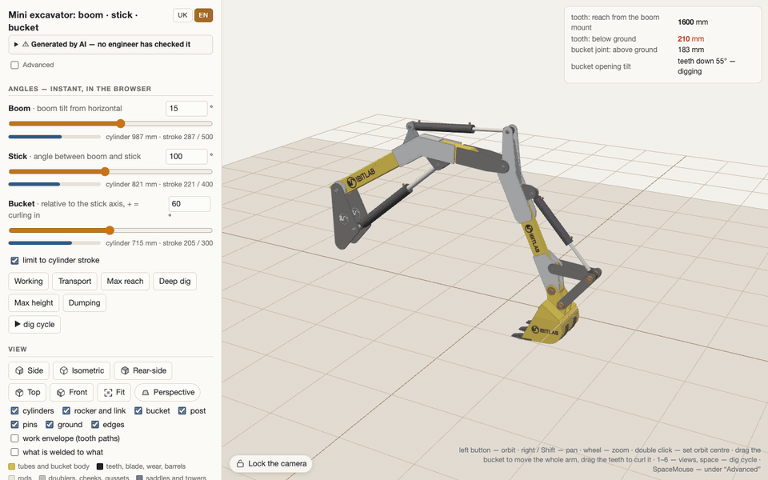
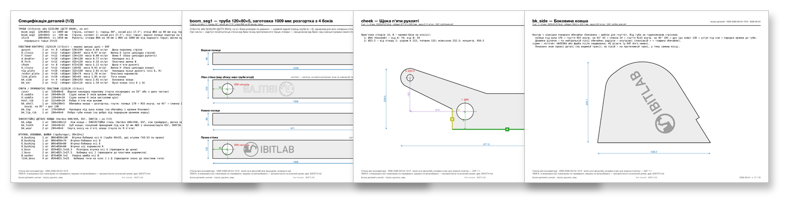
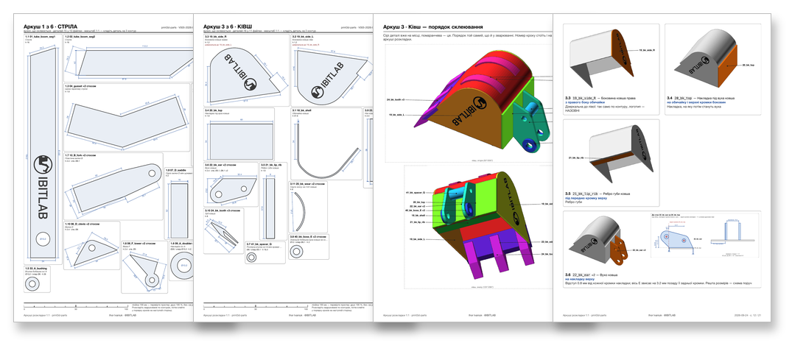
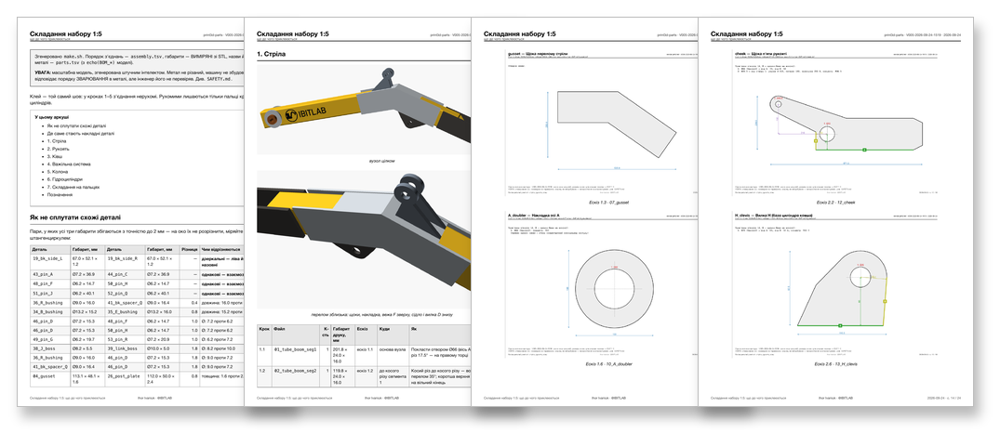

**English** · [Українська](README.uk.md)

<picture>
  <source media="(prefers-color-scheme: dark)" srcset="docs/logo/ibitlab-logo-dark.svg">
  
</picture>

# Mini excavator boom, stick and bucket — a parametric OpenSCAD model

> ⚠️ **Generated by AI — not checked by an engineer, never built, never tested.** A mini excavator can maim and kill; everything here is provided as is, at your own risk. The full disclaimer is [below](#disclaimer); the hazards specific to this design are in [SAFETY.md](SAFETY.md). Read both before you cut any metal.

## ▶ [Open the live 3D model](https://ibitlab.github.io/pub-excavator-openscad/)

**[ibitlab.github.io/pub-excavator-openscad](https://ibitlab.github.io/pub-excavator-openscad/)** — nothing to install: OpenSCAD runs inside the page (WebAssembly). Move the boom, stick and bucket or simply drag the bucket with the mouse, switch on the work envelope and the "what is welded to what" colouring, change any parameter of the model — it is rebuilt right in the browser. Works on a phone too.

## Documents (PDF, in Ukrainian)

**[Part sketches in steel](versions/V005-2026-09-24-1519/drawings/parts.pdf)** — the bill of materials, every plate with its hole positions tied to real edges, the tubes unfolded on all four sides; the logo is marked where the decal goes. For cutting: DXF 1:1 in [`dxf/`](versions/V005-2026-09-24-1519/dxf/).

**[1:1 sorting sheets for the 1:5 printed kit](print3d-parts/sheets/SHEETS.pdf)** — every printed part drawn at 1:1 the way it lies on the table: put the part on its outline, and if it fits, that is the one; renders of each sub-assembly with a callout to every file, then gluing step cards.

**[Assembly of the printed kit](print3d-parts/ASSEMBLY.pdf)** — what is glued to what, step by step, with the dimensions of every part and a table of look-alike parts.

> 📘 **All the technical detail is in [TECHNICAL.md](TECHNICAL.md)** — the files and scripts, how to run the model and the 3D pages, the chosen geometry and kinematics, the bucket, sections and steel, the AI review, **what must be checked before cutting metal**, fabrication notes and the next stages. Installing and the core commands: [QUICKSTART.md](QUICKSTART.md).

## What this is

Working equipment (boom + stick + bucket linkage + a **300 mm bucket**) built around **already-purchased** hydraulic cylinders:
boom ГЦ 63.40.500.700 (ШС-30 spherical bearing), stick ЦС50.25.400.600 (ШС-25), bucket ЦС50.25.300.510 (ШС-25).
The arms are made of common hollow sections (ordinary stockist sizes); the reinforcements are doublers, cheeks and saddles in S235JR (Ст3) steel.
The bucket is welded up from real parts (side plates, shell, cutting edge, teeth, ears) and checked for collisions with the stick, the rocker and the link over the full cylinder stroke.

| At a glance | |
|---|---|
| Max digging reach / at ground level | 2.90 m / 2.83 m |
| Max digging depth | 1.72 m |
| Max dumping height | 2.55 m |
| Bucket | 300 mm wide, 16.4 l struck / 21.3 l heaped |
| Force at the tooth (bucket cylinder, 160 bar) | up to 11.8 kN |
| Steel without the cylinders and the column | ≈ 130 kg |

*Computed from the model (version V005) with pin A 650 mm above the ground; the working-range drawing and every number behind it are in [TECHNICAL.md](TECHNICAL.md), section 3.*

## The 1:5 printed kit

Every component can be printed at 1:5 and glued together exactly where it would be welded in steel: 54 files, 76 pieces. The sorting sheets and the assembly guide above are made for it; how the kit is split up and printed is in [print3d-parts/README.md](print3d-parts/README.md).

## Disclaimer

> ## ⚠️ Generated by AI. Use at your own risk
>
> **All of this documentation, the model geometry, the calculations, the drawings and the bill of materials were produced and computed by artificial intelligence.** None of it has been checked or approved by a qualified engineer. The "independent review" in section 4a of [TECHNICAL.md](TECHNICAL.md) was likewise carried out by AI agents, not by human experts.
>
> This is **not engineering documentation**. The calculations are simplified, the inputs are incomplete (some were taken from vendor pages marked "≈"), and nothing has been tested physically — no machine has ever been built from this model.
>
> **A mini excavator is a dangerous machine.** A weld that lets go, a pin that shears, a boom that drops under load, a tip-over, a burst hose, a pinhole jet of hydraulic oil (it injects under the skin and requires immediate surgery) — these maim and kill.
>
> **The author and any contributors accept no liability whatsoever** for the consequences of using this material: for harm to life or health, injury, death, damage to property, direct or indirect losses, or for errors in the calculations, drawings or descriptions. The material is provided "as is", without warranty of any kind, express or implied, including any warranty of fitness for a particular purpose.
>
> **Whatever you do with this material, you do at your own risk and on your own responsibility.** Before cutting metal, have the calculations and drawings checked by a qualified mechanical engineer, have the welding done by a certified welder and the hydraulics by a specialist. Follow your local safety regulations. The machine is not certified and is not intended for sale, for commercial use, or for use on public roads.
>
> 👉 **The specific unfinished points and hazards of this particular design are in [SAFETY.md](SAFETY.md). Read it before you cut anything.**

## Licence

**No licence has been chosen for this project yet**, so what was authored here is "all rights reserved" for the time being. This is deliberate: a licence can be added later, but one that has been granted cannot be withdrawn. The output of OpenSCAD (STL, DXF, sketches, BOM) belongs to the project either way: OpenSCAD's own GPL does not reach its output, and this model includes no external SCAD library.

Separately: the `tools/viewer-wasm/dist/` build **embeds OpenSCAD itself under GPL-2.0** ([tools/viewer-wasm/LICENSE](tools/viewer-wasm/LICENSE)). The engine comes from `openscad-wasm-prebuilt@1.2.0`, which ships the GPL text and names its source, so the terms can be met: when you publish `dist/`, put `tools/viewer-wasm/LICENSE` and [THIRD-PARTY.md](THIRD-PARTY.md) next to it — that file lists every third-party component and points at the engine sources.
