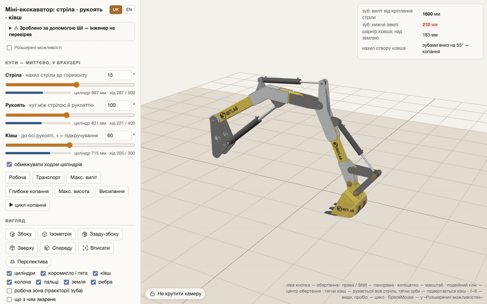

[English](README.md) · **Українська**

<picture>
  <source media="(prefers-color-scheme: dark)" srcset="docs/logo/ibitlab-logo-dark.svg">
  
</picture>

# Стріла, рукоять і ківш міні-екскаватора — параметрична модель OpenSCAD

> ⚠️ **Згенеровано ШІ — інженер не перевіряв, машину не збудовано й не випробувано.** Міні-екскаватор калічить і вбиває; усе тут надано як є, на ваш власний ризик. Повне застереження — [нижче](#застереження), небезпеки саме цієї конструкції — у [SAFETY.uk.md](SAFETY.uk.md). Прочитайте обидва, перш ніж різати метал.

## ▶ [Відкрити живу 3D-модель](https://ibitlab.github.io/pub-excavator-openscad/?lang=uk)

**[ibitlab.github.io/pub-excavator-openscad](https://ibitlab.github.io/pub-excavator-openscad/?lang=uk)** — нічого встановлювати не треба: OpenSCAD працює просто в сторінці (WebAssembly). Рухайте стрілу, рукоять і ківш або просто тягніть ківш мишею, вмикайте робочу зону й розфарбовку «що з чим зварене», змінюйте будь-який параметр моделі — вона перебудовується прямо в браузері. Працює й на телефоні.

## Документи (PDF)

**[Ескізи деталей у металі](versions/V005-2026-09-24-1519/drawings/parts.pdf)** — специфікація, кожна пластина з прив'язками отворів до реальних кромок, розгортки труб з чотирьох боків; логотип позначено там, де наліпка. Для різання — DXF 1:1 у [`dxf/`](versions/V005-2026-09-24-1519/dxf/).

**[Аркуші розкладки 1:1 для друкованого набору 1:5](print3d-parts/sheets/SHEETS.pdf)** — кожна надрукована деталь у масштабі 1:1 так, як лежить на столі: поклали на контур — збіглася, значить вона; рендери кожного вузла з виноскою до кожного файлу, далі картки кроків склеювання.

**[Складання друкованого набору](print3d-parts/ASSEMBLY.pdf)** — що до чого приклеюється, крок за кроком, з розмірами кожної деталі й таблицею схожих деталей.

> 📘 **Усі технічні деталі — у [TECHNICAL.uk.md](TECHNICAL.uk.md)**: файли й скрипти, як запускати модель і 3D-сторінки, обрана геометрія й кінематика, ківш, профілі й сталь, ШІ-рев'ю, **що обов'язково перевірити перед різанням металу**, технологія і наступні етапи. Встановлення й основні команди — [QUICKSTART.uk.md](QUICKSTART.uk.md).

## Що це

Робоче обладнання (стріла + рукоять + важільна система ковша + **ківш 300 мм**) під **уже закуплені** гідроциліндри:
стріла ГЦ 63.40.500.700 (ШС-30), рукоять ЦС50.25.400.600 (ШС-25), ківш ЦС50.25.300.510 (ШС-25).
Корпуси плеч — профільна труба популярних розмірів (звичайний сортамент металобаз), підсилення — накладки/щоки/сідла зі сталі S235JR (Ст3).
Ківш — зварний, з реальних деталей (боковини, обичайка, ніж, зуби, вуха), перевірений на зіткнення з рукояттю, коромислом і тягою на всьому ході циліндра.

| Коротко | |
|---|---|
| Макс. виліт копання / на рівні землі | 2.90 м / 2.83 м |
| Макс. глибина копання | 1.72 м |
| Макс. висота вивантаження | 2.55 м |
| Ківш | 300 мм, 16.4 л врівень / 21.3 л з «шапкою» |
| Зусилля на зубі (циліндр ковша, 160 бар) | до 11.8 кН |
| Метал без циліндрів і колони | ≈ 130 кг |

*Пораховано з моделі (версія V005) за умови, що вісь A на 650 мм над землею; креслення робочої зони й усі числа за ним — у [TECHNICAL.uk.md](TECHNICAL.uk.md), розділ 3.*

## Друкований набір 1:5

Кожен компонент можна надрукувати в масштабі 1:5 і склеїти там, де в металі був би шов: 54 файли, 76 штук. Для нього й зроблено аркуші розкладки та інструкцію складання вище; як набір поділено й друкується — [print3d-parts/README.md](print3d-parts/README.md).

## Застереження

> ## ⚠️ Згенеровано штучним інтелектом. Використання — на власний ризик
>
> **Уся ця документація, геометрія моделі, розрахунки, креслення й специфікації створені та прораховані штучним інтелектом.** Їх не перевіряв і не затверджував кваліфікований інженер. «Незалежна перевірка» в розділі 4а [TECHNICAL.uk.md](TECHNICAL.uk.md) — теж робота ШІ-агентів, а не людей-фахівців.
>
> Це **не проєктна документація**. Розрахунки спрощені, вихідні дані неповні (частину взято з сайтів постачальників із позначкою «≈»), фізичних випробувань не було — машину за цією моделлю ніхто не будував і не випробовував.
>
> **Міні-екскаватор — небезпечна машина.** Обрив зварного шва, зріз пальця, падіння стріли під навантаженням, перекидання, розрив шланга, струмінь оливи під тиском (проникає під шкіру і потребує негайної операції) — усе це калічить і вбиває.
>
> **Автор і будь-які співавтори не несуть жодної відповідальності** за наслідки використання цих матеріалів: за шкоду життю та здоров'ю, травми, смерть, пошкодження майна, прямі чи непрямі збитки, за помилки в розрахунках, кресленнях чи описах. Матеріали надаються «як є», без жодних гарантій — явних або неявних, зокрема без гарантії придатності для будь-якої мети.
>
> **Усе, що ви робите з цими матеріалами, — на ваш власний ризик і під вашу власну відповідальність.** Перед різанням металу віддайте розрахунки й креслення на перевірку кваліфікованому інженеру-механіку, зварювання доручіть атестованому зварнику, гідравліку — профільному фахівцю. Дотримуйтесь місцевих норм безпеки. Машина не сертифікована і не призначена для продажу, комерційного використання чи виїзду на дороги загального користування.
>
> 👉 **Конкретні недоробки й небезпеки саме цієї конструкції — у [SAFETY.uk.md](SAFETY.uk.md). Прочитайте це до того, як щось різати.**

## Ліцензія

**Власну ліцензію проєкт поки не обрав**, тож створене тут наразі лишається «всі права збережено». Це свідомо: ліцензію можна додати пізніше, а видану вже не відкликати. Вихід OpenSCAD (STL, DXF, ескізи, специфікація) належить проєкту в будь-якому разі: GPL самого OpenSCAD на результат не поширюється, а модель не підключає жодної зовнішньої SCAD-бібліотеки.

Окремо: збірка `tools/viewer-wasm/dist/` **вшиває сам OpenSCAD під GPL-2.0** ([tools/viewer-wasm/LICENSE](tools/viewer-wasm/LICENSE)). Рушій береться з `openscad-wasm-prebuilt@1.2.0`, який містить текст GPL і вказує вихідні коди, тож умови виконати можна: публікуючи `dist/`, клади поруч `tools/viewer-wasm/LICENSE` і [THIRD-PARTY.md](THIRD-PARTY.md) — там перелік усіх сторонніх складників і посилання на джерела рушія.
