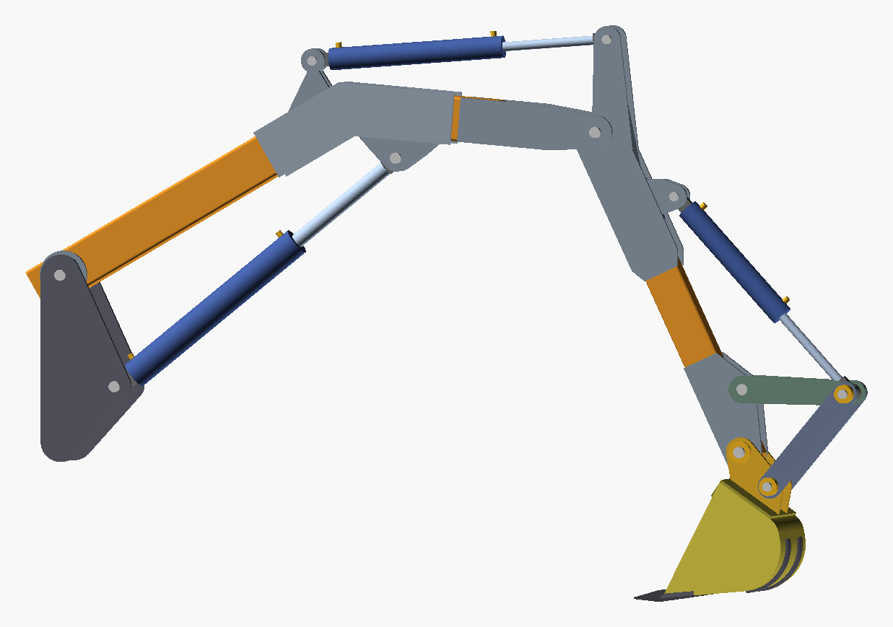
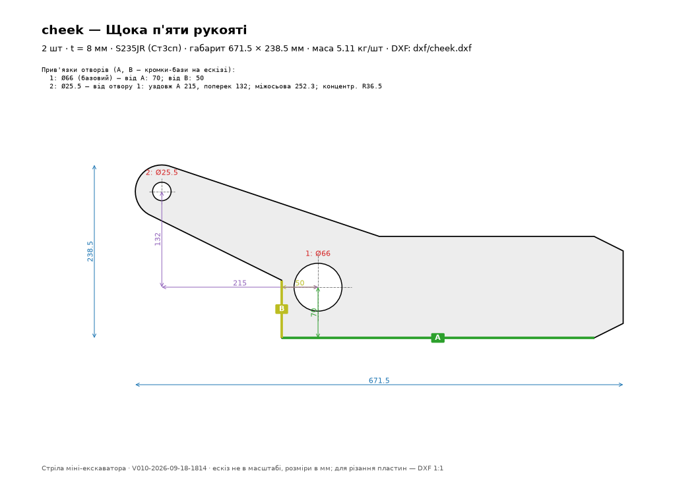
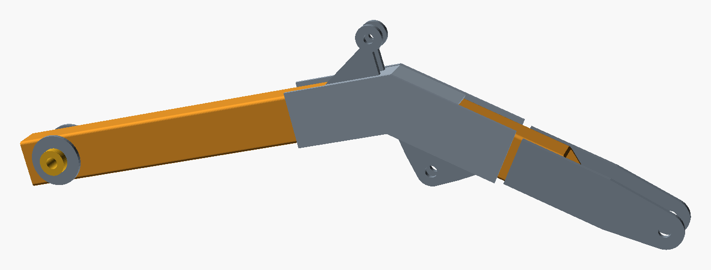
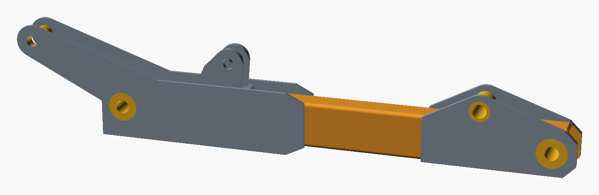
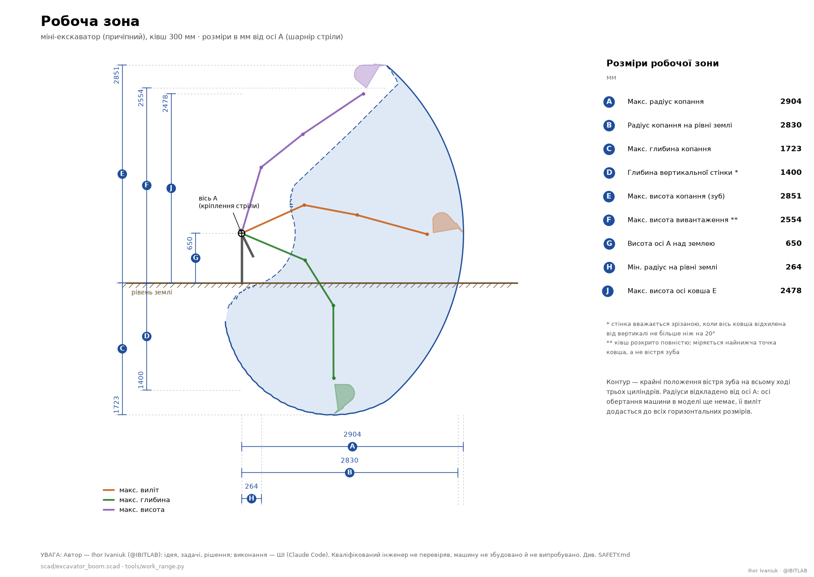
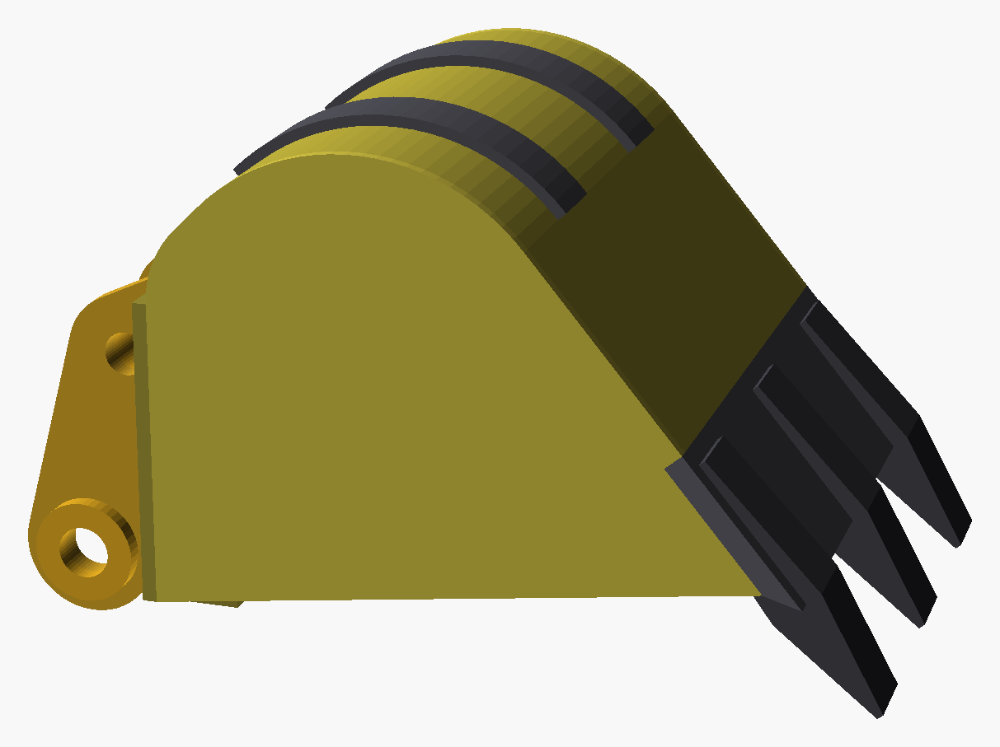
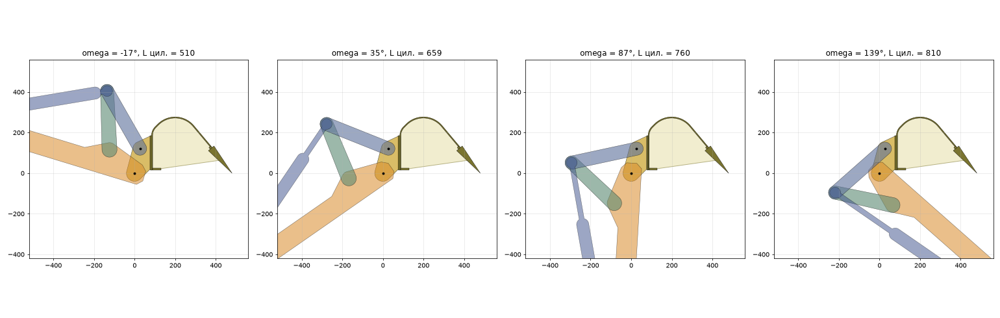

[English](README.md) · **Українська**

# Стріла, рукоять і ківш міні-екскаватора — параметрична модель OpenSCAD

> ## ⚠️ Згенеровано штучним інтелектом. Використання — на власний ризик
>
> **Уся ця документація, геометрія моделі, розрахунки, креслення й специфікації створені та прораховані штучним інтелектом.** Їх не перевіряв і не затверджував кваліфікований інженер. «Незалежна перевірка» в розділі 4а — теж робота ШІ-агентів, а не людей-фахівців.
>
> Це **не проєктна документація**. Розрахунки спрощені, вихідні дані неповні (частину взято з сайтів постачальників із позначкою «≈»), фізичних випробувань не було — машину за цією моделлю ніхто не будував і не випробовував.
>
> **Міні-екскаватор — небезпечна машина.** Обрив зварного шва, зріз пальця, падіння стріли під навантаженням, перекидання, розрив шланга, струмінь оливи під тиском (проникає під шкіру і потребує негайної операції) — усе це калічить і вбиває.
>
> **Автор і будь-які співавтори не несуть жодної відповідальності** за наслідки використання цих матеріалів: за шкоду життю та здоров'ю, травми, смерть, пошкодження майна, прямі чи непрямі збитки, за помилки в розрахунках, кресленнях чи описах. Матеріали надаються «як є», без жодних гарантій — явних або неявних, зокрема без гарантії придатності для будь-якої мети.
>
> **Усе, що ви робите з цими матеріалами, — на ваш власний ризик і під вашу власну відповідальність.** Перед різанням металу віддайте розрахунки й креслення на перевірку кваліфікованому інженеру-механіку, зварювання доручіть атестованому зварнику, гідравліку — профільному фахівцю. Дотримуйтесь місцевих норм безпеки. Машина не сертифікована і не призначена для продажу, комерційного використання чи виїзду на дороги загального користування.
>
> 👉 **Конкретні недоробки й небезпеки саме цієї конструкції — у [SAFETY.uk.md](SAFETY.uk.md). Прочитайте це до того, як щось різати.**

Робоче обладнання (стріла + рукоять + важільна система ковша + **ківш 300 мм**) під **уже закуплені** гідроциліндри:
стріла ГЦ 63.40.500.700 (ШС-30), рукоять ЦС50.25.400.600 (ШС-25), ківш ЦС50.25.300.510 (ШС-25).
Корпуси плеч — профільна труба популярних розмірів (звичайний сортамент металобаз), підсилення — накладки/щоки/сідла зі сталі S235JR (Ст3).
Ківш — зварний, з реальних деталей (боковини, обичайка, ніж, зуби, вуха), перевірений на зіткнення з рукояттю, коромислом і тягою на всьому ході циліндра.

**Швидкий старт (залежності й основні команди): [QUICKSTART.uk.md](QUICKSTART.uk.md).**



## 1. Файли

| Файл | Призначення |
|---|---|
| `scad/excavator_boom.scad` | **Основна модель.** Усі параметри — на початку файлу (групи Customizer). Кути — первинні параметри; діапазони кутів обчислюються з довжин циліндрів і виводяться через `echo()`. |
| `tools/kinematics.py` | Незалежний розв'язувач тієї ж геометрії: перевірка діапазонів, плечі моментів, зусилля на зубі, робоча зона; `--search` — підбір положень кріплень. |
| `tools/work_range.py` | **Креслення робочої зони** з розмірами A…J (як у каталогах екскаваторів): контур будується перебором усього ходу трьох циліндрів, силует ковша береться з `tools/bucket.py`. Обидві мови: `--lang uk\|en`. |
| `views.json` → `tools/views.py` | **Ракурси, збережені в 3D-сторінці**: камера, кути, змінені параметри, видимість. `list` / `flags` / `render НАЗВА` / `check` (звірка з реальним знімком сторінки). Так ракурс, знайдений очима, стає відтворюваним рендером. |
| `tools/strength.py` | Статика ланок + опір матеріалів: епюри N/V/M, перевірка труб і накладок, пальців, втулок, швів; порівняння профілів (`--boom 120x80x5 --stick 100x60x5`). |
| `tools/bucket.py` | **Ківш**: Python-двійник профілю ковша — місткість (врівень / з «шапкою»), маса, кути утримання й висипання, 2D-перевірка зазорів рухомих пар на всьому ході, міцність вух, пальців E/Q і швів. Запуск: `tools/.venv/bin/python tools/bucket.py [--png файл]`. |
| `docs/01-design-inputs.md` | **Джерело, пишеться вручну.** Вихідні дані: циліндри, ШС, пальці/втулки, наявний сортамент металу, гідравліка, орієнтири класу, норми. |
| `docs/research/` | Сирі виписки дослідження з посиланнями на джерела. |
| `docs/img/` | Картинки для цього README; їх оновлює `build_version.sh` з останньої версії. |
| `versions/VNNN-дата-час/` | **Зібрані версії — усе згенероване живе тільки тут**: `stl/`, `renders/`, `docs/` (`02-kinematics.md`, `03-strength.md`, `04-bom.md`, діапазони, перевірка перетинів), `bom/`, `dxf/`, `drawings/`, `scad/` (знімок моделі та скриптів), `VERSION.md`. Актуальна — тека з найбільшим номером. |
| `tools/build_version.sh` | **Скрипт збирання версії**: перевірка перетинів → перевірка рухомих пар → STL усіх деталей → рендери → звіти → `VERSION.md`. Номер версії зростає автоматично. |
| `tools/bom_drawings.sh` | **BOM + креслення**: специфікація (`bom.md`, `bom.csv`), контури всіх пластин у DXF 1:1 для різання, PDF-ескізи з основними розмірами (`drawings/parts.pdf` + PNG-сторінки). Дані беруться з echo моделі та проєкції кожної пластини — окремого списку розмірів немає. Перший запуск створює `tools/.venv` з matplotlib. |
| `tools/viewer.sh` → `tools/viewer.py`, `tools/viewer/index.html` | **Інтерактивна 3D-сторінка в браузері**: обертання / панорама / масштаб, кути змінюються миттєво, будь-який інший параметр моделі перебудовується через OpenSCAD за ≈ 0.4 с. Див. розділ 2. |
| `tools/viewer-wasm.sh` → `tools/viewer-wasm/` (`package.json`, Vite) | **Друга версія 3D-сторінки — без бекенду**: OpenSCAD-WASM у веб-воркері рендерить модель прямо в браузері; збирається у статичний сайт `dist/`. Див. розділ 2. |
| `tools/media/` | Знімки сторінки в headless Chrome (`page_shot.mjs`), колажі (`compose.py`) і повний набір зображень та відео для публікацій (`make_media.sh` → `temp/media/`, не комітиться). |
| `tools/check_overlaps.sh` | Перевірка, що вузли зварної конструкції прилягають, але не перекриваються (об'єм перетину кожної пари вузлів = 0). |
| `tools/check_motion.sh` | Перевірка **рухомих** пар у 3D на всьому ході циліндрів: ківш ↔ рукоять/коромисло/тяга/циліндр, тяга ↔ коромисло, корпуси всіх трьох циліндрів ↔ свої кронштейни, рукоять ↔ стріла; довідково — ківш ↔ стріла у складеній позі. |
| `tools/stl_volume.py` | Об'єм STL (см³), потрібен для перевірки перетинів. |
| `tools/agent_analytics.py` | Аналітика агентної роботи за журналами Claude Code (токени, хвилини, ролі). |
| `tools/git-hooks/pre-commit` | Git-хук: перед комітом змін у `scad/` перевіряє перекриття пластин. Увімкнути один раз: `git config core.hooksPath tools/git-hooks`. |
| `CLAUDE.md` | Правила проєкту для Claude Code (мова, коміти, де що лежить). |
| `.claude/skills/` | Skills проєкту: `scad-mechanism` (правила моделі й чеклист), `new-assembly` (рецепт нового вузла), `build-version`, `part-drawings`, `browser-verify` (перевірка сторінок у headless Chrome), `media-kit` (матеріали для публікацій), `design-review`, `research-sweep`, `agent-analytics`. Усе локально в репозиторії, у `~/.claude` нічого не ставиться. |
| `.claude/workflows/` | Збережені багатоагентні workflow: `design-review` (рецензенти + спростування) і `research-sweep` (дослідники + критик). Кожен агент одразу пише результат у `docs/reviews/…` або `docs/research/…`, щоб нічого не губилось при збої ліміту. |

Перевірка збігу двох незалежних реалізацій (OpenSCAD ↔ Python): діапазони кутів збігаються з точністю 0.1°, гілка важільної системи ковша — 0.000 мм.

## 2. Як користуватися моделлю

Відкрити `scad/excavator_boom.scad` в OpenSCAD (≥ 2021.01; перевірено на 2026.09). У Customizer (Window → Customizer) перша група:

| Параметр | Значення за замовчуванням | Діапазон (обчислений) | Зміст |
|---|---|---|---|
| `boom_angle` | 15° | **−38.1° … +58.3°** | кут хорди стріли (вісь A → вісь B) до горизонту, + вгору |
| `stick_angle` | 100° | **50.7° … 155.6°** | внутрішній кут стріла–рукоять у шарнірі B (складено … розкрито) |
| `bucket_angle` | 60° | **−17.0° … +138.5°** | кут ковша відносно осі рукояті, + = підкручування |
| `clamp_to_cylinders` | true | | обмежувати кути можливостями циліндрів (інакше — червоний циліндр + попередження) |

Консоль (`echo`) показує: діапазони, поточні довжини циліндрів і плечі моментів, координати зуба. Далі йдуть групи: циліндри (зведена довжина, хід, гільза/шток, палець), стріла, рукоять, важільна система ковша, пальці/втулки/пластини, відображення (`show_envelope` — робоча зона точками).

Командний рядок:
```
openscad -o out.png --viewall --autocenter -D boom_angle=-38 -D stick_angle=90 -D bucket_angle=60 scad/excavator_boom.scad
openscad -o out.echo scad/excavator_boom.scad        # лише echo з діапазонами
cd tools && python3 kinematics.py && python3 strength.py --boom 120x80x5 --stick 100x60x5
```

### Інтерактивна 3D-сторінка (Step 2.0)

```
tools/viewer.sh                                   # відкриває http://127.0.0.1:8765/ у браузері (Ctrl+C — зупинити)
python3 tools/viewer.py --export файл.html        # статична сторінка без сервера (є в кожній версії: versions/VNNN-…/viewer.html)
```

- **Миша**: ліва кнопка — обертання, права або Shift — панорама, коліщатко — масштаб до курсора, подвійний клік по деталі — новий центр обертання. Кнопки виглядів (збоку, ізометрія, зверху, спереду, вписати) і перемикач перспектива / ортогонально.
- **Кути стріли, рукояті, ковша** рухають модель миттєво: позу складає сама сторінка за тими самими формулами, що й функції `pt_*()` моделі, з точок, які модель друкує в `echo(VIEW = …)` (звірено з echo моделі: положення зуба і довжини циліндрів збігаються до 0.1 мм). Межі повзунків — з ходу циліндрів; біля кожного кута видно довжину циліндра і використаний хід. Якщо зняти «обмежувати ходом циліндрів», циліндр поза ходом червоніє. Є готові пози і «цикл копання».
- **Усі інші параметри** (групи Customizer читаються прямо з `.scad` — окремого списку немає) ідуть на локальний сервер: він запускає OpenSCAD паралельно для 12 деталей у власних системах координат і віддає сітки з кольорами (формат OFF). Змінені параметри підсвічуються; «Копіювати зміни» дає готові рядки для вставки в `.scad`; «Перечитати модель» підхоплює правки файлу. Попередження моделі (`!!!` — мертва точка важелів, недосяжна довжина циліндра) показуються на екрані.
- Сервер слухає лише 127.0.0.1; значення з браузера приводяться до типів зі схеми (числа, булеві, переліки), довільний текст в OpenSCAD не потрапляє. three.js завантажується з CDN (jsdelivr) — потрібен інтернет.

### 3D-сторінка без бекенду: OpenSCAD-WASM у браузері (Step 2.1)

```
cd tools/viewer-wasm && npm install      # залежності: three, openscad-wasm-prebuilt (OpenSCAD 2025.01 + Manifold, 11 МБ), vite
npm run dev                              # http://localhost:8766/ — правка scad/excavator_boom.scad одразу перезавантажує сторінку
npm run build                            # статичний сайт у dist/ (≈12 МБ): класти на будь-який статичний хостинг
npm run preview                          # переглянути зібраний dist/ локально
npm test                                 # димовий тест без браузера
# те саме однією командою з кореня: tools/viewer-wasm.sh [build|preview|phone|test]
# phone — зібрати й відкрити доступ із телефона в тій же Wi-Fi (Vite інакше слухає лише 127.0.0.1)
```

- Та сама сторінка й те саме керування, що у версії з сервером (вона лишилась: `tools/viewer.sh`), але **OpenSCAD працює у веб-воркері браузера**; Python і встановлений OpenSCAD не потрібні. Модель вшивається у сторінку під час збирання (`?raw`-імпорт), параметри Customizer розбирає JavaScript (`src/schema.js`).
- Один запуск рушія на зміну параметра: модель у режимі `part="view_all"` кладе всі 12 деталей зі зсувом по Y, сторінка розрізає сітку назад (`src/offmesh.js`). Виміряно у Chrome: перший старт ≈ 5 с (завантаження рушія), **перебудова після зміни параметра ≈ 2.2 с**; кути, як і раніше, миттєві. Для порівняння: версія з сервером перебудовує за ≈ 0.4 с.
- **Дві мови: українська та англійська.** Перемикач `UK | EN` у шапці панелі; мова береться з `?lang=en` в адресі, далі з пам'яті браузера, далі з мови самого браузера. Переключення лише перемальовує підписи — OpenSCAD не перезапускається, кути, прапорці й змінені параметри лишаються на місці. Перекладено і назви груп та описи всіх 103 параметрів моделі: англійські тексти лежать у `src/i18n.js`, українські беруться прямо з коментарів `.scad`, тож модель лишається єдиним джерелом правди. `npm test` перевіряє, що словник не розійшовся з моделлю (кожна група і кожен описаний параметр мають переклад) і що обидві мови мають однакові ключі. Попередження, які друкує сама модель (`!!!`), лишаються українською — вони приходять з `echo()` у `.scad`. Сторінка з сервером (`tools/viewer.sh`) — лише українська.
- **З адреси сторінка читає лише мову** (`?lang=en`). Початкові значення параметрів колись задавалися там само — прибрано навмисно: це був єдиний шлях, яким значення з чужого посилання потрапляло у текст моделі OpenSCAD. Модель вшивається у сторінку під час збирання, і **відкрити в ній чужий `.scad` теж не можна** — це прибрано навмисно: текст такого файлу став би назвами груп, описами й попередженнями в панелі, тобто чужими даними в сторінці, яка живе на спільному домені GitHub Pages.
- **На телефоні й планшеті панель — шухляда знизу**, у трьох станах: згорнута (тільки смужка-ручка з вильотом і висотою зуба — модель на 93 % екрана), робоча (три повзунки кутів і готові пози) і повна (ще й ракурси з прапорцями видимості). Тягнеться пальцем за ручку, дотик по ручці згортає й розгортає. Розкладку вмикає не лише ширина, а й `pointer: coarse`: телефон, повернутий набік (844 px), і планшет у портреті (768 px) інакше діставали б бічну колонку на пів екрана. Параметри моделі, пристрої та ракурси для рендерів на дотикових пристроях сховані — з телефона їх не міняють. Попередження про ШІ там живе під значком ⚠ у ручці, поруч із кнопкою згортання й перемикачем мови, і розкривається карткою поверх моделі. Ручка «липне» до верху панелі, тож згорнути й розгорнути можна з будь-якого місця прокрутки — і позиція прокрутки при цьому зберігається. Унизу панелі — нотатка про те, чого на телефоні немає.
- **Знімок кадру.** Кнопка «⤓ Зберегти PNG» у розділі «Вигляд» віддає поточний кадр разом зі смугою підпису: виліт зуба, глибина чи висота над землею, кути стріли, рукояті й ковша, нахил отвору. Знімок екрана цього не дає — він тягне за собою всю панель, а числа лишаються дрібними. На телефоні кнопка викликає системне «Поділитися», тож картинку можна одразу покласти у фото або надіслати.
- **Легенда кольорів** під прапорцями видимості: труби, пластини й накладки, гідроциліндри, ківш, втулки з пальцями. Кольори взято не зі стелі, а з самих викликів `color(...)` у моделі, і `npm test` перевіряє, що вони не розійшлися.
- **Смужка завантаження рушія.** 11 МБ їхали мовчки, і на повільному каналі це виглядало як зависання. Тепер сторінка тягне файл сама, потоково, і показує «4.2 / 11 МБ» — рівно один раз, без подвійного завантаження. Глибина зуба нижче землі в HUD виділена кольором: це головне число сторінки.
- **Клавіші (лише з клавіатурою):** `1`–`6` — готові види, пробіл — цикл копання. На дотикових пристроях не вішаються зовсім.
- **Публікація на GitHub Pages**: `.github/workflows/pages.yml` збирає сторінку й викладає її при кожному push у `main` (увімкнути один раз: Settings → Pages → Source: GitHub Actions). Перед збиранням workflow ганяє `npm test`, щоб зламана модель не потрапила на сайт, і кладе поруч `LICENSE` та `THIRD-PARTY.md` — цього вимагає GPL, бо сторінка вшиває сам OpenSCAD. Ті самі посилання є внизу панелі сторінки.
- `dist/` не відкривається подвійним кліком (`file://` не дозволяє модульні воркери) — потрібен будь-який статичний веб-сервер (`npm run preview`, GitHub Pages тощо). `node_modules/` і `dist/` у git не потрапляють.
- Рушій у браузері старіший (2025.01) за настільний OpenSCAD (2026.09). `npm test` перевіряє, що він будує модель без попереджень, усі деталі непорожні, поза з JavaScript збігається з echo моделі, а блок складання пози однаковий в обох версіях сторінки.

### 3Dconnexion SpaceMouse у браузері (Step 2.2)

Обидві сторінки (з сервером і WASM) керуються 3D-мишею без плагінів; блок коду однаковий в обох (`//<spacemouse>`).

| Браузер | Шлях | Що зробити |
|---|---|---|
| **Chrome / Edge / Opera** | WebHID — сторінка сама читає звіти миші | «Вигляд» → кнопка **SpaceMouse** → у вікні браузера «…хоче підключитися до HID-пристрою» вибрати мишу (або «3Dconnexion Universal Receiver») → «Підключити». Вікно з'являється лише після кліку — це вимога браузера. Дозвіл видається **окремо на кожну адресу** (`127.0.0.1:8765`, `localhost:8766`, `localhost:8767` — три різні) і діє, доки миша ввімкнена і браузер відкритий; якщо миша повідомляє серійний номер, Chrome пам'ятає дозвіл назавжди і сторінка підхоплює мишу сама (також після повторного вмикання в USB). Якщо ні — після перезапуску браузера кнопку треба натиснути ще раз. Відкликати: значок ліворуч від адреси → «Налаштування сайту» → HID-пристрої. Потрібен захищений контекст: https, `localhost` або `file://` (перевірено: Chrome відкриває WebHID і для статичного `viewer.html` з диска). |
| **Firefox** | Gamepad API (WebHID у Firefox немає) — миша видна як 6-осьовий «геймпад» | Нічого натискати не треба: **порухайте ковпачок або натисніть кнопку миші**, коли вкладка у фокусі, — статус зміниться на «підключено (Gamepad API)». Перевірити, чи Firefox бачить мишу: `about:support` → або будь-який «gamepad tester». Цей самий шлях працює і в Chrome як запасний. |
| Safari | — | немає ні WebHID, ні доступу до 3D-миші через Gamepad API |

- **Керування** (режим «об'єкт у руці»): ковпачок праворуч/ліворуч і вгору/вниз — зсув; до себе / від себе — масштаб; скрут — обертання довкола вертикалі; нахил до себе / від себе — підйом камери. Кнопка 1 — «Вписати», кнопка 2 — наступний стандартний вигляд. Повзунок чутливості та три прапорці інверсії (зсув / масштаб / обертання) зберігаються в браузері. Крен (нахил убік) свідомо не використовується: вертикаль моделі лишається вертикаллю.
- **macOS:** якщо встановлено драйвер 3Dconnexion, `3DconnexionHelper` відкриває мишу монопольно (у `ioreg` клієнт Chrome має `ClientSeized = Yes`), тому кнопка SpaceMouse дає «Failed to open the device». Рішення: `tools/spacemouse-driver.sh off` → натиснути кнопку ще раз → у вікні вибрати саме **свою мишу** (рядки «3Dconnexion Virtual Mouse / Virtual Data» — віртуальні пристрої драйвера, не вони). Повернути драйвер для CAD-програм: `tools/spacemouse-driver.sh on` (після входу в систему він стартує сам). **Автоматично:** `tools/with-spacemouse.sh <команда>` вимикає помічник перед стартом і вмикає його знову, щойно команда завершиться з будь-якої причини (Ctrl+C, закриття термінала, помилка) — `tools/with-spacemouse.sh tools/viewer.sh`, а для WASM-сторінки `npm run dev:sm` / `npm run preview:sm`. Якщо помічник до старту не працював, він і не запускається. Звичайні `npm run dev` / `preview` драйвер не чіпають.
- **Драйвер 3DxWare** може заважати: на Windows/macOS він сам шле у вікно браузера прокрутку й клавіші (рух «двоїться») або тримає пристрій. Якщо так — у 3Dconnexion Home вимкніть мишу для браузера або закрийте драйвер на час роботи зі сторінкою. Для Firefox на Windows/macOS драйвер зазвичай **треба** закрити, інакше «геймпад» не з'явиться.
- **Linux**: для Chrome/WebHID потрібне право на `/dev/hidraw*` — правило udev `SUBSYSTEM=="hidraw", ATTRS{idVendor}=="256f", MODE="0660", TAG+="uaccess"`; Firefox бере мишу через `/dev/input/js*` без налаштувань (spacenavd не потрібен і має бути вимкнений, якщо захоплює пристрій).
- **Що перевірено**: логіка навігації — автоматично в headless Chrome з підставними пристроями обох типів (`tools/viewer-wasm/test/spacemouse.mjs`: звіти 1/2/3, 12-байтний звіт нових моделей, кнопки, Gamepad API). **Зі справжньою мишею не перевірялося** (її не було під час розробки): якщо якась вісь їде не туди — увімкніть відповідну інверсію; якщо миша взагалі не реагує у Chrome — відкрийте `chrome://device-log` і подивіться, чи приходять звіти HID.
- Офіційний шлях 3Dconnexion (SDK «3DxWare for Web», WebSocket до драйвера — так працює Onshape) тут не використано: він вимагає встановленого драйвера і ліцензійного SDK, зате працює однаково в усіх браузерах. Якщо WebHID/Gamepad не влаштують — це наступний варіант.

### Версії, STL і рендери

```
tools/build_version.sh "що змінено"            # одна команда: нова версія versions/VNNN-дата-час/ (≈1.5 хв)
tools/build_version.sh --commit "що змінено"   # те саме + git add -A і коміт "VNNN: що змінено"
tools/check_overlaps.sh                  # лише перевірка перетинів пластин
tools/check_motion.sh                    # лише перевірка рухомих пар на зіткнення (≈40 с)
openscad -o boom_gussets.stl --export-format binstl -D 'part="boom_gussets"' scad/excavator_boom.scad
```

Параметр `part` (перша група Customizer) обирає, що показувати/експортувати: `assembly`, зварні вузли `boom`, `stick`, групи деталей
`boom_tubes`, `boom_gussets`, `boom_bracket_D`, `boom_bracket_F`, `boom_foot_boss`, `boom_fork_B`, `stick_tube`, `stick_cheeks`, `stick_bracket_H`, `stick_tip`,
ківш `bucket` і його вузли `bucket_sides`, `bucket_shell`, `bucket_top`, `bucket_edge`, `bucket_ears`, `bucket_wear` (у системі ковша: вісь E = 0, x — до вістря зуба), а також `rocker`, `link`, `post` (схематична колона). Вузли стріли експортуються у системі стріли (вісь A = 0, хорда вздовж +X),
вузли рукояті — у системі рукояті (вісь B = 0, вісь рукояті вздовж +X); решта — у позі за замовчуванням.

**Правило моделі:** деталі прилягають одна до одної (спільна грань = зварний шов), але не перекриваються: сідла D/H лежать між виступами щік,
вилки стоять на сідлах, «вежа» F — на верхній накладці перелому, втулки проходять крізь отвори в трубах і щоках, вилка B — врівень зі стінками труби
(проміжок 80 = пакет рукояті 76 + дві упорні шайби по 2 мм). `part="overlap"` з `ov_a`/`ov_b` показує перетин двох вузлів; скрипт перевіряє всі пари.

**Обмеження поточного етапу:**
- STL зроблено на групу деталей: наприклад, обидві щоки перелому з накладкою йдуть одним файлом. Окремі пластини для різання — у `dxf/` (1:1) та `drawings/parts.pdf` (ескізи), їх генерує `tools/bom_drawings.sh`.
- На ескізах лише основні розміри: габарит, діаметри отворів і їхні прив'язки. Базовий (найбільший) отвір прив'язано до реальних кромок деталі: база A — найдовша пряма кромка, база B — найближча перпендикулярна кромка (якщо її немає — відстань уздовж A від її кінця). Інші отвори прив'язано до базового вздовж і поперек бази A; окремо позначено отвори, концентричні заокругленню контуру. Фаски, розділки під зварювання, допуски отворів (H8 під пальці, H7 під втулки) і шорсткість не проставлені — отвори під пальці та втулки остаточно розгортати в зборі.
- Прилягання пластин перевірено лише візуально на рендерах вузлів; числово перевіряються тільки перекриття (`tools/check_overlaps.sh`).
- Рухомі пари перевіряються у дискретних положеннях (13 кутів ковша, 12 — рукояті, 8 — стріли), не безперервно; поворотна колона схематична і в перевірку не входить.

### BOM і креслення деталей (Step x.5)

```
tools/bom_drawings.sh                 # → build/bom/bom.md, bom.csv · build/dxf/*.dxf · build/drawings/parts.pdf
tools/build_version.sh "опис"         # те саме всередині нової версії versions/VNNN-…/
```

Варіанти видачі креслень і що обрано: **DXF 1:1** — основний формат для лазерного/плазмового різання (сервіс бере файл як є); **PDF-ескіз** — для гаража: пластини з прив'язками отворів до кромок-баз, труби — розгорткою з 4 боків (верхня/нижня полиці, ліва/права стінки: косі різи, скіс торця, отвори від торця), товщина, кількість, маса; **CSV** — для замовлення металу й обліку. Свідомо не роблено: повні креслення за ЄСКД з допусками (це вже FreeCAD TechDraw / KOMPAS за STEP-моделлю), розкрій листа (nesting — його роблять у сервісі різання за DXF), STEP-експорт (OpenSCAD його не вміє; за потреби — через FreeCAD з CSG).






## 3. Обрана геометрія (мм) і чому

| Елемент | Значення | Обґрунтування |
|---|---|---|
| Стріла: сегменти L1 / L2, перелом | **900 / 700, 35°** → хорда A–B **1527** | Орієнтир класу 1 т: Bobcat E10 1276, з поправкою на довші ходи наших циліндрів; коротша стріла = менший момент і краща стійкість причіпної машини |
| Рукоять B–E | **950** | клас 810–880 + запас; крутний момент рукояті 4.0–7.4 кН·м |
| База циліндра стріли C (від A) | **[150; −300]** на колоні | нижче й попереду осі A (правило для малих машин) |
| Кронштейн D (шток циліндра стріли) | s = **1050** від A уздовж осі (150 мм за переломом, знизу), виліт 120 від осі труби | дає хід стріли 96° при плечі 220–335 мм; кути передачі ≥13° |
| База циліндра рукояті F | s = **715** назад від B — «вежа» на вершині перелому, вісь на **158** над віссю труби (98 над полицею) | циліндр зверху стріли, копання поршневою порожниною; корпус Ø60 проходить над переломом із зазором ≈ 20 мм |
| П'ята рукояті G | **215 назад / 132 назовні** від B | хід рукояті 105° при плечі 151–250 мм |
| База циліндра ковша H | 246 від B, виліт 120; вилка асиметрична — основа тягнеться назад | уперед плечей немає: там при підкрученому ковші лежить корпус циліндра |
| Коромисло R / довжини | R: 152 від E, 75 над віссю; коромисло **289**, тяга **327**, вушко ковша Q = **[27; 121]** (|EQ| = 124) | поворот ковша 155.5°; кут передачі на вусі ковша ≥ 36° на обох кінцях ходу; сила в тязі ≤ 2.16 сили циліндра (було 2.64) |
| Радіус ковша (вісь E → вістря зуба) | 480 | клас 450–500; найдальша точка обичайки 399 — п'ята не треться об вибій |

Результати (повний звіт — `docs/02-kinematics.md` у теці останньої версії):

| Показник | Значення |
|---|---|
| Хід стріли / рукояті / ковша | 96.4° / 104.9° / 155.5° |
| Момент циліндра стріли @160 бар | 11.0–16.6 кН·м (тягове на кінці стріли 7.2–10.9 кН) |
| Зусилля рукояті на осі ковша @160 бар | 5.0–8.3 кН (клас: 4.3–6.4) |
| Зусилля ковша на зубі @160 бар | 11.8 кН на початку підкручування → 8.2 (ω = 48°) → 2.3 кН у кінці (клас: 8.3–11.2) |
| Виліт зуба на рівні землі / глибина / висота (вісь A на 650 над землею) | 2.83 м / 1.72 м / 2.85 м |



Креслення робочої зони з усіма розмірами (A…J) будує `tools/work_range.py` із тієї
самої кінематики — числа не вписані руками. Висота осі A над землею (650 мм) —
параметр `ground_below_A`, тобто припущення про раму причепа, а не результат
розрахунку. Радіуси відкладено від осі A: осі обертання машини в моделі ще немає,
її виліт додасться до всіх горизонтальних розмірів.

## 3а. Ківш (повний звіт — `docs/05-bucket.md` у теці останньої версії)



Зварний ківш 300 мм під машину класу ≈ 1 т. Система ковша: вісь E = 0, x — до вістря зуба, y — зовнішній бік (де вушко тяги Q).

| Параметр | Значення | Пояснення |
|---|---|---|
| Місткість | **16.4 л врівень / 21.3 л з «шапкою» 1:1** (ISO 7451) | клас 1 т: 18–25 л; ≈ 38 кг мокрої глини |
| Маса | **≈ 27 кг** | боковини 5.7, обичайка 6.3, ніж 2.8, зуби 2.7, накладка 3.2, вуха 3.4 |
| Профіль | верхня полиця 170 → R60 на 45° → спинка 19 → п'ята R120 на 95° → дно 130 + ніж 100 | одна смуга-розгортка **559 × 288 × 5**; довжину спинки модель рахує сама, щоб дно лягло на лінію через вістря зуба |
| Кут дна до лінії «зуб → E» | 50° | кут різання ≈ 40° до траєкторії зуба; більший кут — глибший ківш |
| Висота вух (вісь E → накладка) | 76 | торець рукояті описує довкола E радіус 56 → зазор 20; для цього виступ труби за E скорочено до 50 і знято фаски 25×25 |
| Губа (передня кромка верху) | y = 16 | при повному підкручуванні під губу підходить нижня полиця рукояті: зазор 13 мм, при перебігу +4° — 7 мм |
| Вуха | 2 × 12 мм, проміжок 82 (пакет рукояті 80 + 2×1), R40 довкола E, R35 довкола Q, основа 162 мм на накладці 8 мм | зовнішні бобишки Ø60×10 на осі E; між вухами на осі Q приварена розпірна втулка Ø45 — пара вух працює як рама |
| Тяги | зовні вух (проміжок 108), бобишки Ø50×25 на осях J і Q | тиск у парі палець/тяга < 30 МПа; палець Q зафіксований у вухах |
| Ніж / зуби | смуга 300×100×12, фаска зверху; 3 зуби, виліт 70 | **зносостійка сталь** (Hardox 400/450, 65Г, ніж грейдера); зуби — покупні приварні під ніж 12 мм або з 65Г/30ХГСА. Не Ст3 |
| Решта | боковини 6, обичайка 5, накладка 8, ребро губи 40×8, 2 смуги зносу 40×6 на п'яті | S235JR зі складу; смуги зносу змінні |

Робочі кути. Ківш тримає ґрунт (отвір горизонтальний або нахилений назад) при рукояті від вертикалі до ≈ 45° від горизонту: запас нахилу назад +49° при вертикальній рукояті,
+4° при 45°; при рукояті, витягнутій положистіше за 45°, повне підкручування вже не вирівнює отвір — так само, як на заводських машинах. Висипання: дно нахилене вниз на 63–123°
у всьому діапазоні положень рукояті — липка глина зійде.

Шари по ширині біля осі E: пакет рукояті (|y| < 40) → вуха ковша і пластини коромисла (41…53; **один шар** — у вигляді збоку вони не перетинаються, мін. зазор 64 мм) → тяги та бобишки вух на осі E (54…64; мін. зазор тяга ↔ бобишка E 11 мм).



Міцність при 250 бар у замкненому циліндрі: вухо на осі Q — зминання 75 МПа (запас 4.7), виривання перемички 42 МПа (3.3); шов вух до накладки 63 МПа (3.5); палець Q Ø25 — згин 177 МПа (3.4);
палець E Ø30 — згин 221 МПа (2.7); ніж у своїй площині 54 МПа. Бокову силу на зубі (поворот колони з ковшем у ґрунті) взято 3 кН — уточнити на етапі поворотного механізму.


## 4. Профілі, накладки, сталь (повний звіт — `docs/03-strength.md` у теці останньої версії)

Розрахункові випадки: відрив ковшем, підтягування рукояттю, підйом і притискання стрілою у сітці положень; сила на зубі — за граничним зусиллям активного циліндра (160 бар ×1.25 динаміка; 200 бар; 250 бар для замкненого циліндра, бо Z50 без портових клапанів), копання — штовханням циліндрів (поршнева порожнина), реактивні циліндри тримають до 250 бар; вертикальні випадки обмежені стійкістю машини (`--fstab`, за замовчуванням 15 кН — **уточнити за масою машини**; без обмеження циліндр стріли на близькому вильоті дає до ≈22 кН). Допустимі: fy/1.5, fy/1.15, fy/1.0 відповідно.

### Труби (Ст3/S235, fy 235)

| Плече | Основний варіант | Запас (250 бар, найгірший переріз) | Альтернативи зі звичайного сортаменту |
|---|---|---|---|
| Стріла | **120×80×5** (h=120 у площині згину), ≈1.75 м, 14.6 кг/м | **1.72** (середина 2-го сегм.), 1.97 у зоні перелому з накладками (M до 10.3 кН·м) | 120×80×4 (≈670 грн/м): ≈1.4 — на межі; 100×100×5 (≈793 грн/м): 1.59; 120×120×5 (≈950 грн/м): 2.29 |
| Рукоять | **100×60×5**, ≈1.10 м, 11.4 кг/м | **1.55** біля бази H, 1.65 за щоками, 1.70 у корені (лише разом зі щоками 8 мм: сама труба в корені — 341 МПа!) | 100×60×4 (≈531 грн/м): ≈1.4 — на межі; 120×60×5: вищий запас |

Труба Ст3кп для стріли небажана (просити сертифікат, краще S235JRH/Ст3сп).

### Наварки (S235JR; лист 8/10/12 часто лише «на замовлення», смуга 80×8, 80×10, 100×8, 100×10 — зазвичай у наявності)

| Вузол | Деталь | Розмір | Товщина | Примітка |
|---|---|---|---|---|
| Перелом K стріли | 2 бокові щоки («бумеранг» уздовж обох сегментів) | ≈ 550 мм по осі (від K: 250 назад, 300 вперед — до вилки D), висота 140 (на 10 мм за полиці) | **8** | охоплюють стик, базу F і вилку D; стик труб — з розділкою, повне проплавлення |
| Перелом K, зовнішній кут | накладка зверху між щоками | 80 × 300 (по 150 від K) | 8 | закриває вершину стику; на ній стоїть «вежа» F |
| Вилка D (шток цил. стріли, ШС-30) | 2 пластини вилки | ≈ 220 × 150, отвір Ø30 H8 | **12** (допустимо 10) | проміжок 30 мм (вушко ≈28 + 2), дистанційні шайби до внутрішнього кільця ШС |
| Вилка D | сідло по ширині труби + бокові стінки | 80 × 260, між нижніми виступами щік перелому (щоки виступають на 10 мм = товщина сідла) | 10 | силу 78 кН на стінки труби передають щоки перелому, до яких приварене сідло |
| База F (цил. рукояті, ШС-25) | «вежа» біля вершини перелому: 2 пластини на верхній накладці 1-го сегмента (основа від −150 до −12 мм від K; уперед не можна — там корпус циліндра) | ≈ 134 × 159, отвір Ø25 H8 | 12 | проміжок 27 мм; приварити до верхньої накладки перелому і бокових щік |
| Вісь A | втулка крізь трубу **L=140** (ширша за трубу — бокові навантаження) + 2 круглі накладки + косинки до втулки | труба 66×33 L=140; Ø130 | 10 | палець Ø30 ГАЗ-53, дві втулки по краях 2×45 |
| Вилка B (кінець стріли) | 2 пластини зовні труби, виступ **120**; торець труби скошений (верх коротший на 160) | ≈ 380 × 140, отвір Ø30 | 12 | врівень зі стінками труби; проміжок = 80 мм (пакет рукояті 76 + упорні шайби 2×2) |
| Рукоять, п'ята | 2 щоки з боків труби (висота 140 — на 20 мм за полиці, довжина 470) + «рука» п'яти від верхньої полиці до вушка G | ≈ 470 × 140 + рука ≈ 380 × 200, отвори Ø66 під втулку (B) і Ø25.5 (G) | **8** | **несуть момент циліндра рукояті 12.3 кН·м** — без них труба не проходить; втулка B 66×33 L=76 крізь трубу і щоки; на G — приварені розпірні втулки (60−27)/2; товщина 8 — щоб пакет 76 + шайби 2×2 = 80 |
| База H (цил. ковша) | 2 пластини (асиметричні: основа −78…+28 від осі) + сідло 120 між щоками п'яти | 110 × 92 / 60 × 120 | 12 / 10 | проміжок 27; шов з урахуванням моменту — 0.65 від допустимого |
| Кінець рукояті | втулки E і R крізь трубу + 2 накладки | 45–66 OD; накладка ≈ 340 × 100 | 10 | E — Ø30 (66×33); R — **Ø30** (сила в тязі до 72 кН), бронзові втулки 2×35 |

Пальці: A, B, E, C, D, **R** — **Ø30** (шкворінь ГАЗ-53 / 40Х покращений); F, G, H, J, **Q** — **Ø25** (вушка ШС25; шкворінь Газель 45Х ТВЧ / 40Х). Запаси на згин при 250 бар: A 1.3 (шкворінь, fy≈600 — оцінка) / 1.7 (40Х), решта ≥1.7. Палець J — лише з привареними до коромисла бобишками впритул до вушка циліндра. Тиск у втулках ≤ 27–34 МПа у граничному випадку (сталь ≤ 30, бронза ≤ 40). Шви: кутові двобічні k = 5–6 мм, Э50А / Св-08Г2С, завантажені ≤ 20 %.

## 4а. Незалежна перевірка та що змінено після неї

Чотири незалежні **ШІ-агенти** з різними лінзами (кінематика, статика, технологічність, код SCAD) дали 30 зауважень. Це перевірка машиною, а не інженерна експертиза: вона ловить внутрішні суперечності й грубі помилки, але не замінює людину з досвідом. Сирі тексти зауважень — у `docs/research/review_findings.md`. Виправлено:
зсув усіх пластин у моделі на пів товщини; знак сили копання (зусилля були занижені на ~25 %); відсутній у звіті момент у корені рукояті; колізію п'яти й заднього кінця рукояті з торцем труби стріли (виліт вилки 120, скошений торець, нова форма п'яти); колізію корпусу циліндра рукояті з вершиною перелому (база F піднята і перенесена на вершину); проміжки вилок 27/30 замість 21/23; палець осі ковша 30; вісь коромисла Ø30; бобишка осі A 140 мм; вищі щоки рукояті; початок підкручування ковша у розрахункових випадках.
Свідомо залишено на наступний етап: внутрішні діафрагми під D/F неможливі в закритій трубі — їх замінюють сідла зі стінками та щоки; фіксація пальців і маслянки; орієнтація портів циліндрів убік (перевірити на реальних циліндрах); важільна система ковша має кут передачі лише ≈22° на початку підкручування (сила в тязі 2.3× сили циліндра) — оптимізувати разом із ковшем.

**Після етапу ковша (перевірка рухомих пар, `tools/check_motion.sh`)** знайдено і виправлено те, чого статична перевірка перекриттів не бачила: корпус циліндра ковша (Ø60, ширший за проміжок вилки 27) при підкрученому ковші врізався у передні «плечі» вилки H — вилку зроблено асиметричною; корпус циліндра рукояті так само зачіпав передню лапу «вежі» F — основа вежі тепер уся на 1-му сегменті (138 мм, шов 0.57 від допустимого з урахуванням моменту). У моделі циліндрів шийка вушка тепер плоска (завширшки як вушко), а не кругла Ø37/Ø48, яка давала хибні перетини.

## 5. Що обов'язково перевірити перед різанням металу

1. **Виміряти** зведені міжосьові довжини всіх трьох циліндрів (700 / 600 / 510 — номінал, на сайті «≈») і діаметр отворів вушок циліндра стріли (ШС-30 — висновок за аналогами; якщо там Ø25 — змінити `boom_cyl_pin`, `pin_A`). Підставити у параметри.
2. **Привід насоса**: з 7 к.с. на НШ-10 без редукції досяжно лише ≈ 60 бар. Потрібне передавальне число ≥ 2.6 (рекомендовано 3: насос ≈1200 об/хв, 11 л/хв, до 180 бар). Уставка клапана Z50 — 160–180 бар.
3. Z50 не має портових запобіжних клапанів: під зовнішнім навантаженням замкнений циліндр стріли може бачити 250–335 бар. Бажано зовнішній блок перехресних запобіжних + антикавітаційних клапанів (G3/8, 220–250 бар) на лініях циліндра стріли.
4. Маса й база машини визначають реальні сили (стійкість): оновити `F_STAB` у `strength.py` і перерахувати.
5. Сертифікат на трубу (Ст3сп/пс або S235JRH, не кп).
6. **Виміряти на циліндрах відстань від осі пальця до початку корпусу/штока повного діаметра** (у моделі `eye_len` = 45 мм): форма вилки H і вежі F розрахована на те, що ближче 45 мм до осі циліндр не ширший за вушко.
7. Ківш: якщо реальна розкрита довжина циліндра ковша більша за 810, перевірити зазор губи до рукояті (`tools/bucket.py`, запас зараз +4° → 7 мм); ніж і зуби — лише зносостійка сталь.

## 6. Технологія (коротко)

- Стик двох сегментів стріли — косий зріз під 17.5° на кожній трубі, розділка, повне проплавлення, потім бокові щоки 8 мм і верхня накладка; не варити по радіусах кутів труби (відступ ≥ 5t).
- Отвори під втулки — кільцевою пилкою через обидві стінки з кондуктором; втулка (труба 66×33 або «на 28») наскрізь, обварити з обох боків по колу, накладки — після; потім розточити/розгорнути в зборі.
- Вилки під вушка ШС: палець затискає лише внутрішнє кільце через дистанційні шайби (ID = палець, OD 32–34 для ШС25 / 37–39 для ШС30); проміжок вилки = ширина вушка + 2 мм.
- Кінці всіх накладок — плавні (радіус/скіс), шви навколо, без «хвостів» на стінці труби; маслянки на A, B, E, R.
- Порядок: сегменти стріли → стик → втулки A/B → щоки → сідла і вилки D/F (по кондуктору з циліндрами у зведеному стані) → рукоять аналогічно → примірка циліндрів → ківш.

## 7. Ліцензія

**Власну ліцензію проєкт поки не обрав**, тож створене тут наразі лишається «всі права збережено». Це свідомо: ліцензію можна додати пізніше, а видану вже не відкликати. Вихід OpenSCAD (STL, DXF, ескізи, специфікація) належить проєкту в будь-якому разі: GPL самого OpenSCAD на результат не поширюється, а модель не підключає жодної зовнішньої SCAD-бібліотеки.

Окремо: збірка `tools/viewer-wasm/dist/` **вшиває сам OpenSCAD під GPL-2.0** ([tools/viewer-wasm/LICENSE](tools/viewer-wasm/LICENSE)). Рушій береться з `openscad-wasm-prebuilt@1.2.0`, який містить текст GPL і вказує вихідні коди, тож умови виконати можна: публікуючи `dist/`, клади поруч `tools/viewer-wasm/LICENSE` і [THIRD-PARTY.md](THIRD-PARTY.md) — там перелік усіх сторонніх складників і посилання на джерела рушія.

## 8. Наступні етапи

Поворотна колона з циліндром повороту ЦС50.25.300.510 (вилка A + палець C), шланги, обмежувачі ходу (перевірити на моделі крайні положення: `folded`, `max_reach`).
