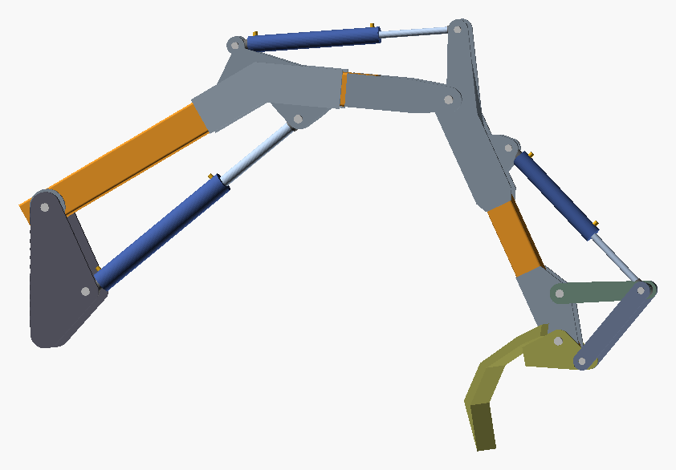
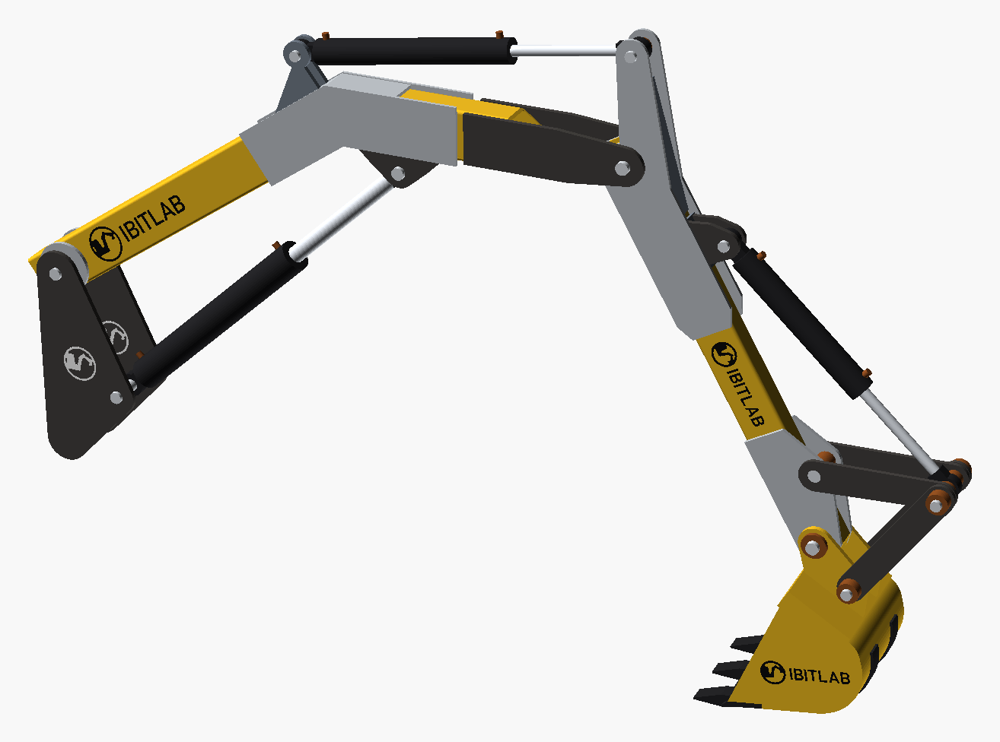

**English** · [Українська](STORY.uk.md)

# How it started

> ⚠️ **Ihor Ivaniuk (@IBITLAB) is the originator and product owner: organises the AI's work, sets the tasks, makes the decisions. The execution is done by AI (Claude Code by Anthropic).** Not checked by an engineer, never built, never tested. The full disclaimer is in [README.md](README.md#disclaimer); the hazards specific to this design are in [SAFETY.md](SAFETY.md).

In the words of Ihor Ivaniuk (@IBITLAB):

The idea came up while I was helping a friend who wanted to build an excavator of his own. He had already bought the parts and the cylinders, but there was neither the time nor the knowledge for the calculations and the drawings. At first I helped with the drawing in Fusion360; we spent several evenings on it, and there was still a great deal of work left. We also lacked the knowledge of mechanics.

After my intensive research into automating the construction of 3D models, and after building several projects, the top model Claude Fable (Anthropic) won me over and convinced me that it was ready for serious projects that I would not even have considered before. And so, from one prompt and a spreadsheet (a list of the parts already bought: cylinders, bushings, pins), a huge part of the project was done.

| The first version of the model — after the first prompts | Now — the latest built version |
|---|---|
|  |  |

That made it clear that the project could be taken further. There are now scripts for OpenSCAD -> STL -> STL scale 1:5 for 3D print, auto documentation -> Web page with excavator playground and runtime rebuild in WEBAssembly in OpenScad. The first version of the STL at scale 1:5 has been printed, a huge pile of corrections and new features went in, and part of it has already been moved to Deprecated.

Next steps: assemble the printed first version following the latest documentation. That way, check how realistic the project is, at least at 1:5. Wait until my friend finds the time and the means to bring in his own corrections and to start ordering laser cutting of the parts.

> ⚠️ **Before ordering any cutting**, the calculations and the drawings must be checked by a qualified mechanical engineer: the model was made by AI, and no professional has checked it yet. What exactly is unfinished and hazardous in this design is in [SAFETY.md](SAFETY.md).

## The first prompts, verbatim

The core of it and the thorough research were done from a one-shot prompt to Claude Fable 5.0 (Anthropic), Effort (Ultracode-xhigh + workflows). The prompts are quoted exactly as they were written — in Ukrainian and English, typos included:

**Step 1. Done.**

> Аттачмент: ексель файл із циліндрами, втулками, пальцями, двигуном і маслонасосом.
>
> Тре створити параметричну модель OpenSCAD для стріли екскаватора(на цьому етапі лиш стріли).
>
> Вже закуплені деталі, циліндри і решта необхідного.
>
> У Екселі є інформація про гідроциліндри, може лінки застарілі, тоді пошукай на тому ж сайті по назві циліндра(коду).
>
> Вимоги:
>
> модель має мати розраховані довжини усі преч стріли, їхнього мінімального та максимального повороту враховуючи наявні циліндри, підбери форму, профіль стріли, і її елементів.
>
> Бажано використовувати для корпусу плеч профільну трубу із популярних розмірів, не ексклюзивних, %назва металобази у моєму місті% наприклад. Місця які потребують підсилення, розрахуй які мають бути наварки, розмір, товщина і тип сталі.
>
> в ідеалі мають бути кілька основних перших параметрів, це кути повороту(розкриття кожного плеча стріли) ну із врахуванням мін і макс можливостей циліндра.
>
> Зроби(організуй) це до закінчення ліміту, щоб робота не пропала.

**Step 1.2. Done.**

> Схоже що ти вже дещо реалізував, перевір лиш що тре доробити:
>
> provide STL for each too, create versions folder and V001-date-time inside, and render script.
>
> Provide readme about the project.
>
> review plates position, they should be connected not overlap other parts.

**Step 1.3 Done**

> BOM list script
>
> sketches for all parts in PDF, with core dimensions? TBD what other options?

I write my prompts in either English or Ukrainian.

True, it crashed the first two times because the usage limit ran out, but I asked it to keep going and to take the limits into account, and after that everything went smoothly.
