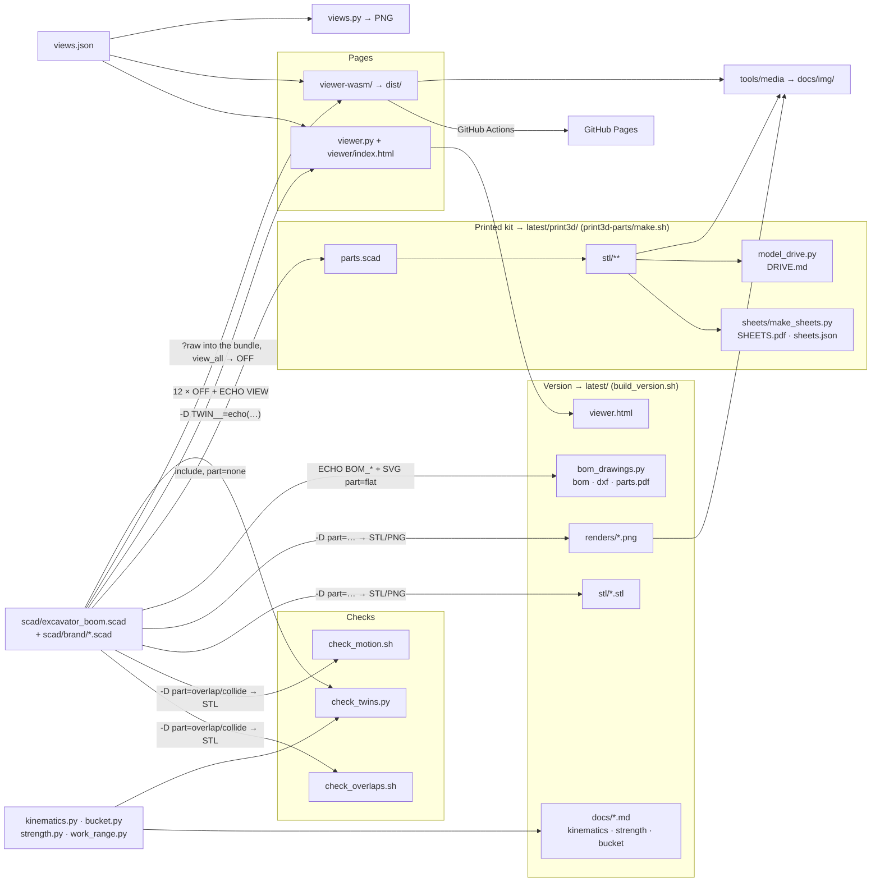

**English** · [Українська](ARCHITECTURE.uk.md)

# Software architecture

A short map: what the code is made of, who calls whom and in what format the data moves. Engineering detail is in [TECHNICAL.md](TECHNICAL.md); geometry in the pages, print versus steel and the OFF format are in [GEOMETRY.md](GEOMETRY.md).

## 1. Principle

- **One source of truth** — `scad/excavator_boom.scad`. Everything else consumes it.
- **The model's interface is the OpenSCAD command line**: input is `-D name=value`, output is a geometry file plus `ECHO:` lines on stderr. No tool keeps its own list of dimensions: numbers are read from echo, outlines from the export.
- **Twins** (`tools/kinematics.py`, `tools/bucket.py`, the `//<pose>` block in the pages) repeat the model's formulas in independent code; the checks catch any divergence (section 6): `check_twins.py` for Python, `npm test` for the pages.
- **Generated output** lives in `latest/` (the current version, the 1:5 kit inside it) and `versions/VNNN-…/` (the archive); the root holds only sources and `docs/img/`. Intermediate files go to `build/`, which is not in git.

## 2. Stack

| Layer | Technology |
|---|---|
| Model | OpenSCAD (desktop 2026.x, Manifold backend; CGAL only for renders) |
| Calculations, drawings, PDF | Python 3: standard library (system `python3`); numpy, shapely, matplotlib, Pillow (`tools/.venv`) |
| Orchestration | bash scripts (`build_version.sh`, `make.sh`, `check_*.sh`) |
| 3D page with a server | `http.server` (Python) + three.js 0.160 from a CDN, a single HTML file, no build step |
| 3D page without a backend | Vite, three.js, `openscad-wasm-prebuilt` (2025.01 engine) in a web worker, WebXR (AR on Android); tests run in node |
| PDF / screenshots / video | headless Chrome (HTML → PDF, screenshots), puppeteer-core, ffmpeg, poppler |
| CI / hosting | GitHub Actions → GitHub Pages (the WASM page only) |
| Process | git hook `tools/git-hooks/pre-commit`, linters `tools/lint.sh` (ruff, shellcheck), Claude Code skills and workflows in `.claude/` |

## 3. How the parts connect

## 4. The model's interface

**Input** — `-D` only:

| Parameter | Values |
|---|---|
| `part` | `assembly` (default), a sub-assembly (`boom`, `stick`, `bucket`, `post`, …), a group of plates (`boom_gussets`, …), `flat` / `tubeface` / `flatbrand` / `tubebrand` (2D projections), `overlap` / `collide` (intersection `ov_a`×`ov_b`), `view_all` (every body of the page in one file), `none` (the model as a library) |
| `boom_angle`, `stick_angle`, `bucket_angle` | the pose, degrees; the model itself clamps anything beyond the cylinder stroke |
| `show_*`, `ground_span` | visibility of sub-assemblies and helpers (ground, work envelope, logo) |
| anything else | any Customizer parameter (groups `/* [Name] */` at the top of the file) |

**Output:**

| Channel | Format | Read by |
|---|---|---|
| `ECHO: "=== …"` | text: angle ranges, current pose, bucket | `VERSION.md`, the pages' log |
| `ECHO: "!!! …"` | text: warnings (cylinder cannot reach, dead centre) | the pages, `npm test` (fails on them) |
| `ECHO: VIEW = [[key, value], …]` | list of pairs ≈ JSON (`undef/nan/inf` → `null`) | both pages: joint points, list of bodies, pins |
| `ECHO: BOM_PARAMS / BOM_FLAT / BOM_STRIPS / BOM_WEAR / BOM_SHELL / BOM_TUBES / BOM_ROUND / BOM_PINS` | nested lists | `bom_drawings.py` |
| STL (binary) | sub-assembly geometry | the version, the checks (`stl_volume.py` → cm³), the kit |
| OFF with face colours | mesh + RGB per face | the pages (colour = material / role) |
| SVG | 2D plate outline (`part="flat"`) | `bom_drawings.py` → DXF, dimensions, mass |
| PNG | render (`--render=cgal`, orthographic/perspective) | the version, the sheets, `views.py` |

## 5. Data flows

| From → to | Format | Who / how |
|---|---|---|
| model → checks | intersection STL → volume, cm³ (tolerance 0.05) | `check_overlaps.sh` (plate pairs within a sub-assembly), `check_motion.sh` (moving pairs over the full stroke) |
| model ↔ Python twins | the twins' parameters and results as OpenSCAD expressions in one `-D TWIN__=echo(…)` → a list ≈ JSON; tolerance 0.05 mm / 0.01° | `check_twins.py` (in `build_version.sh` and the git hook) |
| model → version | STL, PNG, echo → `VERSION.md`, all in `build/version/` | `build_version.sh` |
| new build ↔ `latest/` | STL as triangle sets, reports and angle ranges as text without numbers and dates → exit code 0 (same) / 1 (changed) | `compare_build.py`: changed — the old `latest/` goes to `versions/` (git mv), a new version; same — `latest/` refreshed in place |
| twins → reports | Markdown on stdout, PNG (matplotlib) | `kinematics.py`, `strength.py`, `bucket.py`, `work_range.py` |
| model → BOM and drawings | echo `BOM_*` + SVG → `bom.md`, `bom.csv`, DXF 1:1, `parts.pdf` | `bom_drawings.py` |
| version → README | PNG copies in `docs/img/`; `README*.md` link to `latest/…` (stable paths). A drawing page is copied only if it changed outside the dated header and footer | `build_version.sh`, `copy_if_changed.py` |
| page (server) ↔ `viewer.py` | `GET /api/schema` → parameters as JSON; `GET /api/views` → `views.json`; `POST /api/build {params, fresh}` → `{view, parts{body: {pos, groups[{color, idx}]}}, log, ms}` | 12 OpenSCAD processes in parallel, one OFF per body; cache of recent parameter sets |
| WASM page ↔ worker | `postMessage {id, source, files, defs}` → `{id, view, parts, log, ms}` (buffers transferred) | one run of `part="view_all"`: bodies shifted by `i·spacing` along Y, `offmesh.js` cuts them apart |
| model → WASM page | the `.scad` text is bundled at build time (`?raw`), `views.json` as JSON | Vite; no other inputs (the URL supplies only `?lang`) |
| pose in the browser | angles → `pose()` points → body matrices | JS, no OpenSCAD; the same formulas as the model's `pt_*()` |
| page → saved views | JSON (camera, angles, changed parameters, visibility): clipboard / `views.json` file / `localStorage` | `views.py render` → OpenSCAD PNG |
| model → 1:5 kit | `parts.scad` + `parts.tsv` (TSV, `-` = empty) → one STL per component, in `build/print3d/` → `latest/print3d/` as sub-version VNNN.K (the previous one → `print3d-history/`) | `print3d-parts/make.sh` (only if the model matches `latest/scad/`); `check_print.py` → JSON; `make_bom.py` → `BOM.md`; `model_drive.py` → `DRIVE.md` |
| kit → sheets | STL (shapely silhouettes) + `assembly.tsv` + `sheets.scad` (PNG) → HTML → PDF | `make_sheets.py` → `SHEETS.pdf`, `sheets.json` (every number); `png/` previews (from the PDF via poppler) stay in `build/`, the bucket sheet goes to `docs/img/` through `copy_if_changed.py` |
| page/PDF → README media | puppeteer screenshots → GIF (ffmpeg); PDF previews | `tools/media/readme_media.sh` → `docs/img/` |
| `main` → Pages | `npm ci` → `npm test` → `vite build` → `dist/` + LICENSE, THIRD-PARTY | `.github/workflows/pages.yml` |

## 6. What must agree and who checks it

| Invariant | Check |
|---|---|
| plates touch but do not overlap | `check_overlaps.sh`; git hook before committing changes in `scad/` |
| Python and shell code free of real errors | `tools/lint.sh` (ruff: pyflakes and bugbear; shellcheck) — run by hand |
| moving pairs do not collide | `check_motion.sh` (part of the version build) |
| Python twins = the model (`kinematics.py`, `bucket.py`) | `check_twins.py`: every parameter, the joint points and cylinder lengths in 27 poses, the angle ranges, the bucket profile — in one OpenSCAD run (≈ 0.3 s); stops the version build, runs in the git hook when `scad/` or a twin is committed |
| the model builds in the older WASM engine without warnings | `npm test` (also in CI before publishing) |
| the `//<pose>`, `//<spacemouse>`, `//<viewjson>` blocks are identical in both pages | `npm test` |
| JS pose = the model's echo (bucket tooth) | `npm test` |
| translation complete, legend colours exist in the model's `color(...)` | `npm test` |
| camera conversion page → OpenSCAD | `views.py check` + `media/view_roundtrip.mjs` |
| every kit part is in exactly one step | `make.sh` (`parts.tsv` ↔ `assembly.tsv`) |
| the kit is built from the model of `latest/` | `make.sh` refuses if `scad/` differs from `latest/scad/` |
| a new version number only when something real changed | `compare_build.py` inside `build_version.sh` (`--new` to force) |
| docs: links, anchors, skeleton of bilingual pairs | `check_docs.py` |
| no personal data in a commit (text and PDF, PNG, zip metadata) | `check_personal.py` |

## 7. Where things live

| Folder | Contents |
|---|---|
| `scad/` | the model and the logo polygons |
| `tools/` | twins, generators, checks, `media/`, `git-hooks/`, `dev/` (SpaceMouse helper, agent analytics) |
| `web/` | the pages: `viewer/` with its server `viewer.py`, `viewer-wasm/` (published on Pages); how to use them — [web/README.md](../web/README.md) |
| `latest/` | the current version: `stl/`, `renders/`, `docs/`, `bom/`, `dxf/`, `drawings/`, `scad/` (snapshot of the model and scripts), `viewer.html`, `VERSION.md`; `print3d/` — the current 1:5 kit (VNNN.K), `print3d-history/` — its earlier sub-versions |
| `versions/VNNN-…/` | the archive: a former `latest/` moves here (git mv) when the geometry or the report numbers change |
| `build/` | intermediate files and check logs, drawing and sheet PNG previews; not in git |
| `print3d-parts/` | sources of the 1:5 kit: `parts.scad`, `parts.tsv`, `assembly.tsv`, `make.sh`, `group.sh`, `sheets/` (generator), `stand/` (a separate display stand with its own `make.sh` and STL); the output goes to `latest/print3d/`; description — [print3d-parts/README.md](../print3d-parts/README.md) (Ukrainian) |
| `docs/` | the documents: TECHNICAL, QUICKSTART, ARCHITECTURE, GEOMETRY, STORY (`.md` / `.uk.md`); README and SAFETY stay in the root |
| `docs/img/` | README images (updated by `build_version.sh` and `readme_media.sh`) |
| `views.json` | saved views (shared by the pages and `views.py`) |
| `.claude/` | agent skills and workflows |
| `temp/` | drafts and publication media, not in git |
| `_deprecated/` | archive, not used |

Key files by role (the pages and the printed kit are described in their own READMEs):

| File | What it does |
|---|---|
| `scad/excavator_boom.scad` | **The model.** All parameters at the top of the file (Customizer groups); the angles are the primary parameters, their ranges are derived from the cylinder lengths and printed by `echo()` |
| `tools/kinematics.py` | Kinematics twin: angle ranges, moment arms, tooth force, work envelope; `--search` fits the mounting positions |
| `tools/bucket.py` | Bucket twin: capacity (struck / heaped), mass, carry and dump angles, 2D clearances of the moving pairs over the full stroke, strength of the ears, pins E/Q and welds. Run with `tools/.venv/bin/python` |
| `tools/strength.py` | Member statics plus strength of materials: N/V/M diagrams, tubes and doublers, pins, bushings, welds; section comparison (`--boom 120x80x5 --stick 100x60x5`) |
| `tools/work_range.py` | Working-range drawing with dimensions A…J, swept over the full stroke of all three cylinders; `--lang uk\|en` |
| `tools/check_twins.py` | The Python twins against the model (section 6) |
| `tools/check_overlaps.sh`, `tools/check_motion.sh` | Plates abut but never overlap; moving pairs do not collide over the full cylinder stroke |
| `tools/build_version.sh`, `tools/compare_build.py` | The version build (checks → STL → renders → reports → BOM and drawings → `latest/`) and the "new version or refresh in place" decision |
| `tools/bom_drawings.sh` → `bom_drawings.py` | BOM, 1:1 DXF of every plate, PDF sketches — from the model's echo and plate projections, with no separate list of dimensions |
| `views.json` → `tools/views.py` | Views saved on the 3D page become reproducible renders: `list` / `flags` / `render NAME` / `check` |
| `scad/brand/` → `tools/brand_merge.py` | The logo: one polygon per size (the generator's ~800 zero-area slivers made every WASM rebuild ≈ 3× slower); where it goes is the `brand_marks` table in the model |
| `tools/page_style.py`, `tools/author.py` | One look for every PDF (header, footer); authorship from `AUTHORS` |
| `tools/copy_if_changed.py` | Copies a PDF page PNG into `docs/img/` only if the page changed outside its dated header and footer — otherwise every build would commit a new binary |
| `tools/media/` | README media (`readme_media.sh`: the page tour GIF, PDF previews) and publication media (`make_media.sh` → `temp/media/`) |
| `tools/check_personal.py` | Before every commit: personal data in the staged text and in binary metadata (PDF, PNG, zip-based `.3mf`); the machine-specific patterns are read at run time, none is stored in the script |
| `tools/check_docs.py` | After editing the docs: links, anchors, the skeleton of the bilingual pairs |
| `tools/lint.sh` | ruff (`ruff.toml`) and shellcheck (`.shellcheckrc`); Python dependencies in `tools/requirements.txt`, the linters in `tools/requirements-dev.txt` |
| `tools/git-hooks/pre-commit` | Before committing `scad/` or a twin: `check_twins.py` and the overlap check. Enable once: `git config core.hooksPath tools/git-hooks` |
| `CLAUDE.md`, `.claude/skills/`, `.claude/workflows/` | Rules for Claude Code; the project skills; multi-agent workflows (`design-review`, `research-sweep`) whose agents write their results straight into files |
