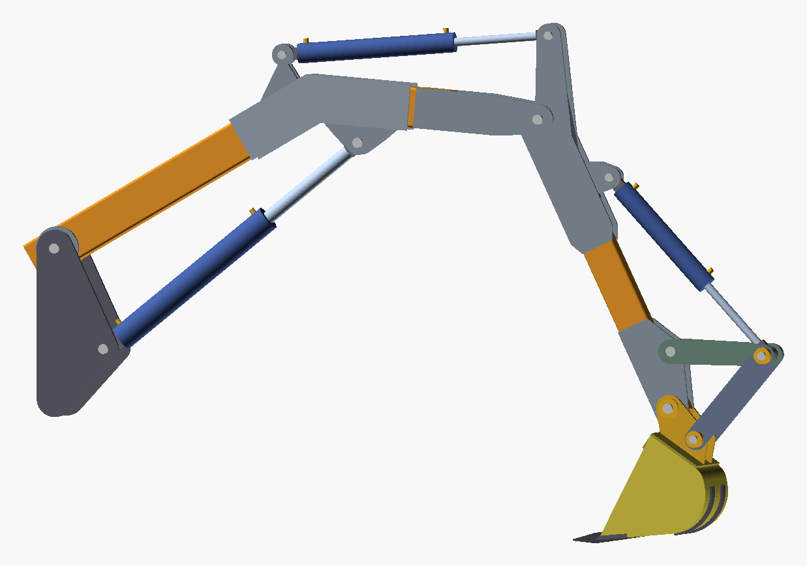
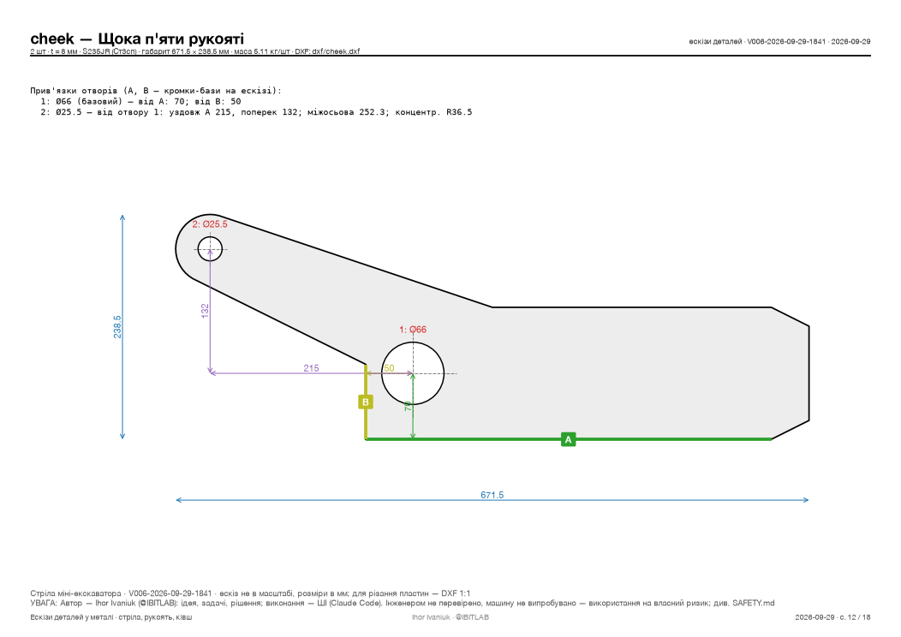
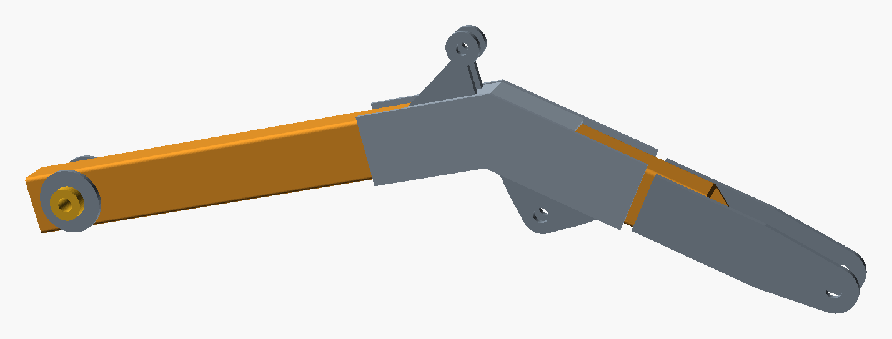
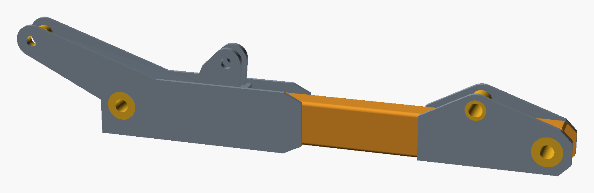
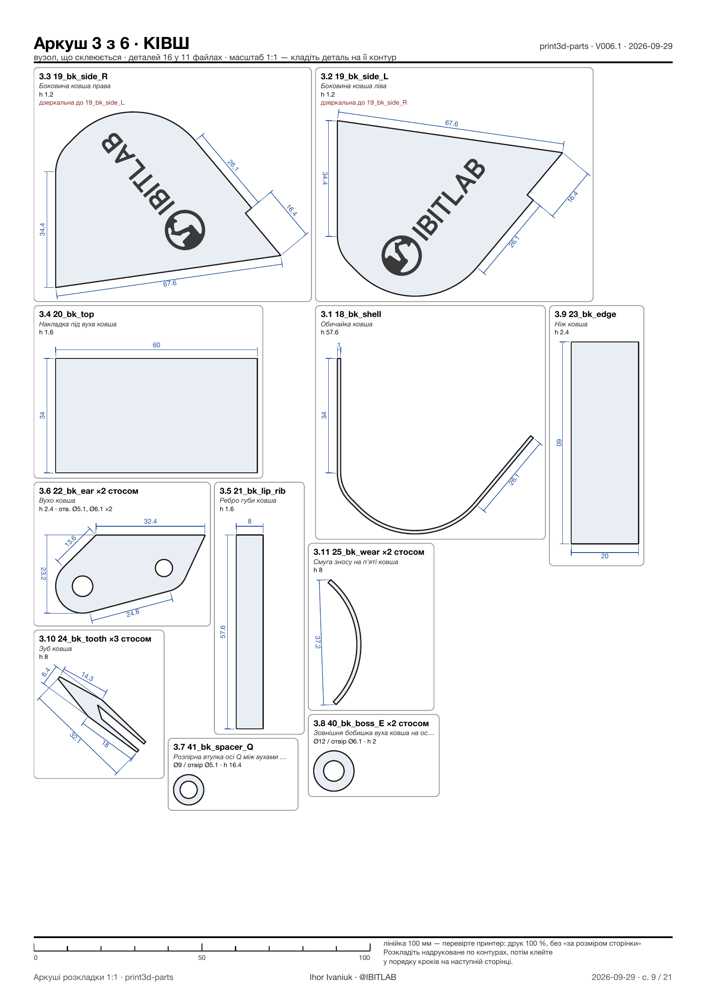
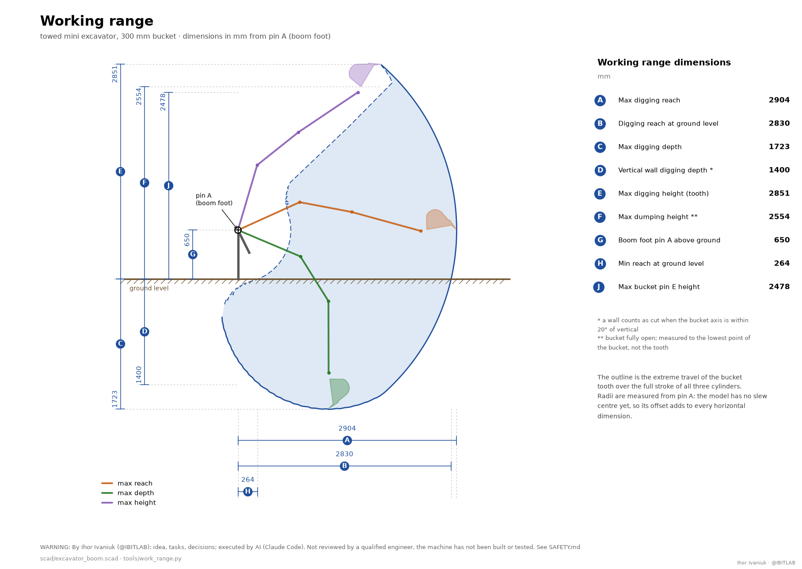
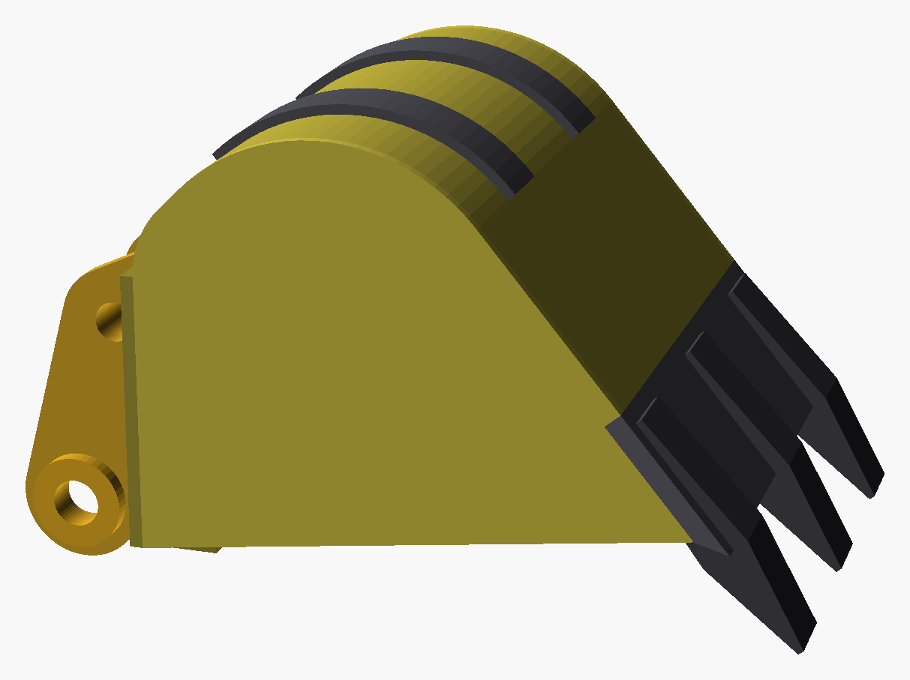
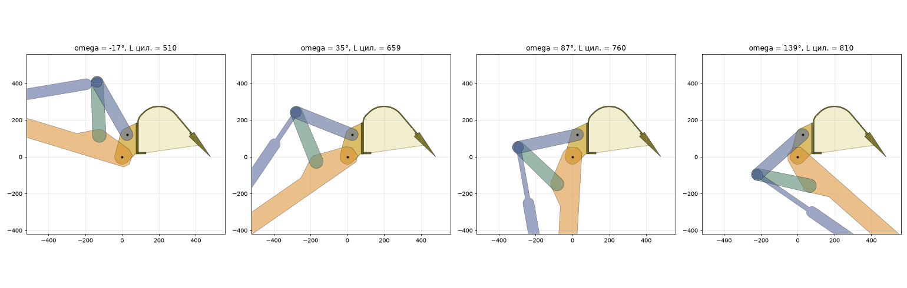

**English** · [Українська](TECHNICAL.uk.md)

# Technical details — mini excavator boom, stick and bucket

> ⚠️ **Ihor Ivaniuk (@IBITLAB) is the originator and product owner: organises the AI's work, sets the tasks, makes the decisions. The execution — geometry, calculations, drawings, code and texts — is done by AI (Claude Code by Anthropic).** Not checked by an engineer, never built, never tested. The full disclaimer is in [README.md](../README.md#disclaimer); the hazards specific to this design are in [SAFETY.md](../SAFETY.md).

The overview, the live 3D model and the PDF documents are in [README.md](../README.md). This file holds the details.



## 1. Files

Where everything lives, what each script does and who calls whom — [ARCHITECTURE.md](ARCHITECTURE.md), sections 3 and 7. The 3D pages have their own description in [web/README.md](../web/README.md), the 1:5 printed kit in [print3d-parts/README.md](../print3d-parts/README.md) (Ukrainian).

The two independent implementations (OpenSCAD ↔ Python) are compared automatically by `tools/check_twins.py`: every parameter, the joint points and cylinder lengths in 27 poses, the angle ranges and the bucket profile, within 0.05 mm and 0.01° (the bucket range within 0.05°: the model scans it in 0.25° steps). Any divergence stops the version build and the commit.

## 2. Using the model

Open `scad/excavator_boom.scad` in OpenSCAD (≥ 2021.01; verified on 2026.09). The first group in the Customizer (Window → Customizer):

| Parameter | Default | Range (computed) | Meaning |
|---|---|---|---|
| `boom_angle` | 15° | **−38.1° … +58.3°** | angle of the boom chord (axis A → axis B) to the horizon, + upwards |
| `stick_angle` | 100° | **50.7° … 155.6°** | interior boom–stick angle at joint B (folded … extended) |
| `bucket_angle` | 60° | **−17.0° … +138.5°** | bucket angle relative to the stick axis, + = curling in |
| `clamp_to_cylinders` | true | | limit the angles to what the cylinders can reach (otherwise: a red cylinder + a warning) |

The console (`echo`) prints the ranges, the current cylinder lengths and moment arms, and the tooth coordinates. The remaining groups are: cylinders (closed length, stroke, barrel/rod, pin), boom, stick, bucket linkage, pins/bushings/plates, and display (`show_envelope` draws the work envelope as points).

From the command line:
```
openscad -o out.png --viewall --autocenter -D boom_angle=-38 -D stick_angle=90 -D bucket_angle=60 scad/excavator_boom.scad
openscad -o out.echo scad/excavator_boom.scad        # just the echo with the ranges
cd tools && python3 kinematics.py && python3 strength.py --boom 120x80x5 --stick 100x60x5
```

### The 3D pages

```
web/viewer.sh                                   # the page with a server: http://127.0.0.1:8765/ (Ctrl+C to stop)
python3 web/viewer.py --export file.html        # a static page with no server (one ships with every version: latest/viewer.html)
web/viewer-wasm.sh [build|preview|phone|test]   # the page with no backend (OpenSCAD-WASM), the one published on GitHub Pages
```

The angles move the model instantly; any other parameter is rebuilt through OpenSCAD. How to use both pages — phones, AR, the SpaceMouse, publishing to GitHub Pages — is in [web/README.md](../web/README.md).

### Versions, STL and renders

```
tools/build_version.sh "what changed"            # one command: latest/ — a new version or a refresh in place (≈2 min, +1 min for the kit)
tools/build_version.sh --commit "what changed"   # the same plus the commits: the archive move first, then "VNNN: what changed"
tools/check_overlaps.sh                  # only the plate intersection check
tools/check_motion.sh                    # only the moving-pair collision check (≈40 s)
openscad -o boom_gussets.stl --export-format binstl -D 'part="boom_gussets"' scad/excavator_boom.scad
```

The `part` parameter (the first Customizer group) selects what is shown or exported: `assembly`, the weldments `boom` and `stick`, the part groups
`boom_tubes`, `boom_gussets`, `boom_bracket_D`, `boom_bracket_F`, `boom_foot_boss`, `boom_fork_B`, `stick_tube`, `stick_cheeks`, `stick_bracket_H`, `stick_tip`,
the `bucket` and its sub-assemblies `bucket_sides`, `bucket_shell`, `bucket_top`, `bucket_edge`, `bucket_ears`, `bucket_wear` (in the bucket frame: axis E = 0, x towards the tooth tip), plus `rocker`, `link` and `post` (a schematic swing column). The boom sub-assemblies are exported in the boom frame (axis A = 0, the chord along +X),
the stick ones in the stick frame (axis B = 0, the stick axis along +X); everything else comes out in the default pose.

**The model's rule:** parts abut one another (a shared face = a weld) but never overlap: the D/H saddles sit between the protruding cheeks,
the clevises stand on the saddles, the F "tower" sits on the top doubler of the break, the bushings pass through holes in the tubes and cheeks, and clevis B is flush with the tube walls
(the 80 gap = a 76 stick pack + two 2 mm thrust washers). `part="overlap"` with `ov_a`/`ov_b` shows the intersection of two sub-assemblies; the script checks every pair.

**Limits of the current stage:**
- STL is produced per group of parts: both break cheeks with the doubler, for instance, come out as one file. Individual plates for cutting are in `dxf/` (1:1) and `drawings/parts.pdf` (sketches), generated by `tools/bom_drawings.sh`.
- The sketches carry only the main dimensions: the overall size, hole diameters and their datums. The base (largest) hole is dimensioned from the real edges of the part: datum A is the longest straight edge, datum B the nearest perpendicular edge (and, where there is none, the distance along A from its end). The other holes are dimensioned from the base hole along and across datum A; holes concentric with a fillet of the outline are marked separately. Chamfers, weld preparation, hole tolerances (H8 for pins, H7 for bushings) and surface finish are not specified — the pin and bushing holes are to be reamed in the assembled state.
- The fit between plates has only been checked visually on the renders of the sub-assemblies; the only thing checked numerically is overlap (`tools/check_overlaps.sh`).
- The moving pairs are checked at discrete positions (13 bucket angles, 12 stick, 8 boom), not continuously; the swing column is schematic and is not part of the check.

### BOM and part drawings (Step x.5)

```
tools/bom_drawings.sh                 # → build/bom/bom.md, bom.csv · build/dxf/*.dxf · build/drawings/parts.pdf
tools/build_version.sh "description"  # the same, inside latest/
```

The options for issuing drawings, and what was chosen: **DXF 1:1** — the main format for laser and plasma cutting (the shop takes the file as it is); **a PDF sketch** — for the workshop: plates with the holes dimensioned from the datum edges, tubes as a development of all 4 faces (top/bottom flanges, left/right walls: mitre cuts, the end bevel, holes measured from the end), thickness, quantity and mass; **CSV** — for ordering the steel and for record-keeping. Deliberately not done: full drawings to ЕСКД with tolerances (that is FreeCAD TechDraw / KOMPAS territory, working from a STEP model), sheet nesting (the cutting shop does that from the DXF), and STEP export (OpenSCAD cannot do it; if needed, go through FreeCAD with CSG).






### The 1:5 printed kit and the sorting sheets

```
print3d-parts/make.sh "what changed"                               # a new kit sub-version in latest/print3d/: STL, checks, BOM, sorting sheets
tools/.venv/bin/python print3d-parts/sheets/make_sheets.py --png   # a draft of the sheets only, in build/sheets/ (≈1.5 min; renders are cached)
```

A printed kit is a pile of look-alikes: bushings, pins and washers differ by fractions of a millimetre, and sorting them by eye does not work. `latest/print3d/sheets/SHEETS.pdf` sorts the pile on paper: six A4 sheets, one per sub-assembly that gets glued (boom, stick, bucket, rocker with link, column with cylinders) and a separate one for the pins and washers that join the sub-assemblies. Every part is drawn as a **1:1** outline the way it lies on the table: put the part on its outline, and if it fits, that is the one. Next to the outline are the gluing step number, the file name, the overall size, the height, the hole diameters; identical flat parts share one outline as a stack, pins each get their own, and pairs that match in every dimension (A and C, F and H, J and Q) are marked as interchangeable. The free space on the sheet holds renders of the sub-assembly with a callout to every file, followed by gluing step cards: what is already glued is grey, the new part is orange, and for the pins the cards are close-ups of the joints. Nothing here is drawn by hand: outlines and holes are taken from the measured STL, the composition and the steps from `assembly.tsv` and `parts.tsv`, and the views are chosen by how many parts they show. A 100 mm ruler at the bottom of every sheet tells you whether the printer is scaling. How it is done and what was decided — `print3d-parts/sheets/README.md`.



## 3. The chosen geometry (mm) and why

| Item | Value | Rationale |
|---|---|---|
| Boom: segments L1 / L2, break | **900 / 700, 35°** → chord A–B **1527** | A 1 t class benchmark: the Bobcat E10 is 1276, corrected for the longer strokes of our cylinders; a shorter boom means a smaller moment and better stability for a towable machine |
| Stick B–E | **950** | the class runs 810–880, plus a margin; stick torque 4.0–7.4 kN·m |
| Boom cylinder base C (from A) | **[150; −300]** on the column | below and ahead of axis A (the rule for small machines) |
| Bracket D (boom cylinder rod) | s = **1050** from A along the axis (150 mm past the break, underneath), 120 offset from the tube axis | gives 96° of boom travel at a 220–335 mm arm; transmission angles ≥13° |
| Stick cylinder base F | s = **715** back from B — a "tower" on the crest of the break, the axis **158** above the tube axis (98 above the flange) | the cylinder sits on top of the boom and digs on the bore side; the Ø60 body clears the break by ≈ 20 mm |
| Stick heel G | **215 back / 132 outboard** from B | 105° of stick travel at a 151–250 mm arm |
| Bucket cylinder base H | 246 from B, 120 offset; the clevis is asymmetric — the base extends backwards | there are no arms ahead: that is where the cylinder body lies when the bucket is curled in |
| Rocker R / lengths | R: 152 from E, 75 above the axis; rocker **289**, link **327**, bucket ear Q = **[27; 121]** (\|EQ\| = 124) | 155.5° of bucket rotation; the transmission angle at the bucket ear stays ≥ 36° at both ends of the stroke; the link force is ≤ 2.16× the cylinder force (it used to be 2.64) |
| Bucket radius (axis E → tooth tip) | 480 | the class runs 450–500; the outermost point of the shell is 399, so the heel never rubs the face |

Results (the full report is `docs/02-kinematics.md` in the latest version folder):

| Metric | Value |
|---|---|
| Boom / stick / bucket travel | 96.4° / 104.9° / 155.5° |
| Boom cylinder moment @160 bar | 11.0–16.6 kN·m (7.2–10.9 kN of pull at the boom tip) |
| Stick force at the bucket axis @160 bar | 5.0–8.3 kN (class: 4.3–6.4) |
| Bucket force at the tooth @160 bar | 11.8 kN at the start of the curl → 8.2 (ω = 48°) → 2.3 kN at the end (class: 8.3–11.2) |
| Tooth reach at ground level / digging depth / height (axis A 650 above the ground) | 2.83 m / 1.72 m / 2.85 m |



The working-range drawing with all dimensions (A…J) is built by `tools/work_range.py`
from the same kinematics — no number is typed in by hand. The height of pin A above
the ground (650 mm) is the `ground_below_A` parameter, i.e. an assumption about the
trailer frame rather than a computed result. Radii are measured from pin A: the model
has no slew centre yet, so its offset adds to every horizontal dimension.

## 3a. The bucket (the full report is `docs/05-bucket.md` in the latest version folder)



A welded 300 mm bucket for a machine of roughly the 1 t class. The bucket frame: axis E = 0, x towards the tooth tip, y the outboard side (where the link ear Q is).

| Parameter | Value | Explanation |
|---|---|---|
| Capacity | **16.4 l struck / 21.3 l heaped 1:1** (ISO 7451) | the 1 t class runs 18–25 l; ≈ 38 kg of wet clay |
| Mass | **≈ 27 kg** | side plates 5.7, shell 6.3, cutting edge 2.8, teeth 2.7, doubler 3.2, ears 3.4 |
| Profile | top flange 170 → R60 through 45° → back 19 → heel R120 through 95° → floor 130 + cutting edge 100 | one developed strip, **559 × 288 × 5**; the model works out the length of the back itself, so that the floor lands on the line through the tooth tip |
| Floor angle to the "tooth → E" line | 50° | a cutting angle of ≈ 40° to the tooth path; a larger angle means a deeper bucket |
| Ear height (axis E → doubler) | 76 | the stick tube end sweeps a radius of 56 about E → a 20 clearance; for that the tube overhang past E was cut back to 50 and 25×25 chamfers were added |
| Lip (the front edge of the top plate) | y = 16 | at full curl the lower flange of the stick comes under the lip: 13 mm of clearance, and 7 mm at +4° of over-travel |
| Ears | 2 × 12 mm, 82 gap (an 80 stick pack + 2×1), R40 about E, R35 about Q, a 162 mm base on an 8 mm doubler | outer bosses Ø60×10 on axis E; a Ø45 spacer tube is welded between the ears on axis Q, so the pair of ears works as a frame |
| Links | outside the ears (108 gap), bosses Ø50×25 on axes J and Q | the pressure in the pin/link pair is < 30 MPa; pin Q is fixed in the ears |
| Cutting edge / teeth | a 300×100×12 strip, chamfered on top; 3 teeth, 70 reach | **wear-resistant steel** (Hardox 400/450, 65Г, a grader blade); the teeth are bought-in weld-on ones for a 12 mm edge, or made from 65Г/30ХГСА. Not mild steel |
| The rest | side plates 6, shell 5, doubler 8, lip rib 40×8, two 40×6 wear strips on the heel | S235JR from ordinary stock; the wear strips are replaceable |

Working angles. The bucket holds the load (the opening horizontal or tilted back) with the stick anywhere from vertical to ≈ 45° from the horizon: a back-tilt margin of +49° with the stick vertical,
+4° at 45°; with the stick stretched out flatter than 45°, a full curl no longer levels the opening — exactly as on factory-built machines. Dumping: the floor is tilted down by 63–123°
across the whole range of stick positions, so sticky clay will come off.

The layers across the width near axis E: the stick pack (\|y\| < 40) → the bucket ears and the rocker plates (41…53; **a single layer** — in side view they never intersect, minimum clearance 64 mm) → the links and the ear bosses on axis E (54…64; minimum clearance between link and boss E is 11 mm).



Strength at 250 bar in a closed cylinder: the ear on axis Q — 75 MPa of bearing (safety factor 4.7), 42 MPa of tear-out through the web (3.3); the weld of the ears to the doubler 63 MPa (3.5); pin Q Ø25 — 177 MPa in bending (3.4);
pin E Ø30 — 221 MPa in bending (2.7); the cutting edge in its own plane 54 MPa. The side force at the tooth (swinging the column with the bucket in the ground) was taken as 3 kN — to be refined at the swing-mechanism stage.

## 4. Sections, reinforcements, steel (the full report is `docs/03-strength.md` in the latest version folder)

The load cases: breakout with the bucket, pulling in with the stick, lifting and pushing down with the boom across a grid of positions; the force at the tooth follows from the limiting force of the active cylinder (160 bar ×1.25 for dynamics; 200 bar; 250 bar for a closed cylinder, because the Z50 valve has no port reliefs), digging is done by pushing the cylinders (the bore side) while the reacting cylinders hold up to 250 bar; the vertical cases are capped by the stability of the machine (`--fstab`, 15 kN by default — **to be refined once the machine mass is known**; without the cap the boom cylinder delivers up to ≈22 kN at short reach). The allowables are fy/1.5, fy/1.15 and fy/1.0 respectively.

### Tubes (Ст3/S235, fy 235)

| Arm | Main option | Safety factor (250 bar, worst section) | Alternatives from ordinary stock |
|---|---|---|---|
| Boom | **120×80×5** (h=120 in the bending plane), ≈1.75 m, 14.6 kg/m | **1.72** (middle of the 2nd segment), 1.97 at the break with the doublers (M up to 10.3 kN·m) | 120×80×4 (≈670 UAH/m): ≈1.4 — marginal; 100×100×5 (≈793 UAH/m): 1.59; 120×120×5 (≈950 UAH/m): 2.29 |
| Stick | **100×60×5**, ≈1.10 m, 11.4 kg/m | **1.55** near base H, 1.65 behind the cheeks, 1.70 at the root (only together with the 8 mm cheeks: the bare tube at the root sees 341 MPa!) | 100×60×4 (≈531 UAH/m): ≈1.4 — marginal; 120×60×5: a higher margin |

Rimming steel (Ст3кп) is undesirable for the boom — ask for a certificate, and prefer S235JRH / Ст3сп.

### Weld-on reinforcements (S235JR; 8/10/12 plate is often made to order, while 80×8, 80×10, 100×8 and 100×10 flat bar is usually in stock)

| Sub-assembly | Part | Size | Thickness | Note |
|---|---|---|---|---|
| Boom break K | 2 side cheeks (a "boomerang" along both segments) | ≈ 550 mm along the axis (from K: 250 back, 300 forward — up to clevis D), 140 high (10 mm past the flanges) | **8** | they wrap the joint, base F and clevis D; the tube joint is bevelled for full penetration |
| Break K, outer corner | a doubler on top, between the cheeks | 80 × 300 (150 either side of K) | 8 | it closes the crest of the joint; the F "tower" stands on it |
| Clevis D (boom cylinder rod, ШС-30) | 2 clevis plates | ≈ 220 × 150, Ø30 H8 hole | **12** (10 acceptable) | a 30 mm gap (a ≈28 eye + 2), spacer washers up to the inner race of the bearing |
| Clevis D | a saddle across the tube width + side walls | 80 × 260, between the lower protrusions of the break cheeks (which stand 10 mm proud = the saddle thickness) | 10 | the 78 kN force is carried into the tube walls by the break cheeks, to which the saddle is welded |
| Base F (stick cylinder, ШС-25) | a "tower" near the crest of the break: 2 plates on the top doubler of the 1st segment (the base runs from −150 to −12 mm from K; it cannot go forward — the cylinder body is there) | ≈ 134 × 159, Ø25 H8 hole | 12 | a 27 mm gap; weld it to the top doubler of the break and to the side cheeks |
| Axis A | a bushing through the tube, **L=140** (wider than the tube — side loads) + 2 round doublers + gussets to the bushing | 66×33 tube, L=140; Ø130 | 10 | a Ø30 ГАЗ-53 king pin, two bushings of 2×45 at the ends |
| Clevis B (boom tip) | 2 plates outside the tube, **120** of reach; the tube end is mitred (the top is 160 shorter) | ≈ 380 × 140, Ø30 hole | 12 | flush with the tube walls; the gap is 80 mm (a 76 stick pack + 2×2 thrust washers) |
| Stick heel | 2 cheeks on the sides of the tube (140 high — 20 mm past the flanges, 470 long) + the heel "arm" from the top flange to ear G | ≈ 470 × 140 + an arm of ≈ 380 × 200, Ø66 hole for the bushing (B) and Ø25.5 (G) | **8** | **they carry the 12.3 kN·m moment of the stick cylinder** — without them the tube does not pass; bushing B 66×33 L=76 goes through the tube and the cheeks; spacer bushings of (60−27)/2 are welded at G; the 8 thickness is what makes the 76 pack + 2×2 washers = 80 |
| Base H (bucket cylinder) | 2 plates (asymmetric: the base runs −78…+28 from the axis) + a 120 saddle between the heel cheeks | 110 × 92 / 60 × 120 | 12 / 10 | a 27 gap; the weld, with the moment taken into account, is at 0.65 of the allowable |
| Stick tip | bushings E and R through the tube + 2 doublers | 45–66 OD; the doubler is ≈ 340 × 100 | 10 | E — Ø30 (66×33); R — **Ø30** (the link force reaches 72 kN), bronze bushings of 2×35 |

Pins: A, B, E, C, D and **R** are **Ø30** (a ГАЗ-53 king pin / tempered 40Х); F, G, H, J and **Q** are **Ø25** (ШС25 eyes; a Газель king pin, induction-hardened 45Х / 40Х). Bending safety factors at 250 bar: A 1.3 (the king pin, fy≈600 — an estimate) / 1.7 (40Х), the rest ≥1.7. Pin J only works with bosses welded to the rocker right up against the cylinder eye. The bearing pressure in the bushings is ≤ 27–34 MPa in the limiting case (steel ≤ 30, bronze ≤ 40). Welds: double-sided fillets with k = 5–6 mm, Э50А / Св-08Г2С electrodes, loaded to ≤ 20 %.

## 4a. The independent review and what changed after it

Four independent **AI agents** with different lenses (kinematics, statics, buildability, SCAD code) raised 30 findings. This is a machine review, not an engineering appraisal: it catches internal contradictions and gross errors, but it is no substitute for an experienced human. The raw texts of the findings are in `docs/research/review_findings.md`. Fixed:
every plate in the model shifted by half its thickness; the sign of the digging force (the forces had been ≈25 % too low); a missing root moment for the stick in the report; the collision of the heel and the rear end of the stick with the boom tube end (clevis reach 120, a mitred end, a new heel shape); the collision of the stick cylinder body with the crest of the break (base F raised and moved onto the crest); clevis gaps of 27/30 instead of 21/23; a 30 bucket-axis pin; a Ø30 rocker axis; a 140 mm boss on axis A; taller stick cheeks; the start of the bucket curl in the load cases.
Deliberately left for the next stage: internal diaphragms under D/F are impossible in a closed tube — saddles with walls and the cheeks take their place; pin retention and grease nipples; orienting the cylinder ports sideways (to be checked on the real cylinders); the bucket linkage has a transmission angle of only ≈22° at the start of the curl (a link force 2.3× the cylinder force) — to be optimised together with the bucket.

**After the bucket stage (the moving-pair check, `tools/check_motion.sh`)** something the static overlap check could not see was found and fixed: the bucket cylinder body (Ø60, wider than the 27 clevis gap) cut into the front "shoulders" of clevis H when the bucket was curled in — the clevis was made asymmetric; the stick cylinder body likewise caught the front foot of the F "tower" — the tower base now sits entirely on the 1st segment (138 mm, the weld at 0.57 of the allowable with the moment included). In the cylinder model the neck of the eye is now flat (as wide as the eye) rather than a round Ø37/Ø48, which used to produce false intersections.

## 5. What must be checked before cutting metal

1. **Measure** the closed pin-to-pin length of all three cylinders (700 / 600 / 510 are nominal, and the vendor page says "≈") and the bore of the boom cylinder eyes (ШС-30 is an inference from comparable parts; if it turns out to be Ø25, change `boom_cyl_pin` and `pin_A`). Put the values into the parameters.
2. **The pump drive**: 7 hp on an НШ-10 with no reduction reaches only ≈ 60 bar. A ratio of ≥ 2.6 is needed (3 is recommended: the pump at ≈1200 rpm, 11 l/min, up to 180 bar). Set the Z50 relief to 160–180 bar.
3. The Z50 has no port reliefs: under an external load a closed boom cylinder can see 250–335 bar. An external block of cross-over relief + anti-cavitation valves (G3/8, 220–250 bar) on the boom cylinder lines is desirable.
4. The mass and wheelbase of the machine determine the real forces (stability): update `F_STAB` in `strength.py` and recompute.
5. A mill certificate for the tube (Ст3сп/пс or S235JRH, not кп).
6. **Measure, on the cylinders, the distance from the pin axis to where the body/rod reaches full diameter** (`eye_len` = 45 mm in the model): the shape of clevis H and of tower F assumes the cylinder is no wider than the eye within 45 mm of the axis.
7. The bucket: if the real extended length of the bucket cylinder exceeds 810, re-check the lip-to-stick clearance (`tools/bucket.py`; the margin is currently +4° → 7 mm); the cutting edge and the teeth must be wear-resistant steel only.

## 6. Fabrication notes (briefly)

- The joint between the two boom segments is a 17.5° mitre on each tube, bevelled, with full penetration, followed by the 8 mm side cheeks and the top doubler; do not weld across the corner radii of the tube (keep ≥ 5t away).
- Bushing holes are cut with a hole saw through both walls using a jig; the bushing (a 66×33 tube, or "28 bore") goes right through and is welded all round on both sides, with the doublers added afterwards; then bore or ream it in the assembled state.
- Clevises for spherical-bearing eyes: the pin clamps only the inner race, through spacer washers (ID = the pin, OD 32–34 for ШС25 / 37–39 for ШС30); the clevis gap is the eye width + 2 mm.
- The ends of every doubler are eased (a radius or a taper), welded all round, with no "tails" left on the tube wall; grease nipples at A, B, E and R.
- Sequence: the boom segments → the joint → bushings A/B → the cheeks → the saddles and clevises D/F (on a jig, with the cylinders closed) → the stick in the same way → trial-fit the cylinders → the bucket.

## 7. Next stages

A swing column with the ЦС50.25.300.510 swing cylinder (clevis A + pin C), the hoses, and travel stops (check the extreme positions on the model: `folded`, `max_reach`).

**Pin retention and grease nipples.** In the model the pins are plain rods: no axial stop and nothing to stop them turning. The room is already there — every pin stands 10–12 mm proud of the outer faces (21 mm on axis A). The decision splits in two. Load-carrying Ø30 pins (A, B, E, R): a flat milled on the end plus a keeper plate bolted to a welded boss — that holds the pin both axially and against rotation. Rotation matters more than bushing wear here: the ear bore is H8 and not hardened, so it would be the welded structure wearing out rather than a replaceable part. Pins at spherical bearings (C, D, F, H, G, J, Q): the pin **clamps** the inner ring through spacer washers, so it needs a genuine clamp — a head with a nut, or a plate that presses — and not a circlip, which gives a stop without preload and lets the spacer stack rattle. A cotter pin has to be checked separately: a Ø5 through hole eats noticeably into pin E Ø30, whose bending margin is already 2.7. Grease: either a nipple in the side of the boss straight into the bushing, or an axial channel through the pin (recalculate the section then). None of this shows on the 1:5 printed set: a 1.35 mm circlip groove becomes 0.27 mm, below the nozzle.
