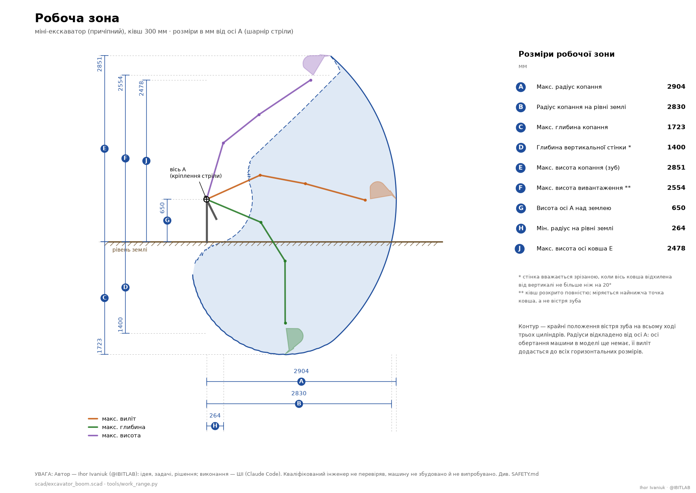

[English](TECHNICAL.md) · **Українська**

# Технічні деталі — стріла, рукоять і ківш міні-екскаватора

> ⚠️ **Ihor Ivaniuk (@IBITLAB) — ідейник і власник продукту: організовує роботу ШІ, ставить задачі, приймає рішення. Виконавець — ШІ (Claude Code від Anthropic): геометрія, розрахунки, креслення, код і тексти.** Інженер не перевіряв, машину не збудовано й не випробувано. Повне застереження — у [README.uk.md](../README.uk.md#застереження), небезпеки саме цієї конструкції — у [SAFETY.uk.md](../SAFETY.uk.md).

Огляд, жива 3D-модель і PDF-документи — у [README.uk.md](../README.uk.md). Тут — подробиці.


## 1. Файли

Де що лежить, що робить кожен скрипт і хто кого викликає — [ARCHITECTURE.uk.md](ARCHITECTURE.uk.md), розділи 3 і 7. 3D-сторінки мають окремий опис у [web/README.uk.md](../web/README.uk.md), друкований набір 1:5 — у [print3d-parts/README.md](../print3d-parts/README.md).

Дві незалежні реалізації (OpenSCAD ↔ Python) звіряє автоматично `tools/check_twins.py`: кожен параметр, точки шарнірів і довжини циліндрів у 27 позах, діапазони кутів і профіль ковша з точністю 0.05 мм і 0.01° (діапазон ковша — 0.05°: модель сканує його з кроком 0.25°). Будь-яка розбіжність зупиняє збирання версії й коміт.

## 2. Як користуватися моделлю

Відкрити `scad/excavator_boom.scad` в OpenSCAD (≥ 2021.01; перевірено на 2026.09). У Customizer (Window → Customizer) перша група:

| Параметр | Значення за замовчуванням | Діапазон (обчислений) | Зміст |
|---|---|---|---|
| `boom_angle` | 15° | **−38.1° … +58.3°** | кут хорди стріли (вісь A → вісь B) до горизонту, + вгору |
| `stick_angle` | 100° | **50.7° … 155.6°** | внутрішній кут стріла–рукоять у шарнірі B (складено … розкрито) |
| `bucket_angle` | 60° | **−17.0° … +138.5°** | кут ковша відносно осі рукояті, + = підкручування |
| `clamp_to_cylinders` | true | | обмежувати кути можливостями циліндрів (інакше — червоний циліндр + попередження) |

Консоль (`echo`) показує: діапазони, поточні довжини циліндрів і плечі моментів, координати зуба. Далі йдуть групи: циліндри (зведена довжина, хід, гільза/шток, палець), стріла, рукоять, важільна система ковша, пальці/втулки/пластини, відображення (`show_envelope` — робоча зона точками).

Командний рядок:
```
openscad -o out.png --viewall --autocenter -D boom_angle=-38 -D stick_angle=90 -D bucket_angle=60 scad/excavator_boom.scad
openscad -o out.echo scad/excavator_boom.scad        # лише echo з діапазонами
cd tools && python3 kinematics.py && python3 strength.py --boom 120x80x5 --stick 100x60x5
```

### 3D-сторінки

```
web/viewer.sh                                   # сторінка з сервером: http://127.0.0.1:8765/ (Ctrl+C — зупинити)
python3 web/viewer.py --export файл.html        # статична сторінка без сервера (є в кожній версії: latest/viewer.html)
web/viewer-wasm.sh [build|preview|phone|test]   # сторінка без бекенду (OpenSCAD-WASM) — та, що на GitHub Pages
```

Кути рухають модель миттєво, будь-який інший параметр перебудовується через OpenSCAD. Як користуватися обома сторінками — телефон, AR, SpaceMouse, публікація на GitHub Pages — у [web/README.uk.md](../web/README.uk.md).

### Версії, STL і рендери

```
tools/build_version.sh "що змінено"            # одна команда: latest/ — нова версія або оновлення на місці (≈2 хв, +1 хв на набір)
tools/build_version.sh --commit "що змінено"   # те саме + коміти: спершу переїзд в архів, потім "VNNN: що змінено"
tools/check_overlaps.sh                  # лише перевірка перетинів пластин
tools/check_motion.sh                    # лише перевірка рухомих пар на зіткнення (≈40 с)
openscad -o boom_gussets.stl --export-format binstl -D 'part="boom_gussets"' scad/excavator_boom.scad
```

Параметр `part` (перша група Customizer) обирає, що показувати/експортувати: `assembly`, зварні вузли `boom`, `stick`, групи деталей
`boom_tubes`, `boom_gussets`, `boom_bracket_D`, `boom_bracket_F`, `boom_foot_boss`, `boom_fork_B`, `stick_tube`, `stick_cheeks`, `stick_bracket_H`, `stick_tip`,
ківш `bucket` і його вузли `bucket_sides`, `bucket_shell`, `bucket_top`, `bucket_edge`, `bucket_ears`, `bucket_wear` (у системі ковша: вісь E = 0, x — до вістря зуба), а також `rocker`, `link`, `post` (схематична колона). Вузли стріли експортуються у системі стріли (вісь A = 0, хорда вздовж +X),
вузли рукояті — у системі рукояті (вісь B = 0, вісь рукояті вздовж +X); решта — у позі за замовчуванням.

**Правило моделі:** деталі прилягають одна до одної (спільна грань = зварний шов), але не перекриваються: сідла D/H лежать між виступами щік,
вилки стоять на сідлах, «вежа» F — на верхній накладці перелому, втулки проходять крізь отвори в трубах і щоках, вилка B — врівень зі стінками труби
(проміжок 80 = пакет рукояті 76 + дві упорні шайби по 2 мм). `part="overlap"` з `ov_a`/`ov_b` показує перетин двох вузлів; скрипт перевіряє всі пари.

**Обмеження поточного етапу:**
- STL зроблено на групу деталей: наприклад, обидві щоки перелому з накладкою йдуть одним файлом. Окремі пластини для різання — у `dxf/` (1:1) та `drawings/parts.pdf` (ескізи), їх генерує `tools/bom_drawings.sh`.
- На ескізах лише основні розміри: габарит, діаметри отворів і їхні прив'язки. Базовий (найбільший) отвір прив'язано до реальних кромок деталі: база A — найдовша пряма кромка, база B — найближча перпендикулярна кромка (якщо її немає — відстань уздовж A від її кінця). Інші отвори прив'язано до базового вздовж і поперек бази A; окремо позначено отвори, концентричні заокругленню контуру. Фаски, розділки під зварювання, допуски отворів (H8 під пальці, H7 під втулки) і шорсткість не проставлені — отвори під пальці та втулки остаточно розгортати в зборі.
- Прилягання пластин перевірено лише візуально на рендерах вузлів; числово перевіряються тільки перекриття (`tools/check_overlaps.sh`).
- Рухомі пари перевіряються у дискретних положеннях (13 кутів ковша, 12 — рукояті, 8 — стріли), не безперервно; поворотна колона схематична і в перевірку не входить.

### BOM і креслення деталей (Step x.5)

```
tools/bom_drawings.sh                 # → build/bom/bom.md, bom.csv · build/dxf/*.dxf · build/drawings/parts.pdf
tools/build_version.sh "опис"         # те саме всередині latest/
```

Варіанти видачі креслень і що обрано: **DXF 1:1** — основний формат для лазерного/плазмового різання (сервіс бере файл як є); **PDF-ескіз** — для гаража: пластини з прив'язками отворів до кромок-баз, труби — розгорткою з 4 боків (верхня/нижня полиці, ліва/права стінки: косі різи, скіс торця, отвори від торця), товщина, кількість, маса; **CSV** — для замовлення металу й обліку. Свідомо не роблено: повні креслення за ЄСКД з допусками (це вже FreeCAD TechDraw / KOMPAS за STEP-моделлю), розкрій листа (nesting — його роблять у сервісі різання за DXF), STEP-експорт (OpenSCAD його не вміє; за потреби — через FreeCAD з CSG).


### Друкований набір 1:5 і аркуші розкладки

```
print3d-parts/make.sh "що змінено"                                 # нова підверсія набору в latest/print3d/: STL, перевірка, BOM, аркуші розкладки
tools/.venv/bin/python print3d-parts/sheets/make_sheets.py --png   # лише чернетка аркушів у build/sheets/ (≈1.5 хв; рендери кешуються)
```

Надрукований набір — це купа схожих деталей: втулки, пальці й шайби різняться на долі міліметра, і розібрати їх на око не вдається. `latest/print3d/sheets/SHEETS.pdf` розбирає її на папері: шість аркушів A4, по одному на кожен вузол, що склеюється (стріла, рукоять, ківш, коромисло з тягою, колона з циліндрами), і окремий для пальців та шайб, якими вузли з'єднуються. Кожна деталь намальована контуром **1:1** так, як лежить на столі: деталь кладеться на свій контур, збіглася — це вона. Біля контуру — номер кроку склеювання, назва файлу, габарит, висота, діаметри отворів; однакові плоскі деталі — одним контуром стосом, пальці — кожен окремо, а пари, що збігаються всіма розмірами (A і C, F і H, J і Q), позначені як взаємозамінні. У вільне місце аркуша стають рендери вузла з виносками до кожного файлу, далі йдуть картки кроків склеювання: уже приклеєне сіре, нова деталь помаранчева, для пальців — крупні плани шарнірів. Руками тут нічого не намальовано: контури й отвори знімаються з виміряних STL, склад і кроки — з `assembly.tsv` і `parts.tsv`, ракурси підбираються за тим, скільки деталей на них видно. Лінійка 100 мм унизу кожного аркуша показує, чи не масштабує принтер. Як це зроблено і що вирішено — `print3d-parts/sheets/README.md`.


## 3. Обрана геометрія (мм) і чому

| Елемент | Значення | Обґрунтування |
|---|---|---|
| Стріла: сегменти L1 / L2, перелом | **900 / 700, 35°** → хорда A–B **1527** | Орієнтир класу 1 т: Bobcat E10 1276, з поправкою на довші ходи наших циліндрів; коротша стріла = менший момент і краща стійкість причіпної машини |
| Рукоять B–E | **950** | клас 810–880 + запас; крутний момент рукояті 4.0–7.4 кН·м |
| База циліндра стріли C (від A) | **[150; −300]** на колоні | нижче й попереду осі A (правило для малих машин) |
| Кронштейн D (шток циліндра стріли) | s = **1050** від A уздовж осі (150 мм за переломом, знизу), виліт 120 від осі труби | дає хід стріли 96° при плечі 220–335 мм; кути передачі ≥13° |
| База циліндра рукояті F | s = **715** назад від B — «вежа» на вершині перелому, вісь на **158** над віссю труби (98 над полицею) | циліндр зверху стріли, копання поршневою порожниною; корпус Ø60 проходить над переломом із зазором ≈ 20 мм |
| П'ята рукояті G | **215 назад / 132 назовні** від B | хід рукояті 105° при плечі 151–250 мм |
| База циліндра ковша H | 246 від B, виліт 120; вилка асиметрична — основа тягнеться назад | уперед плечей немає: там при підкрученому ковші лежить корпус циліндра |
| Коромисло R / довжини | R: 152 від E, 75 над віссю; коромисло **289**, тяга **327**, вушко ковша Q = **[27; 121]** (|EQ| = 124) | поворот ковша 155.5°; кут передачі на вусі ковша ≥ 36° на обох кінцях ходу; сила в тязі ≤ 2.16 сили циліндра (було 2.64) |
| Радіус ковша (вісь E → вістря зуба) | 480 | клас 450–500; найдальша точка обичайки 399 — п'ята не треться об вибій |

Результати (повний звіт — `docs/02-kinematics.md` у теці останньої версії):

| Показник | Значення |
|---|---|
| Хід стріли / рукояті / ковша | 96.4° / 104.9° / 155.5° |
| Момент циліндра стріли @160 бар | 11.0–16.6 кН·м (тягове на кінці стріли 7.2–10.9 кН) |
| Зусилля рукояті на осі ковша @160 бар | 5.0–8.3 кН (клас: 4.3–6.4) |
| Зусилля ковша на зубі @160 бар | 11.8 кН на початку підкручування → 8.2 (ω = 48°) → 2.3 кН у кінці (клас: 8.3–11.2) |
| Виліт зуба на рівні землі / глибина / висота (вісь A на 650 над землею) | 2.83 м / 1.72 м / 2.85 м |



Креслення робочої зони з усіма розмірами (A…J) будує `tools/work_range.py` із тієї
самої кінематики — числа не вписані руками. Висота осі A над землею (650 мм) —
параметр `ground_below_A`, тобто припущення про раму причепа, а не результат
розрахунку. Радіуси відкладено від осі A: осі обертання машини в моделі ще немає,
її виліт додасться до всіх горизонтальних розмірів.

## 3а. Ківш (повний звіт — `docs/05-bucket.md` у теці останньої версії)


Зварний ківш 300 мм під машину класу ≈ 1 т. Система ковша: вісь E = 0, x — до вістря зуба, y — зовнішній бік (де вушко тяги Q).

| Параметр | Значення | Пояснення |
|---|---|---|
| Місткість | **16.4 л врівень / 21.3 л з «шапкою» 1:1** (ISO 7451) | клас 1 т: 18–25 л; ≈ 38 кг мокрої глини |
| Маса | **≈ 27 кг** | боковини 5.7, обичайка 6.3, ніж 2.8, зуби 2.7, накладка 3.2, вуха 3.4 |
| Профіль | верхня полиця 170 → R60 на 45° → спинка 19 → п'ята R120 на 95° → дно 130 + ніж 100 | одна смуга-розгортка **559 × 288 × 5**; довжину спинки модель рахує сама, щоб дно лягло на лінію через вістря зуба |
| Кут дна до лінії «зуб → E» | 50° | кут різання ≈ 40° до траєкторії зуба; більший кут — глибший ківш |
| Висота вух (вісь E → накладка) | 76 | торець рукояті описує довкола E радіус 56 → зазор 20; для цього виступ труби за E скорочено до 50 і знято фаски 25×25 |
| Губа (передня кромка верху) | y = 16 | при повному підкручуванні під губу підходить нижня полиця рукояті: зазор 13 мм, при перебігу +4° — 7 мм |
| Вуха | 2 × 12 мм, проміжок 82 (пакет рукояті 80 + 2×1), R40 довкола E, R35 довкола Q, основа 162 мм на накладці 8 мм | зовнішні бобишки Ø60×10 на осі E; між вухами на осі Q приварена розпірна втулка Ø45 — пара вух працює як рама |
| Тяги | зовні вух (проміжок 108), бобишки Ø50×25 на осях J і Q | тиск у парі палець/тяга < 30 МПа; палець Q зафіксований у вухах |
| Ніж / зуби | смуга 300×100×12, фаска зверху; 3 зуби, виліт 70 | **зносостійка сталь** (Hardox 400/450, 65Г, ніж грейдера); зуби — покупні приварні під ніж 12 мм або з 65Г/30ХГСА. Не Ст3 |
| Решта | боковини 6, обичайка 5, накладка 8, ребро губи 40×8, 2 смуги зносу 40×6 на п'яті | S235JR зі складу; смуги зносу змінні |

Робочі кути. Ківш тримає ґрунт (отвір горизонтальний або нахилений назад) при рукояті від вертикалі до ≈ 45° від горизонту: запас нахилу назад +49° при вертикальній рукояті,
+4° при 45°; при рукояті, витягнутій положистіше за 45°, повне підкручування вже не вирівнює отвір — так само, як на заводських машинах. Висипання: дно нахилене вниз на 63–123°
у всьому діапазоні положень рукояті — липка глина зійде.

Шари по ширині біля осі E: пакет рукояті (|y| < 40) → вуха ковша і пластини коромисла (41…53; **один шар** — у вигляді збоку вони не перетинаються, мін. зазор 64 мм) → тяги та бобишки вух на осі E (54…64; мін. зазор тяга ↔ бобишка E 11 мм).


Міцність при 250 бар у замкненому циліндрі: вухо на осі Q — зминання 75 МПа (запас 4.7), виривання перемички 42 МПа (3.3); шов вух до накладки 63 МПа (3.5); палець Q Ø25 — згин 177 МПа (3.4);
палець E Ø30 — згин 221 МПа (2.7); ніж у своїй площині 54 МПа. Бокову силу на зубі (поворот колони з ковшем у ґрунті) взято 3 кН — уточнити на етапі поворотного механізму.


## 4. Профілі, накладки, сталь (повний звіт — `docs/03-strength.md` у теці останньої версії)

Розрахункові випадки: відрив ковшем, підтягування рукояттю, підйом і притискання стрілою у сітці положень; сила на зубі — за граничним зусиллям активного циліндра (160 бар ×1.25 динаміка; 200 бар; 250 бар для замкненого циліндра, бо Z50 без портових клапанів), копання — штовханням циліндрів (поршнева порожнина), реактивні циліндри тримають до 250 бар; вертикальні випадки обмежені стійкістю машини (`--fstab`, за замовчуванням 15 кН — **уточнити за масою машини**; без обмеження циліндр стріли на близькому вильоті дає до ≈22 кН). Допустимі: fy/1.5, fy/1.15, fy/1.0 відповідно.

### Труби (Ст3/S235, fy 235)

| Плече | Основний варіант | Запас (250 бар, найгірший переріз) | Альтернативи зі звичайного сортаменту |
|---|---|---|---|
| Стріла | **120×80×5** (h=120 у площині згину), ≈1.75 м, 14.6 кг/м | **1.72** (середина 2-го сегм.), 1.97 у зоні перелому з накладками (M до 10.3 кН·м) | 120×80×4 (≈670 грн/м): ≈1.4 — на межі; 100×100×5 (≈793 грн/м): 1.59; 120×120×5 (≈950 грн/м): 2.29 |
| Рукоять | **100×60×5**, ≈1.10 м, 11.4 кг/м | **1.55** біля бази H, 1.65 за щоками, 1.70 у корені (лише разом зі щоками 8 мм: сама труба в корені — 341 МПа!) | 100×60×4 (≈531 грн/м): ≈1.4 — на межі; 120×60×5: вищий запас |

Труба Ст3кп для стріли небажана (просити сертифікат, краще S235JRH/Ст3сп).

### Наварки (S235JR; лист 8/10/12 часто лише «на замовлення», смуга 80×8, 80×10, 100×8, 100×10 — зазвичай у наявності)

| Вузол | Деталь | Розмір | Товщина | Примітка |
|---|---|---|---|---|
| Перелом K стріли | 2 бокові щоки («бумеранг» уздовж обох сегментів) | ≈ 550 мм по осі (від K: 250 назад, 300 вперед — до вилки D), висота 140 (на 10 мм за полиці) | **8** | охоплюють стик, базу F і вилку D; стик труб — з розділкою, повне проплавлення |
| Перелом K, зовнішній кут | накладка зверху між щоками | 80 × 300 (по 150 від K) | 8 | закриває вершину стику; на ній стоїть «вежа» F |
| Вилка D (шток цил. стріли, ШС-30) | 2 пластини вилки | ≈ 220 × 150, отвір Ø30 H8 | **12** (допустимо 10) | проміжок 30 мм (вушко ≈28 + 2), дистанційні шайби до внутрішнього кільця ШС |
| Вилка D | сідло по ширині труби + бокові стінки | 80 × 260, між нижніми виступами щік перелому (щоки виступають на 10 мм = товщина сідла) | 10 | силу 78 кН на стінки труби передають щоки перелому, до яких приварене сідло |
| База F (цил. рукояті, ШС-25) | «вежа» біля вершини перелому: 2 пластини на верхній накладці 1-го сегмента (основа від −150 до −12 мм від K; уперед не можна — там корпус циліндра) | ≈ 134 × 159, отвір Ø25 H8 | 12 | проміжок 27 мм; приварити до верхньої накладки перелому і бокових щік |
| Вісь A | втулка крізь трубу **L=140** (ширша за трубу — бокові навантаження) + 2 круглі накладки + косинки до втулки | труба 66×33 L=140; Ø130 | 10 | палець Ø30 ГАЗ-53, дві втулки по краях 2×45 |
| Вилка B (кінець стріли) | 2 пластини зовні труби, виступ **120**; торець труби скошений (верх коротший на 160) | ≈ 380 × 140, отвір Ø30 | 12 | врівень зі стінками труби; проміжок = 80 мм (пакет рукояті 76 + упорні шайби 2×2) |
| Рукоять, п'ята | 2 щоки з боків труби (висота 140 — на 20 мм за полиці, довжина 470) + «рука» п'яти від верхньої полиці до вушка G | ≈ 470 × 140 + рука ≈ 380 × 200, отвори Ø66 під втулку (B) і Ø25.5 (G) | **8** | **несуть момент циліндра рукояті 12.3 кН·м** — без них труба не проходить; втулка B 66×33 L=76 крізь трубу і щоки; на G — приварені розпірні втулки (60−27)/2; товщина 8 — щоб пакет 76 + шайби 2×2 = 80 |
| База H (цил. ковша) | 2 пластини (асиметричні: основа −78…+28 від осі) + сідло 120 між щоками п'яти | 110 × 92 / 60 × 120 | 12 / 10 | проміжок 27; шов з урахуванням моменту — 0.65 від допустимого |
| Кінець рукояті | втулки E і R крізь трубу + 2 накладки | 45–66 OD; накладка ≈ 340 × 100 | 10 | E — Ø30 (66×33); R — **Ø30** (сила в тязі до 72 кН), бронзові втулки 2×35 |

Пальці: A, B, E, C, D, **R** — **Ø30** (шкворінь ГАЗ-53 / 40Х покращений); F, G, H, J, **Q** — **Ø25** (вушка ШС25; шкворінь Газель 45Х ТВЧ / 40Х). Запаси на згин при 250 бар: A 1.3 (шкворінь, fy≈600 — оцінка) / 1.7 (40Х), решта ≥1.7. Палець J — лише з привареними до коромисла бобишками впритул до вушка циліндра. Тиск у втулках ≤ 27–34 МПа у граничному випадку (сталь ≤ 30, бронза ≤ 40). Шви: кутові двобічні k = 5–6 мм, Э50А / Св-08Г2С, завантажені ≤ 20 %.

## 4а. Незалежна перевірка та що змінено після неї

Чотири незалежні **ШІ-агенти** з різними лінзами (кінематика, статика, технологічність, код SCAD) дали 30 зауважень. Це перевірка машиною, а не інженерна експертиза: вона ловить внутрішні суперечності й грубі помилки, але не замінює людину з досвідом. Сирі тексти зауважень — у `docs/research/review_findings.md`. Виправлено:
зсув усіх пластин у моделі на пів товщини; знак сили копання (зусилля були занижені на ~25 %); відсутній у звіті момент у корені рукояті; колізію п'яти й заднього кінця рукояті з торцем труби стріли (виліт вилки 120, скошений торець, нова форма п'яти); колізію корпусу циліндра рукояті з вершиною перелому (база F піднята і перенесена на вершину); проміжки вилок 27/30 замість 21/23; палець осі ковша 30; вісь коромисла Ø30; бобишка осі A 140 мм; вищі щоки рукояті; початок підкручування ковша у розрахункових випадках.
Свідомо залишено на наступний етап: внутрішні діафрагми під D/F неможливі в закритій трубі — їх замінюють сідла зі стінками та щоки; фіксація пальців і маслянки; орієнтація портів циліндрів убік (перевірити на реальних циліндрах); важільна система ковша має кут передачі лише ≈22° на початку підкручування (сила в тязі 2.3× сили циліндра) — оптимізувати разом із ковшем.

**Після етапу ковша (перевірка рухомих пар, `tools/check_motion.sh`)** знайдено і виправлено те, чого статична перевірка перекриттів не бачила: корпус циліндра ковша (Ø60, ширший за проміжок вилки 27) при підкрученому ковші врізався у передні «плечі» вилки H — вилку зроблено асиметричною; корпус циліндра рукояті так само зачіпав передню лапу «вежі» F — основа вежі тепер уся на 1-му сегменті (138 мм, шов 0.57 від допустимого з урахуванням моменту). У моделі циліндрів шийка вушка тепер плоска (завширшки як вушко), а не кругла Ø37/Ø48, яка давала хибні перетини.

## 5. Що обов'язково перевірити перед різанням металу

1. **Виміряти** зведені міжосьові довжини всіх трьох циліндрів (700 / 600 / 510 — номінал, на сайті «≈») і діаметр отворів вушок циліндра стріли (ШС-30 — висновок за аналогами; якщо там Ø25 — змінити `boom_cyl_pin`, `pin_A`). Підставити у параметри.
2. **Привід насоса**: з 7 к.с. на НШ-10 без редукції досяжно лише ≈ 60 бар. Потрібне передавальне число ≥ 2.6 (рекомендовано 3: насос ≈1200 об/хв, 11 л/хв, до 180 бар). Уставка клапана Z50 — 160–180 бар.
3. Z50 не має портових запобіжних клапанів: під зовнішнім навантаженням замкнений циліндр стріли може бачити 250–335 бар. Бажано зовнішній блок перехресних запобіжних + антикавітаційних клапанів (G3/8, 220–250 бар) на лініях циліндра стріли.
4. Маса й база машини визначають реальні сили (стійкість): оновити `F_STAB` у `strength.py` і перерахувати.
5. Сертифікат на трубу (Ст3сп/пс або S235JRH, не кп).
6. **Виміряти на циліндрах відстань від осі пальця до початку корпусу/штока повного діаметра** (у моделі `eye_len` = 45 мм): форма вилки H і вежі F розрахована на те, що ближче 45 мм до осі циліндр не ширший за вушко.
7. Ківш: якщо реальна розкрита довжина циліндра ковша більша за 810, перевірити зазор губи до рукояті (`tools/bucket.py`, запас зараз +4° → 7 мм); ніж і зуби — лише зносостійка сталь.

## 6. Технологія (коротко)

- Стик двох сегментів стріли — косий зріз під 17.5° на кожній трубі, розділка, повне проплавлення, потім бокові щоки 8 мм і верхня накладка; не варити по радіусах кутів труби (відступ ≥ 5t).
- Отвори під втулки — кільцевою пилкою через обидві стінки з кондуктором; втулка (труба 66×33 або «на 28») наскрізь, обварити з обох боків по колу, накладки — після; потім розточити/розгорнути в зборі.
- Вилки під вушка ШС: палець затискає лише внутрішнє кільце через дистанційні шайби (ID = палець, OD 32–34 для ШС25 / 37–39 для ШС30); проміжок вилки = ширина вушка + 2 мм.
- Кінці всіх накладок — плавні (радіус/скіс), шви навколо, без «хвостів» на стінці труби; маслянки на A, B, E, R.
- Порядок: сегменти стріли → стик → втулки A/B → щоки → сідла і вилки D/F (по кондуктору з циліндрами у зведеному стані) → рукоять аналогічно → примірка циліндрів → ківш.

## 7. Наступні етапи

Поворотна колона з циліндром повороту ЦС50.25.300.510 (вилка A + палець C), шланги, обмежувачі ходу (перевірити на моделі крайні положення: `folded`, `max_reach`).

**Фіксація пальців і маслянки.** У моделі пальці — гладкі стрижні: ні осьового стопора, ні захисту від провертання. Місце під них уже закладено — палець виступає за зовнішні торці на 10–12 мм (на осі A — 21). Рішення розпадається на дві групи. Силові Ø30 (A, B, E, R): лиска на торці + стопорна планка на болті до привареної бобишки — тримає і осьово, і від провертання. Провертання тут дорожче за знос втулки: отвір у вусі H8 і не гартований, тобто зношувалася б зварна конструкція, а не змінна деталь. Пальці при ШС (C, D, F, H, G, J, Q): палець **затискає** внутрішнє кільце через дистанційні шайби, тож потрібен саме затяг — головка з гайкою або планка з притиском; стопорне кільце дає упор без затягу, і пакет шайб почне стукати. Шплінт рахувати окремо: наскрізний отвір Ø5 помітно з'їдає палець E Ø30, у якого запас на згин і так 2.7. Маслянка — або збоку в бобишці прямо у втулку, або осьовим каналом у пальці (тоді перерахувати перетин). У друкованому наборі 1:5 цього все одно не побачити: канавка під стопорне кільце 1.35 мм стає 0.27 мм — менше за сопло.
