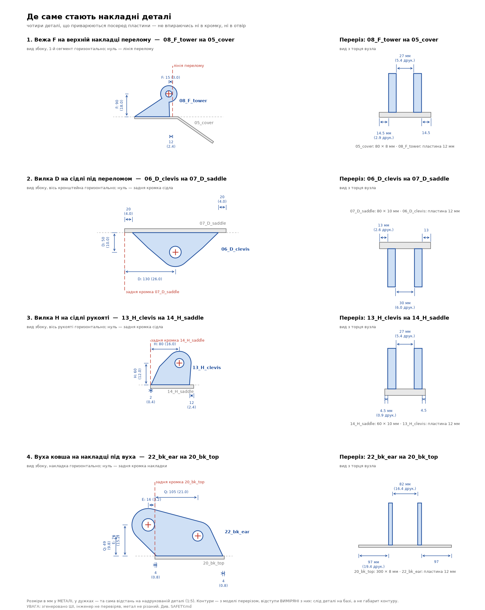

# Складання набору 1:5: що до чого приклеюється

> Згенеровано `make.sh`. Порядок з'єднань — `assembly.tsv`, габарити —
> ВИМІРЯНІ зі STL, назви й розміри в металі — `parts.tsv` (з `echo(BOM_*)` моделі).
>
> **УВАГА:** масштабна модель, згенерована штучним інтелектом. Метал не різаний,
> машину не збудовано. Порядок відповідає порядку ЗВАРЮВАННЯ в металі, але
> інженер його не перевіряв. Див. `SAFETY.md`.

Клей — той самий шов: у кроках 1–5 з'єднання нерухомі. Рухомими лишаються
тільки пальці кроку 7 і штоки циліндрів.

## Як не сплутати схожі деталі

Пари, у яких усі три габарити збігаються з точністю до 2 мм — на око їх не розрізнити, міряйте штангенциркулем:

| Деталь | Габарит, мм | Деталь | Габарит, мм | Різниця | Чим відрізняються |
|---|---|---|---|---:|---|
| `43_pin_A` | Ø7.2 × 36.9 | `44_pin_C` | Ø7.2 × 36.9 | — | **однакові — взаємозамінні** |
| `48_pin_F` | Ø6.2 × 14.7 | `50_pin_H` | Ø6.2 × 14.7 | — | **однакові — взаємозамінні** |
| `51_pin_J` | Ø6.2 × 40.1 | `52_pin_Q` | Ø6.2 × 40.1 | — | **однакові — взаємозамінні** |
| `36_R_bushing` | Ø9.0 × 16.0 | `41_bk_spacer_Q` | Ø9.0 × 16.4 | 0.4 | довжина: 16.0 проти 16.4 |
| `34_B_bushing` | Ø13.2 × 15.2 | `35_E_bushing` | Ø13.2 × 16.0 | 0.8 | довжина: 15.2 проти 16.0 |
| `46_pin_D` | Ø7.2 × 15.3 | `48_pin_F` | Ø6.2 × 14.7 | 1.0 | Ø: 7.2 проти 6.2 |
| `46_pin_D` | Ø7.2 × 15.3 | `50_pin_H` | Ø6.2 × 14.7 | 1.0 | Ø: 7.2 проти 6.2 |
| `49_pin_G` | Ø6.2 × 19.7 | `53_pin_R` | Ø7.2 × 20.9 | 1.0 | Ø: 6.2 проти 7.2 |
| `38_J_boss` | Ø8.2 × 5.5 | `39_link_boss` | Ø10.0 × 5.0 | 1.8 | Ø: 8.2 проти 10.0 |
| `36_R_bushing` | Ø9.0 × 16.0 | `46_pin_D` | Ø7.2 × 15.3 | 1.8 | Ø: 9.0 проти 7.2 |
| `41_bk_spacer_Q` | Ø9.0 × 16.4 | `46_pin_D` | Ø7.2 × 15.3 | 1.8 | Ø: 9.0 проти 7.2 |
| `04_gusset` | 113.1 × 48.1 × 1.6 | `26_post_plate` | 112.0 × 50.0 × 2.4 | 0.8 | товщина: 1.6 проти 2.4 |

Габарити тут — у позі друку (деталь лежить так, як вийшла з принтера),
відсортовані від найбільшого до найменшого, щоб порівняння не залежало від того,
яким боком ви взяли деталь.

## Де саме стають накладні деталі

Більшість деталей упирається в кромку або в отвір — їх не поставиш інакше.
Але чотири приварюються ПОСЕРЕД пластини, нічим не впираючись: вежа F,
вилка D, вилка H і вуха ковша. На око їх не виставити.

Числа ВИМІРЯНІ зі слідів деталей на базових пластинах — не взяті з коду
моделі й не вписані руками. Праворуч та сама відстань на надрукованій
деталі. Це ті самі числа, що стоять підписами на кресленні.

**`08_F_tower` на `05_cover`**

| Розмір | У металі, мм | Надруковано, мм |
|---|---:|---:|
| задня кромка деталі від задньої кромки накладки | 0 | 0.00 |
| передня кромка деталі не доходить до лінії перелому на | 12 | 2.40 |
| центр отвору F назад від лінії перелому | 15 | 3.00 |
| центр отвору F від поверхні накладки | 90 | 18.00 |
| проміжок між пластинами пари | 27 | 5.40 |
| від бічної кромки накладки до зовнішньої грані пластини | 14.5 | 2.90 |

**`06_D_clevis` на `07_D_saddle`**

| Розмір | У металі, мм | Надруковано, мм |
|---|---:|---:|
| відступ від задньої кромки сідла | 20 | 4.00 |
| відступ від передньої кромки сідла | 20 | 4.00 |
| центр отвору D від задньої кромки сідла | 130 | 26.00 |
| центр отвору D від поверхні сідла | 50 | 10.00 |
| проміжок між пластинами пари | 30 | 6.00 |
| від бічної кромки сідла до зовнішньої грані пластини | 13 | 2.60 |

**`13_H_clevis` на `14_H_saddle`**

| Розмір | У металі, мм | Надруковано, мм |
|---|---:|---:|
| відступ від задньої кромки сідла | 2 | 0.40 |
| відступ від передньої кромки сідла | 12 | 2.40 |
| центр отвору H від задньої кромки сідла | 80 | 16.00 |
| центр отвору H від поверхні сідла | 60 | 12.00 |
| проміжок між пластинами пари | 27 | 5.40 |
| від бічної кромки сідла до зовнішньої грані пластини | 4.5 | 0.90 |

**`22_bk_ear` на `20_bk_top`**

| Розмір | У металі, мм | Надруковано, мм |
|---|---:|---:|
| відступ від задньої кромки накладки | 4 | 0.80 |
| відступ від передньої кромки накладки | 4 | 0.80 |
| центр отвору E позаду задньої кромки накладки | 16 | 3.20 |
| центр отвору E від поверхні накладки | 76 | 15.20 |
| центр отвору Q від задньої кромки накладки | 105 | 21.00 |
| центр отвору Q від поверхні накладки | 49 | 9.80 |
| проміжок між пластинами пари | 82 | 16.40 |
| від бічної кромки накладки до зовнішньої грані пластини | 97 | 19.40 |

Усі чотири — дзеркальні пари й стоять симетрично середній площині вузла,
тому «від бічної кромки до зовнішньої грані» однакове з обох боків.
Відступи міряються по СЛІДУ деталі на базі: бобишка навколо отвору звисає
за основу (у вежі F на 17.5 мм за лінію перелому, у вуха ковша на 56 мм
позаду накладки), і за габаритом контуру деталь стала б не на місце.

## 1. Стріла

| Крок | Файл | К-сть | Габарит друку, мм | Ескіз | Куди | Як |
|---|---|---:|---|---|---|---|
| 1.1 | `01_tube_boom_seg1` | 1 | 201.8 × 24.0 × 16.0 | [аркуш](../versions/V001-2026-09-20-0505/drawings/png/03_boom_seg1.png) | основа вузла | Покласти отвором Ø66 (вісь A) ліворуч; косий різ 17.5° — на правому торці |
| 1.2 | `02_tube_boom_seg2` | 1 | 119.8 × 24.0 × 16.0 | [аркуш](../versions/V001-2026-09-20-0505/drawings/png/04_boom_seg2.png) | до косого різу сегмента 1 | Косий різ до косого різу — вони й дають перелом 35°; коротша верхня полиця дивиться на вільний кінець |
| 1.3 | `04_gusset` | 2 | 113.1 × 48.1 × 1.6 | [аркуш](../versions/V001-2026-09-20-0505/drawings/png/07_gusset.png) | з обох боків стику труб | Щоки перекривають шов перелому; нижня кромка — урівень із нижньою полицею |
| 1.4 | `05_cover` | 1 | 62.4 × 16.0 × 21.0 | — | зверху на перелом, між щоками | Уже зігнута посередині на 35°, лягає одразу на обидві верхні полиці. На неї потім стане вежа F — див. крок 1.8 |
| 1.5 | `33_A_bushing` | 1 | Ø13.2 × 28.0 | — | в отвір Ø66 сегмента 1 | Наскрізь крізь обидві стінки; виступає з боків порівну — втулка довша за ширину труби |
| 1.6 | `09_A_doubler` | 2 | Ø26.0 × 2.0 | [аркуш](../versions/V001-2026-09-20-0505/drawings/png/10_A_doubler.png) | на бічні стінки труби навколо втулки A | По одній накладці з кожного боку, отвором на втулку |
| 1.7 | `10_B_fork` | 2 | 84.6 × 46.0 × 2.4 | [аркуш](../versions/V001-2026-09-20-0505/drawings/png/11_B_fork.png) | на передній торець сегмента 2, з боків | Дві пластини; між ними потім заходить п'ята рукояті |
| 1.8 | `08_F_tower` | 2 | 27.8 × 31.0 × 2.4 | [аркуш](../versions/V001-2026-09-20-0505/drawings/png/09_F_tower.png) | на верхню накладку перелому | Задня кромка — ВРІВЕНЬ із задньою кромкою накладки, передня не доходить до лінії перелому на 12 мм (2.4 друкованих). Уперед не можна: там проходить корпус циліндра. Решта розмірів — розділ «Де саме стають накладні деталі» |
| 1.9 | `07_D_saddle` | 1 | 52.0 × 16.0 × 2.0 | — | знизу між щоками перелому | Сідло стає врівень із виступами щік. Під нього потім стане вилка D — див. крок 1.10 |
| 1.10 | `06_D_clevis` | 2 | 41.4 × 24.2 × 2.4 | [аркуш](../versions/V001-2026-09-20-0505/drawings/png/08_D_clevis.png) | на сідло D | Відступ 20 мм (4.0 друкованих) від кожного торця сідла, отвір — рівно посередині його довжини, проміжок 30 мм. Решта розмірів — розділ «Де саме стають накладні деталі» |

## 2. Рукоять

| Крок | Файл | К-сть | Габарит друку, мм | Ескіз | Куди | Як |
|---|---|---:|---|---|---|---|
| 2.1 | `03_tube_stick` | 1 | 210.0 × 20.0 × 12.0 | [аркуш](../versions/V001-2026-09-20-0505/drawings/png/05_stick.png) | основа вузла | Задній торець — той, де отвір Ø66 за 50 мм від краю (вісь B); другий Ø66 (вісь E) — за 1000 мм |
| 2.2 | `11_cheek` | 2 | 134.3 × 47.7 × 1.6 | [аркуш](../versions/V001-2026-09-20-0505/drawings/png/12_cheek.png) | з боків труби на задньому кінці | Щоки виступають за полиці на 20 мм; саме вони несуть момент циліндра рукояті |
| 2.3 | `12_heel_rib` | 1 | 62.2 × 12.0 × 2.0 | — | між щоками, у п'яті | Ребро замикає п'яту в коробку |
| 2.4 | `34_B_bushing` | 1 | Ø13.2 × 15.2 | — | в отвір Ø66 за 50 мм від заднього торця | Наскрізь крізь трубу і ОБИДВІ щоки |
| 2.5 | `14_H_saddle` | 1 | 24.0 × 12.0 × 2.0 | — | зверху між виступами щік | Сідло під вилку циліндра ковша |
| 2.6 | `13_H_clevis` | 2 | 22.1 × 18.5 × 2.4 | [аркуш](../versions/V001-2026-09-20-0505/drawings/png/13_H_clevis.png) | на сідло H | Стоїть НЕСИМЕТРИЧНО: 2 мм (0.4 друкованих) від задньої кромки сідла, 12 мм (2.4) від передньої — основа тягнеться назад, бо вперед плечей немає, туди лягає корпус циліндра. Решта розмірів — розділ «Де саме стають накладні деталі» |
| 2.7 | `37_G_boss` | 2 | Ø7.8 × 3.3 | — | на щоки ззовні, вісь G | Розпірні втулки, по одній на щоку: вони задають проміжок під вушко штока |
| 2.8 | `15_tip_plate` | 2 | 64.4 × 31.9 × 2.0 | [аркуш](../versions/V001-2026-09-20-0505/drawings/png/14_tip_plate.png) | на передній кінець труби, з боків | Накладки під осі E і R |
| 2.9 | `35_E_bushing` | 1 | Ø13.2 × 16.0 | — | в отвір Ø66 за 1000 мм від заднього торця | Наскрізь крізь трубу і обидві накладки кінця |
| 2.10 | `36_R_bushing` | 1 | Ø9.0 × 16.0 | — | між накладками кінця, над верхньою полицею | Вісь коромисла тримається тільки накладками, труби не торкається |

## 3. Ківш

| Крок | Файл | К-сть | Габарит друку, мм | Ескіз | Куди | Як |
|---|---|---:|---|---|---|---|
| 3.1 | `18_bk_shell` | 1 | 58.3 × 52.1 × 57.6 | [аркуш](../versions/V001-2026-09-20-0505/drawings/png/06_bk_shell.png) | основа вузла | Уже зігнута: полиця → R55 на 45° → спинка → R115 на 95° → дно; ставити порожниною догори |
| 3.2 | `19_bk_side` | 2 | 67.0 × 52.1 × 1.2 | [аркуш](../versions/V001-2026-09-20-0505/drawings/png/17_bk_side.png) | з боків обичайки | Боковини по всьому контуру обичайки |
| 3.3 | `20_bk_top` | 1 | 34.0 × 60.0 × 1.6 | — | на обичайку і верхні кромки боковин | Накладка, на яку потім стануть вуха |
| 3.4 | `21_bk_lip_rib` | 1 | 8.0 × 57.6 × 1.6 | — | під передню кромку верху | Ребро губи |
| 3.5 | `22_bk_ear` | 2 | 23.2 × 44.4 × 2.4 | [аркуш](../versions/V001-2026-09-20-0505/drawings/png/18_bk_ear.png) | на накладку верху | Відступ 4 мм (0.8 друкованих) від кожної кромки накладки; вісь E звисає на 16 мм позаду її задньої кромки. Решта розмірів — розділ «Де саме стають накладні деталі» |
| 3.6 | `41_bk_spacer_Q` | 1 | Ø9.0 × 16.4 | — | між вухами, вісь Q | Приварити до ОБОХ вух — це розпірка, а не втулка обертання |
| 3.7 | `40_bk_boss_E` | 2 | Ø12.0 × 2.0 | — | зовні вух, вісь E | По одній бобишці зовні кожного вуха |
| 3.8 | `23_bk_edge` | 1 | 20.0 × 60.0 × 2.4 | — | на передню кромку дна | Ніж; фаска 34° — догори |
| 3.9 | `24_bk_tooth` | 3 | 22.4 × 26.1 × 8.0 | — | на ніж | Три зуби вилкою охоплюють ніж |
| 3.10 | `25_bk_wear` | 2 | 37.1 × 9.8 × 8.0 | — | знизу на п'яту | Смуги зносу, уже вигнуті по радіусу п'яти |

## 4. Важільна система

| Крок | Файл | К-сть | Габарит друку, мм | Ескіз | Куди | Як |
|---|---|---:|---|---|---|---|
| 4.1 | `16_rocker_plate` | 2 | 71.7 × 15.8 × 2.0 | [аркуш](../versions/V001-2026-09-20-0505/drawings/png/15_rocker_plate.png) | основа коромисла | Дві пластини: отвір R сідає на рукоять, отвір J — до штока циліндра ковша |
| 4.2 | `38_J_boss` | 2 | Ø8.2 × 5.5 | — | зсередини пластин коромисла, вісь J | Упритул до вушка циліндра — без них палець J працює на згин |
| 4.3 | `17_link_plate` | 2 | 54.8 × 63.3 × 2.0 | [аркуш](../versions/V001-2026-09-20-0505/drawings/png/16_link_plate.png) | основа тяги | Дві пластини |
| 4.4 | `39_link_boss` | 4 | Ø10.0 × 5.0 | — | зовні пластин тяги, осі J і Q | По дві бобишки на пластину, чотири на вузол |

## 5. Колона

| Крок | Файл | К-сть | Габарит друку, мм | Ескіз | Куди | Як |
|---|---|---:|---|---|---|---|
| 5.1 | `26_post_plate` | 2 | 50.0 × 112.0 × 2.4 | — | схема опори | Дві плити з осями A і C. Це не готовий вузол: рами причепа в моделі ще немає |

## 6. Гідроциліндри

| Крок | Файл | К-сть | Габарит друку, мм | Ескіз | Куди | Як |
|---|---|---:|---|---|---|---|
| 6.1 | `27_cyl_boom_body` | 1 | 130.8 × 18.0 × 15.2 | — | — | Гільза циліндра стріли Ø63, канал під шток глухий |
| 6.2 | `28_cyl_boom_rod` | 1 | 124.8 × 11.6 × 8.0 | — | у гільзу циліндра стріли | Шток має ходити — НЕ клеїти |
| 6.3 | `29_cyl_stick_body` | 1 | 110.3 × 14.8 × 12.0 | — | — | Гільза циліндра рукояті Ø50 |
| 6.4 | `30_cyl_stick_rod` | 1 | 104.3 × 10.6 × 5.0 | — | у гільзу циліндра рукояті | Шток має ходити — НЕ клеїти |
| 6.5 | `31_cyl_bucket_body` | 1 | 92.3 × 14.8 × 12.0 | — | — | Гільза циліндра ковша Ø50 |
| 6.6 | `32_cyl_bucket_rod` | 1 | 84.3 × 10.6 × 5.0 | — | у гільзу циліндра ковша | Шток має ходити — НЕ клеїти |

## 7. Складання на пальцях

| Крок | Файл | К-сть | Габарит друку, мм | Ескіз | Куди | Як |
|---|---|---:|---|---|---|---|
| 7.1 | `43_pin_A` | 1 | Ø7.2 × 36.9 | — | стріла на плити колони | Крізь втулку A; голівка пальця заходить першою |
| 7.2 | `44_pin_C` | 1 | Ø7.2 × 36.9 | — | база циліндра стріли на плити колони | НЕ плутати з пальцем D: цей проходить крізь обидві плити колони, тож удвічі довший (Ø30×182 проти Ø30×74). За довжиною він однаковий із пальцем A |
| 7.3 | `45_pin_B` | 1 | Ø7.2 × 26.1 | — | п'ята рукояті у вилку B стріли | Разом із шайбами наступного кроку |
| 7.4 | `42_washer_B` | 2 | Ø15.2 × 0.4 | — | на палець B, з боків пакета рукояті | Вибирають зазор між вилкою 80 і пакетом 76 — по 2 мм на бік |
| 7.5 | `46_pin_D` | 1 | Ø7.2 × 15.3 | — | шток циліндра стріли у вилку D | — |
| 7.6 | `48_pin_F` | 1 | Ø6.2 × 14.7 | — | база циліндра рукояті у вежу F | — |
| 7.7 | `49_pin_G` | 1 | Ø6.2 × 19.7 | — | шток циліндра рукояті у п'яту G | Між щоками, крізь розпірні втулки G |
| 7.8 | `47_pin_E` | 1 | Ø7.2 × 30.5 | — | ківш на кінець рукояті | Крізь втулку E, вуха ковша і зовнішні бобишки |
| 7.9 | `53_pin_R` | 1 | Ø7.2 × 20.9 | — | коромисло на накладки кінця рукояті | Крізь втулку R |
| 7.10 | `50_pin_H` | 1 | Ø6.2 × 14.7 | — | база циліндра ковша у вилку H | — |
| 7.11 | `51_pin_J` | 1 | Ø6.2 × 40.1 | — | шток циліндра ковша і тяги на коромислі | Найдовший палець Ø25 разом із Q |
| 7.12 | `52_pin_Q` | 1 | Ø6.2 × 40.1 | — | тяга у вуха ковша | Крізь розпірку Q |

## Позначення

- **Ескіз** — аркуш із контуром і розмірами деталі В МЕТАЛІ. Саме за ним
  упізнаєте пластину, коли на столі лежать три схожі. Аркушів немає у смуг,
  круглих деталей і пальців: їхні розміри цілком описані рядком специфікації.
- **Габарит друку** — виміряний зі STL, у міліметрах надрукованої деталі.
  Розмір у металі (лист 8 мм, труба 120×80×5 тощо) — у `BOM.md` і `parts.tsv`.
- Числа в колонці **Як** — це розміри В МЕТАЛІ, як їх бачить модель
  (отвір Ø66, проміжок 30 мм). На надрукованій деталі вони вп'ятеро менші:
  Ø66 → 13.2 мм, проміжок 30 → 6 мм. Так зроблено навмисно — за цими числами
  деталь упізнається на кресленнях і в BOM.
- **К-сть** — скільки штук цього файлу в наборі; дзеркальні пари друкуються
  з одного файлу, тож ліва й права деталь однакові.
- Кроки 1–5 — вузли, їх можна складати в будь-якому порядку між собою.
  Крок 6 (циліндри) і 7 (пальці) — останні.
