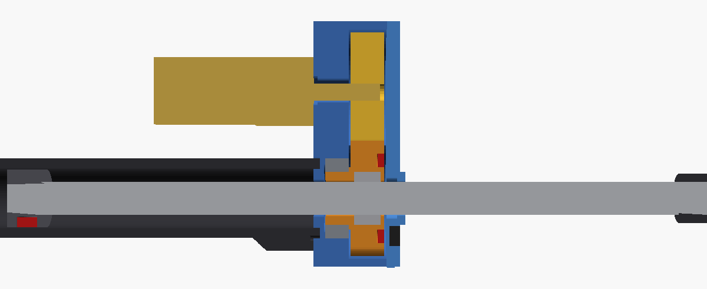

# Циліндри моделі 1:5 на шпильці M5 і моторедукторі N20

Робочий варіант циліндрів друкованого набору: окремі деталі поруч із «глухими» циліндрами з `parts.tsv`, не замість них. Тут лише джерела. Збирає їх `print3d-parts/make.sh` (крок «циліндри на шпильці M5»), результат лежить у [`latest/print3d/m5_cylinders/`](../../latest/print3d/m5_cylinders/): `stl/`, `img/` і [`CALC.md`](../../latest/print3d/m5_cylinders/CALC.md) з розрахунком.

Циліндри повторюють гідроциліндри моделі: **зведена довжина, хід, вушка й зовнішній Ø гільзи ті самі, що в `scad/excavator_boom.scad` (1:5)**. Рух дає шпилька M5×0.8: гайка крутиться, шпилька (шток) їде. Мотор — 12GAN20-298 на 60 об/хв, шестерні 1:1.



## Як влаштовано

```
 кришка з вушком       гільза (ребро всередині)             голова          ніс  вушко штока
 ┌──┐┌──────┐══════════════════════════════════╗┌──────────────┐┌─┐
 │ o││ [П]  │  ← поршень-шайба на хвості       ║│ губа│MR128│Ш │┤ ├─────────── o
 └──┘└──────┘══════════════════════════════════╝│     │     │ │ │└─┘  шпилька M5
   Хз                                        Хр  └──────────────┘
                                   [ N20 ]──────── шестерня мотора
```

- **Шпилька — це шток і не крутиться.** На її хвості — друкований поршень-шайба (нарізається самою шпилькою, сідає на клей). Паз поршня ковзає по ребру всередині гільзи, тож шпилька не провертається навіть тоді, коли циліндр лежить окремо на столі. Вушко штока вкручується на передній кінець.
- **Гайка — у шестерні.** Звичайна гайка M5 закладається в шестерню на паузі друку: вона замкнена з обох боків і не випаде. Маточина шестерні сидить у підшипнику MR128ZZ (8×12×3.5).
- **Голова стоїть там, де шток виходить із корпусу.** Інакше не можна: хвіст шпильки мусить мати куди втягтися. Тому зведений циліндр ховає шпильку в гільзі, а розкритий виводить її через гайку назовні.
- **Мотор — паралельно, збоку.** Корпус N20 лежить уздовж гільзи, вал заходить у голову, на валу — шестерня 27 зубів, модуль 0.6, така сама, як шестерня гайки (1:1). Мотор кріпиться двома гвинтами M1.6 у торець редуктора, хвіст — краплею клею до гільзи. Усі три мотори стоять ліворуч (+Y, якщо дивитись від колони на ківш): мотори й джгути на одному боці, і мотор виходить із площини механізму, де все рухається. Зіткнень з машиною немає (`make.sh collide`); датчики кінцевиків — на правому боці, навпроти мотора.
- **Упори механічні.** Зведений — поршень об дно кришки. Розкритий — поршень об губу голови. Губа тримає лише зовнішнє кільце підшипника, а поршень б'є в нерухому частину, не в шестерню, яка крутиться. Шийка вушка штока голови не торкається (зазор 1 мм).
- **Голова з двох деталей.** Задня частина (губа, гніздо підшипника, камера шестерень, кріплення мотора) друкується заднім торцем на стіл, і нависань у неї немає. Передня стінка з носом-напрямною несе датчики енкодера. Стягуються двома саморізами M2.

Стек голови від заднього торця: губа 1.8 (у ній паз, куди вклеюється гільза) · MR128 3.5 · 0.3 · шестерня 5.0 · 0.4 · передня стінка 2.0 = 13 мм.

## Зворотний зв'язок

**Енкодер — оберти й напрямок.** У передньому торці шестерні гайки два магніти Ø2×1 під 180°, повернуті назустріч різними полюсами (N і S). Навпроти них у передній стінці стоять два латчі Холла під 90° один до одного. Латч вмикається від N і вимикається від S, тож кожен дає меандр 50/50, а два разом дають квадратуру: 4 фронти на оберт гайки = **0.2 мм ходу** на фронт. Напрямок видно з того, який сигнал випереджає. Магніти стоять навпроти граней гайки, де між гайкою й западиною зубів найбільше пластику.

**Кінцевики — магніт у поршні.** Про «паличку до кнопки» подумав, і ось чому зробив інакше:

- У цій схемі **обидва крайні положення й так видно біля голови**. Розкритий — поршень підходить упритул до голови. Зведений — вушко штока підходить до носа. Паличка через увесь циліндр не потрібна.
- **Кнопки тут ламаються.** Тактова кнопка має хід 0.25 мм і жодного перебігу. N20 на 298:1 тисне на упор сотнями ньютонів (`CALC.md`), і кнопку в ланцюжку упору розчавить. Мікроперемикач із важелем (12.8×5.8 мм) має перебіг, але завбільшки з половину гільзи.
- **Замість кнопок — датчики Холла, без жодної рухомої деталі.** У боці поршня магніт Ø2×1, такий самий, як в енкодері. Датчик «розкритий» стоїть у приливі гільзи одразу за головою, датчик «зведений» — у приливі задньої кришки. Обидва дивляться крізь стінку гільзи на той бік, де ребро тримає магніт. Спрацьовують, коли поршню до упору лишається ~2–3 мм: на упорі поле біля датчика 11–27 мТл, а поріг DRV5032 — до 4.8 мТл. Дроти «зведеного» йдуть до голови канавкою вздовж гільзи, тож з циліндра виходить **один джгут біля голови**, як ти й хотів.

Якщо все ж потрібна механіка, на цю ж схему лягає варіант із палички. Сталевий дріт Ø1 лежить у пазу гільзи. Поршень у крайніх положеннях зсуває його на ~1 мм. Загнутий кінець дроту виходить біля голови між двома мікроперемикачами з важелями. Упор мусить бути окремим (поршень об губу), щоб сила не йшла через дріт.

## Покупне на один циліндр

| Що | К-сть | Примітка |
|---|---:|---|
| Шпилька M5×0.8 (DIN 976), довжина — у `CALC.md` | 1 | сталь, торці зачистити |
| Гайка M5 (DIN 934, S8×4) | 1 | закладається в шестерню на паузі |
| Підшипник MR128ZZ (8×12×3.5) | 1 | у натяг на маточину й у гніздо |
| Моторедуктор 12GAN20-298, 60 об/хв, 12 В | 1 | вал Ø3 з лиською, 10 мм |
| Гвинт M1.6×5 | 2 | мотор до голови |
| Саморіз M2×8 | 2 | передня стінка до голови |
| Магніт N52 Ø2×1 | 3 | 2 — енкодер, полюси назустріч (N і S); 1 — поршень, кінцевики, полюс будь-який |
| Латч Холла TO-92: US1881 / DRV5013 / SS41F | 2 | енкодер |
| Датчик Холла TO-92: DRV5032 (омніполярний) | 2 | кінцевики; A3144 теж годиться, але реагує лише на південний полюс, і для стріли (товща стінка) його поріг на межі |

Усього на три циліндри: 3 мотори, 3 підшипники, 9 магнітів Ø2×1, 12 датчиків.

## Друк

| Деталь | Як класти | Примітка |
|---|---|---|
| Гільза `*_tube` | стоячи, заднім торцем на стіл | ребро всередині друкується без підпор |
| Голова, задня `*_head_rear` | заднім торцем (з пазом під гільзу) на стіл | нависань немає |
| Передня стінка `*_head_front` | стиком донизу, носом догори | кишені датчиків догори |
| Шестерня гайки `*_gear` | переднім торцем (магніти) на стіл | **пауза** на висоті верху кишені, вкласти гайку |
| Шестерня мотора `*_pinion` | плазом | отвір під вал з лиською, у натяг |
| Поршень `*_puck` | плазом | отвір 4.2 — шпилька наріже різьбу сама |
| Кришка `*_cap` | стаканом донизу | дно — міст над стаканом |
| Вушко штока `*_eye` | шийкою донизу | отвір 4.2 під шпильку |

Шестерні модуля 0.6 — межа для сопла 0.4: друкувати шаром 0.1 і повільно. Перед усім набором надрукуй пробу: кільце під MR128 (натяг, `PRESS` у `m5_cyl.scad`) і шестерню мотора на вал.

## Складання

1. Шестерню гайки надрукувати з паузою, вкласти гайку. У передній торець вклеїти 2 магніти Ø2×1 різними полюсами назовні. Полюс перевір іншим магнітом: один має притягуватися, другий відштовхуватися.
2. Запресувати MR128 у задню частину голови, маточину шестерні вставити в підшипник.
3. Мотор: шестерню — на вал, мотор — до торця голови двома M1.6. Перевірити, що пара крутиться від руки без заїдань.
4. Вклеїти датчики енкодера в передню стінку (чутливою стороною до шестерні), вивести дроти канавками. Стягнути голову двома M2.
5. Гільзу вклеїти в паз голови: мітка на передньому торці гільзи — навпроти приливу датчиків.
6. Поршень накрутити на хвіст шпильки врівень з торцем, посадити на клей, вклеїти магніт Ø2×1. Шпильку вставити в гільзу **із заднього кінця** (поршень пазом на ребро) і загнати в гайку, крутячи мотор. Поршень крізь гайку не пройде, тому інакше її не вставити.
7. Датчик «розкритий» — у прилив гільзи, «зведений» — у прилив кришки. Дроти «зведеного» покласти в канавку, кришку вклеїти на гільзу.
8. Вушко штока вкрутити на шпильку, що вийшла з носа, повернути паралельно вушку кришки (пальці мають бути паралельні) і посадити на клей.

## Підключення й керування

З кожного циліндра виходить 8 дротів: живлення датчиків 5 В і GND, ENC_A, ENC_B, LIM_EXT, LIM_RET, M+ і M−. Виходи датчиків — відкритий колектор: підтягування 10 кОм до 3.3 В мікроконтролера. Мотори — через драйвер з обмеженням струму, що тримає 12 В: наприклад, DRV8871 (один на мотор, поріг струму задає резистор ILIM — номінал бери з даташиту на ≈ 0.2 А). DRV8833 теж обмежує струм (I = 0.2 В / R_SENSE), але розрахований лише до 10.8 В. З ним мотори треба живити від ~9 В, і 60 об/хв стануть ~45.

- **Обмеження струму обов'язкове.** 298:1 на 12 В тисне на шпильку сотнями ньютонів, а друковані упори й MR128 розраховані на десятки.
- **Нуль.** Після ввімкнення кожен циліндр втягується до спрацювання LIM_RET. Там лічильник енкодера = 0, далі позиція = лічильник × 0.2 мм.
- **Межі.** Програмні межі за лічильником (0.5 мм від кожного датчика). Датчики — друга лінія захисту, механічний упор — третя, і в нормі до нього не доходить.
- **Заїдання.** Мотор під напругою, а фронтів енкодера немає понад 0.5 с — стоп. Це ловить і упор, і перекіс.

## Розрахунок

[`CALC.md`](../../latest/print3d/m5_cylinders/CALC.md) пише `calc.py` щоразу, коли збирається набір. Там:
- довжини кожного циліндра й довжина шпильки;
- маса з самих STL;
- сила ваги на кожному циліндрі за всіма позами (з `print3d-parts/model_drive.py`);
- час ходу вибраного мотора порожнім і з повним ковшем піску;
- що дали б інші N20.

Коротко: 12GAN20-298 на 60 об/хв з шестернями 1:1 проходить хід за 75–127 с, у 25–31 раза повільніше за машину. Ківш піску мотор тягне, беручи кілька відсотків моменту.

## Відкриті питання

- **Швидкість.** 60 об/хв, 1:1 — це 0.8 мм/с, у 25–31 раза повільніше за машину: стріла проходить хід за ~2 хв. Зате тягне повний ківш піску з запасом у десятки разів. Якщо захочеться швидше за тієї самої голови, 12GAN20-20 (1000 об/хв) дає лише у ×2 повільніше за машину без піску. Друковані деталі ті самі: корпус N20 однаковий, змінюється лише шестерня мотора.
- **Розміри N20 звірити з тим, що приїде.** Довжина редуктора 298:1 (закладено 9 мм), вал 10 мм, отвори M1.6 через 9 мм, бобишка редуктора Ø4.
- **Голова ширша за гільзу.** Ø≈21 мм проти 12–15 мм у гільзи, плюс мотор збоку. Менше не вийде: шестерня гайки має вмістити гайку S8 і два магніти.
- **Шток стріли тонший, ніж у моделі** (M5 проти Ø8 у масштабі): шпилька і є штоком.
- **Сталь важить.** Три шпильки — ~50 г. Разом із моторами це вже враховано в силах (розрахунок бере маси з цих STL).

## Файли

| Файл | Що |
|---|---|
| `m5_cyl.scad` | модель: збірка, розрізи, кожна деталь (`-D 'cyl="stick"' -D 'pp="head_rear"'`). Сталі на початку — вибір мотора, шестерень, кута мотора, розміри гільзи |
| `calc.py` | довжини, маса, сили, час ходу → `CALC.md`; читає сталі з `m5_cyl.scad` |
| `make.sh` | перетини власних деталей, зіткнення з машиною, STL і друкованість, рендери, `CALC.md` |

`print3d-parts/m5_cylinders/make.sh` сам складає все в `build/m5_cylinders/`, щоб було видно результат до збирання набору. У `latest/` це потрапляє лише через `print3d-parts/make.sh`. Окремі кроки: `make.sh pairs collide`. Інші кути мотора: `PHIS="0 90 -90 180" ALL=1 make.sh collide`.

Модель машини підключається як бібліотека й не змінюється. Довжини, хід, вушка й зовнішній Ø гільзи — з неї, тож зміниться циліндр у моделі — зміняться й ці.
