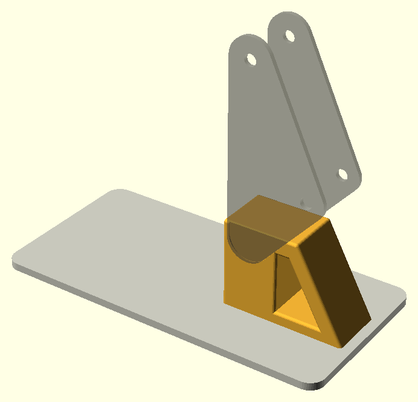
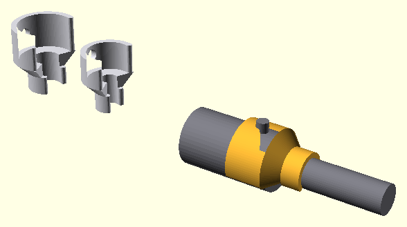

# Стійка для показу — тимчасово

Підставка під зібраний друкований набір, поки в моделі немає рами причепа, і прищепки,
що фіксують штоки друкованих циліндрів у потрібному положенні в обидва боки. **Не деталі машини і не
частина набору**: у `parts.tsv`, BOM і аркуші не входять, модель і `parts.scad` не
змінені. Усе тут: `stand.scad`, `make.sh`, `stl/`, `preview.png`, `clips.png`.

## Три деталі

| Файл | Що це | Габарит | Друк |
|---|---|---|---|
| `stl/stand_peg.stl` | стрижень Ø12×30 на фланці Ø22×3, наскрізний отвір Ø3 під шуруп | 22×22×33 | фланцем на стіл |
| `stl/stand_base.stl` | основа: плита 180×90×4, отвір Ø3 і потай Ø10 знизу під шляпку | 180×90×4 | плазом |
| `stl/stand_post.stl` | поворотна стійка-трикутник: отвір Ø12.5 під стрижень, виїмка під фланець знизу, виїмки 0.5 мм під плити колони на бічних гранях голови; кромки скруглені R1.5, крім нижніх | 64×29×46 | стоячи, п'ятою на стіл |

Шар 0.2, 3 периметри, заповнення 15–20 %, підпор не треба (стелі вікна й отвору —
містки, потай і перехід до отвору — конуси 45°). Колір будь-який.

**Основу можна не друкувати.** Стрижень прикручується тим самим шурупом до будь-якого
шматка дошки чи фанери — отвір Ø3 іде крізь фланець і весь стрижень, шуруп сам ріже
різьбу в пластику. Шуруп — чорний гіпсовий 3.5 мм; довжина: товщина дошки + не більше
32 мм (стрижень 33 мм від низу фланця, довший шуруп вийде з верхівки і впреться у стелю
отвору стійки). Для основи 4 мм — 3.5×25…32.

## Складання

1. **Стрижень на основу (або на дошку).** Шуруп знизу, шляпка в потай — основа має лежати
   рівно. Сталь усередині стрижня і тримає згин від стріли; сам пластиковий стрижень Ø12
   на такій довжині зламався б.
2. **Стійка на стрижень.** Просто надіти: фланець ховається у виїмку знизу, стійка стоїть
   на основі всією п'ятою. Не клеїти — вона крутиться. Зазор 0.5 мм; туго — розвернути
   отвір свердлом 12.5, бовтається — нічого страшного, момент тримає глибина 30 мм.
3. **Плити колони у виїмки.** Нижня кругла частина кожної плити (`26_post_plate`) сідає
   у виїмку на бічній грані голови, отвір осі C дивиться вперед, у бік п'яти. Клей — той
   самий, що для набору. Плити стають на відстані втулки A (28.4 мм) без вимірювань.
4. **Вантаж на основу.** На дальню від стрижня частину. Порожню основу стріла з рукояттю
   і ковшем на витягнутому вильоті перекидає; орієнтир — від півкілограма.

Вісь A виходить на 130 мм над столом — стільки ж, скільки над землею в моделі (650 мм).
Поворот приблизно ±90°: п'ята стійки виступає вперед на 50 мм і при більшому куті
впирається у вантаж.

## Прищепка на циліндр

Друковані циліндри — лише симуляція: шток вільно ходить у гільзі, і зафіксувати позу
нічим. Прищепка — ступінчаста C-скоба, що защіпається знизу одразу на голий шток і на
кінець гільзи. Одна на циліндр, ставиться на будь-якому висуненні.

| Файл | Шток | Гільза | Рукав на штоку / гільзі | Для чого |
|---|---|---|---|---|
| `stl/clip_boom.stl` | Ø8 (Ø40 у металі) | Ø15.2 | 5 / 10 | циліндр стріли |
| `stl/clip_stick_bucket.stl` ×2 | Ø5 (Ø25) | Ø12 | 5 / 8 | циліндри рукояті й ковша |

Як тримає:
- **на гільзі — замком:** у спинці рукава отвір під штуцер масляного входу (у моделі
  він за 5 мм від торця гільзи). Скоба надівається знизу, розрізом від штуцера, і штуцер
  входить в отвір — уздовж гільзи вона не зсунеться;
- **від втягування — упором:** торець переходу між рукавами стоїть на торці гільзи;
- **від висунення — обхватом і натягом рукава на штоку:** рукав 5 мм обіймає шток на
  260° (рукав гільзи — на 225°) і сидить із натягом `CLIP_ROD_FIT`: −0.4 на штоку стріли,
  −0.2 на решті (FDM ще й сам звужує дуги на 0.1–0.2 мм). Натяг різний, бо при однаковій
  стінці рукав на Ø8 тисне втричі слабше, ніж на Ø5 (жорсткість кільця ~1/R³), а циліндр
  стріли ще й навантажений найбільше. Це тертя, не замок: на витягування прищепка тримає
  приблизно кілька ньютонів — для складання й розглядання досить, вага вузлів у
  друкованій моделі менша.

Рукав на штоку 5 мм — стільки голого штока є навіть при повному втягуванні (6 мм), тож
прищепка стає в будь-якій позі, включно з крайніми.

Друкувати стоячи на рукаві штока (перехід між рукавами — конус 45°, підпор не треба),
з brim, шар 0.2. Губки скруглені, щоб наїжджати на деталь без зусилля й не дряпати її,
але скруглення з'їдає обхват: ~9° з кожного боку на Ø8 і ~13° на Ø5. Тому рукав штока
ширший: 260° реально обіймають ~242° і ~233° (225° на Ø8 давали б лише ~207°, і шток
вислизав). Губки при защіпанні розходяться на ~23 % і ~17 % на штоку й ~6 % на гільзі —
гнеться лише тонкий рукав, PLA витримує, PETG пружніший. У `stand.scad`: спадає зі штока —
`CLIP_ROD_FIT` цієї прищепки ще на −0.05…−0.1; туго на гільзі — `CLIP_FIT` ближче до 0;
штуцер не входить — збільшити `CLIP_PORT_FIT`.

## Перевірка

`make.sh` робить STL (три деталі стійки і дві прищепки), проганяє `../check_print.py`
(габарит, замкненість, полиці, контакт зі столом) і числові перевірки посадки. Плити:
перетин плит зі стійкою має бути порожнім, а перетин плит із тілом стійки без виїмок —
більшим за нуль, тобто виїмки саме там, де сидять плити, а не поруч. Прищепка стріли на
циліндрі з набору зі штоком на 40 % ходу: при нульових зазорах (`CLIP_FIT`
і `CLIP_ROD_FIT`; від'ємні — навмисний натяг) з гільзою і штоком не перетинається, а без
отвору під штуцер перетинається саме зі штуцером (≈13 мм³ — об'єм штуцера в стінці).

## Що звідки

Від моделі береться лише контур плити колони (ті самі кола, що в `post_schematic()`),
відстань між плитами (втулка A + 2), висота осі A над землею і діаметри штоків — через
`parts.scad`, підключений як бібліотека. Решта — друковані міліметри в шапці
`stand.scad`: посадка стрижня, шуруп, глибина виїмок, розміри основи, радіус кромок,
обхват і зазор прищепок.
